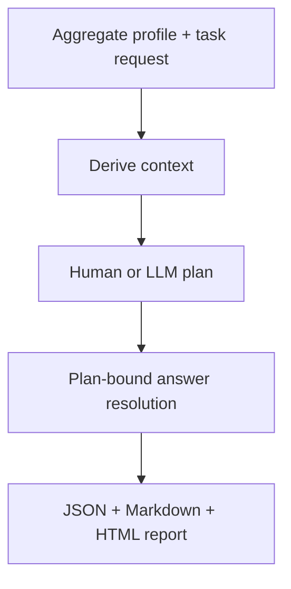
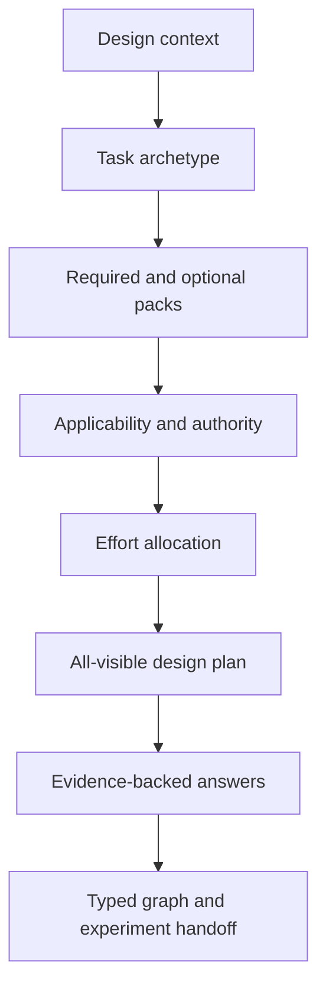

# Data-science design atlas

The design atlas turns exploratory data-science work into a versioned,
machine-readable decision system that a person, an LLM harness, or a graph
planner can inspect without pretending that a checklist answer is executable
code.

The reference release contains:

- **618 cataloged techniques** across 20 lifecycle phases;
- **31 task archetypes** covering data engineering, classical ML, causal work,
  synthetic data, documents, multimodal systems, reinforcement learning, LLM
  harnesses, red teaming, streaming, and model operations;
- **28 modular design packs** with 112 evidence-seeking questions;
- **three explicit branches per question**, required evidence, experiment
  templates, stop conditions, applicability triggers, cost, and risk;
- **E1, E3, E5, E7, and E10** allocation policies that keep all 112 questions
  visible;
- strict JSON Schemas, portable catalog JSON, CLI planning, and self-contained
  JSON/Markdown/HTML reports;
- five individually importable typed graph nodes with 34 finite bindings and
  explicit human/model authority;
- a C0–C7 maturity assessment derived from supplied evidence.

The 618 technique rows came from an owner-supplied inventory dated 2026-08-13.
Its reported implementation labels are retained as provenance, not accepted as
SolutionGraph evidence. Every technique begins at **C1: cataloged**. A declared
node, a passing smoke test, a compiler-compatible route, and a benchmark result
are different claims.

## Five-minute workflow

List the supported task shapes, inspect the catalog, and compile a regression
worklist:

```bash
solutiongraph atlas archetypes
solutiongraph atlas coverage
solutiongraph atlas techniques --phase 4 --query imputation
solutiongraph atlas plan \
  --task-type regression \
  --objective "Predict renewal value at the customer renewal date" \
  --modality modality.tabular \
  --target-name renewal_value \
  --group-field customer_id \
  --effort E3 \
  --output-dir .artifacts/regression-design
```

Open `.artifacts/regression-design/design-plan.html` or give
`design-plan.json` to a harness. The JSON includes every visible question and,
for selected questions, structured branches, evidence requirements, references,
experiment templates, and stop conditions.

For CSV, TSV, JSON, or JSONL, add `--dataset PATH`. The atlas reuses the
aggregate-only semantic profiler to derive row/column shape, missingness,
duplicates, high cardinality, wide-table, time, geography, and target signals;
the resulting context records the exact profile and semantic-map digests. These
signals control applicability and priority only. They do not turn a guessed
field meaning into truth.

To let an LLM propose answers, grant its ordinary model-node authority
explicitly:

```bash
solutiongraph atlas plan \
  --task-type llm-evaluation \
  --objective "Compare coding agents on a fixed ten-task suite" \
  --modality modality.text \
  --mode llm \
  --permission model.invoke \
  --effort E5 \
  --json > .artifacts/llm-eval-design.json
```

Without `model.invoke`, applicable LLM questions remain visible and are marked
`blocked`. An answer still cannot grant a node capability, a permission, or an
acceptance result.

## Run the atlas as a typed graph

`solutiongraph.design_atlas.node_pack` exposes a four-slot reference program:



The context node accepts the semantic interrogation system's aggregate profile
and field-map types; it does not accept raw rows. The planning slot has two
compatible implementations with the same ports and capability. The compiler
admits the human implementation only with `human.review`, and the LLM
implementation only with `model.invoke`. With one authority, the E1/E3/E5/E7/
E10 and three-seed grid exposes 15 planning bindings and 30 complete routes
after the two resolution policies. Granting both authorities exposes 60; it
does not silently broaden authority.

The external `design-atlas.answer-set` port is provider-neutral, so an agent
harness, UI, human review queue, or deterministic fixture can answer the exact
same plan. Every answer set must carry the plan digest. `evidence-required`
resolution fails closed on stale digests, unanswered questions, blocked work,
abstentions, or provisional decisions. The report node then verifies the
context → plan → dossier digest chain before rendering and has no filesystem,
network, or model effect.

```python
from solutiongraph.compiler import Compiler
from solutiongraph.design_atlas.node_pack import (
    DESIGN_ATLAS_PROGRAM,
    DESIGN_ATLAS_REGISTRY,
)

space = Compiler().admit(DESIGN_ATLAS_PROGRAM, DESIGN_ATLAS_REGISTRY)
assert space.route_count_upper_bound == 30
assert len(space.choices_for("plan")) == 15
```

Run `python examples/data_science_design_atlas_graph.py --runtime subprocess`
for an independently verified, evidence-required E1 execution through the
bounded subprocess lifecycle adapter. The test suite also compiles both
human-only and model-only programs, proves incompatible authority is rejected,
executes all four slots, and checks the content-bound report.

## The separation that makes the atlas safe

| Object | It can establish | It cannot establish |
|---|---|---|
| Technique entry | A named approach is in the inventory | Code exists or works |
| Design question | A decision, branches, evidence, and experiment need attention | Which answer is true |
| Decision answer | A responder selected a branch and cited assumptions/evidence | Graph validity or performance |
| Node specification | Exact executable ABI, types, effects, permissions, and implementation identity | Empirical superiority |
| Compiler admission | A candidate can satisfy a slot in this frozen registry snapshot | Expected quality |
| Run receipt | What one execution observed | General performance |
| Benchmark report | Controlled evidence under its stated scope | Universal optimality or production readiness |
| Maturity assessment | The highest contiguous evidence gate supplied | Evidence that was not supplied |

This preserves the core SolutionGraph ontology. Design work happens before and
beside graph compilation; it is not inserted into the data path as fictional
pipeline steps.

## How a task becomes a worklist



`DesignContext` records task type, objective, modalities, lifecycle stage, risk,
signals, constraints, approximate shape, target, time, group, and entity fields.
Unknown fields remain unknown. The planner does not infer business meaning from
a dtype or fabricate a task contract.

Task archetypes nominate required and optional packs. Question triggers further
specialize time, GIS, multimodal, high-risk, production, and other concerns. The
planner then checks response mode and permission before cost/effort allocation.
Every question receives exactly one of these statuses:

| Status | Meaning |
|---|---|
| `selected` | Allocated under the stated effort and seed |
| `deferred` | Applicable but outside the cost/question budget |
| `blocked` | Applicable, but no authorized response mode is available |
| `not-applicable` | Outside the archetype or its applicability triggers |

The seed controls the exploration share. Risk-first choices fill most of the
budget; a declared fraction samples other eligible questions so history and
heuristics do not collapse the design into one familiar route.

## The 28 design packs

| Plane | Pack | Decisions covered |
|---|---|---|
| Intent | Task contract | Decision unit, outcome/horizon, independent oracle, objectives and hard constraints |
| Data | Data source | Provenance, population/sampling, license/consent, snapshot/freshness |
| Data | Schema semantics | Field roles, units/invariants, identity/cardinality, schema evolution |
| Data | Profiling and EDA | Shape/support, missingness, dependencies, conflicts/anomalies/slices |
| Data | Quality cleaning | Quality gates, repair/quarantine, entity resolution, independent verification |
| Evaluation | Validation splits | Split unit, time availability, fold-local fit, protected holdout |
| Modeling | Feature engineering | Availability, encoding, scaling, bounded interactions/domain features |
| Modeling | Targets and labels | Label production, delay/censoring, imbalance/cost, target transforms |
| Modeling | Selection and reduction | Need, method family, stability, dimension stopping |
| Modeling | Baselines and models | Controls, model diversity, resource fit, failure-diverse fallbacks |
| Optimization | Tuning and search | Conditional spaces, policies, historical starts, budget/coverage |
| Modeling | Ensemble and calibration | OOF lineage, diversity, calibration, action threshold |
| Evaluation | Metrics and errors | Decision metrics, uncertainty, slices, failure clusters |
| Evaluation | Robustness and stability | Shift, metamorphic perturbations, adversaries, dependency failures |
| Governance | Fairness and risk | Affected parties, fairness construct, privacy, human authority/recourse |
| Evaluation | Interpretability | Audience, methods, stability/faithfulness, model/system cards |
| Specialized | Causality and experiments | Estimand, identification, assignment, sensitivity |
| Specialized | Time series | Time axes, horizons, walk-forward backtests, hierarchical/event context |
| Specialized | Geospatial | Place identity, CRS/boundaries, spatial splits, point-in-time enrichment |
| Specialized | Text and documents | Document identity, grounded extraction, retrieval, untrusted content |
| Specialized | Image and multimodal | Capture, annotation, alignment, robustness slices |
| Specialized | Synthetic data | Purpose, generator boundary, fidelity/privacy, mixture ablations |
| Specialized | Reinforcement learning | Sequential contract, logging support, policy evaluation, safe exploration |
| Specialized | LLM harness | Scenario matrix, tools/authority, judges, red-team coverage |
| Operations | Deployment and serving | Artifact closure, serving parity, rollout, rollback/recovery |
| Operations | Monitoring and feedback | Telemetry, drift/performance, correction lineage, retraining policy |
| Governance | Reproducibility | Receipts/replay, data/model cards, owners/approvals, incident/retirement |
| Handoff | Decision dossier | Evidence states, semantic graph, experiment grid, claim scope/exit |

The packs are separate modules under `solutiongraph/design_atlas/packs/`. Adding
one concern does not require editing a single global prompt or node monolith.

## Structured question contract

Each `DesignQuestion` contains:

- a stable ID, version, pack, prompt, and rationale;
- permitted response modes (`deterministic`, `llm`, `human`, `external`);
- cost tier and risk weight;
- required evidence kinds;
- two or more explicit `DecisionChoice` branches and downstream action IDs;
- applicability and exclusion triggers;
- a controlled experiment template and stop conditions;
- primary or official research references.

An answer includes the selected choice ID, rationale, evidence references,
assumptions, confidence, and responder identity. `DesignPlanner.resolve()` marks
an answer `accepted` only when at least one evidence reference is attached;
otherwise it is `provisional`. `accepted` describes the decision record—not
the truth of an empirical claim. Consequential evidence remains subject to the
task oracle and ordinary benchmark protocol.

Save answers as an array conforming to `design-answer.schema.json`, then build a
strict dossier against the same context, effort, modes, permissions, and seed:

```bash
solutiongraph atlas resolve context.json answers.json \
  --effort E3 --output decision-dossier.json
```

Changing the allocation inputs changes the plan digest; answers for questions
outside that plan are rejected instead of being silently attached.

## C0–C7 capability maturity

Use `solutiongraph atlas maturity evidence.json` to derive the highest
**contiguous** gate:

| Level | Name | Minimum evidence gate |
|---:|---|---|
| C0 | Absent | No catalog record |
| C1 | Cataloged | Stable catalog identity |
| C2 | Declared | Content-addressed implementation/node declaration |
| C3 | Runnable | Valid-fixture smoke and structured invalid-fixture failure |
| C4 | Composable | Compatibility and leakage/scope tests |
| C5 | Search-integrated | Registered candidate and search tests |
| C6 | Benchmark-validated | At least three receipts across at least two seeds |
| C7 | Operational | Monitoring, security, privacy, rollback, and SLO evidence |

A hundred benchmark receipts do not jump from C1 to C6 if declaration,
execution, compatibility, and search gates are absent. The assessment also
reports a component vector so strong unit evidence cannot hide missing
operations evidence.

Example evidence:

```json
{
  "design_atlas_model_version": "0.1",
  "capability_id": "capability.tabular.median-imputer",
  "cataloged": true,
  "declaration_digest": "sha256:0000000000000000000000000000000000000000000000000000000000000000",
  "valid_smoke_tests": 2,
  "invalid_smoke_tests": 2,
  "compatibility_tests": 3,
  "leakage_tests": 2,
  "search_registered": true,
  "search_tests": 1,
  "benchmark_receipts": 0,
  "benchmark_seeds": 0,
  "monitoring_evidence": [],
  "security_evidence": [],
  "privacy_evidence": [],
  "rollback_evidence": [],
  "slo_evidence": [],
  "artifact_refs": ["tests/nodes/test_median_imputer.py"]
}
```

This derives C5, not C6 or C7.

## Common end-to-end uses

### Data cleaning and enrichment

Use `task.data-cleaning`, `task.data-validation`, `task.data-enrichment`,
`task.geospatial-enrichment`, `task.temporal-enrichment`, or
`task.geotemporal-enrichment`. Pair the atlas with the executable semantic
interrogation loop:

1. map semantic concepts and aggregate profiles;
2. compile the design worklist;
3. run declared deterministic checks;
4. execute authority lookups only with explicit network permission;
5. apply safe changes to a shadow copy;
6. independently verify before/after findings;
7. promote, quarantine, reject, or abstain with receipts.

### Regression, classification, and Kaggle work

The task contract fixes prediction unit, target, split, metric, leakage rules,
submission schema, and local holdout. The atlas surfaces feature, label,
selection, model, tuning, ensemble, calibration, error, robustness,
interpretability, and reproducibility decisions. Then model preprocessing,
feature construction, estimator, calibration, ensemble, and output validation
as separate semantic slots. Compare a fixed control graph with explicit graph
mutations under identical cases, seeds, evaluator, and resource budget. A public
leaderboard is an external observation, not a clean reusable holdout.

### Synthetic training and supplementation

Use `task.synthetic-data`. The generator receives a separate task and evidence
boundary. Run real-only control, synthetic-only diagnostic, and mixed arms.
Preserve generator training inputs, contamination checks, privacy tests,
mixture ratios, downstream model identity, and clean holdout results. Similarity
to the source data is not sufficient evidence of utility or privacy.

### LLM and agent harnesses

Use `task.llm-evaluation` or `task.llm-red-teaming`. Freeze scenario/persona,
model/provider, prompt digest, context, tools/authority, sampling, budget,
transcript visibility, oracle, judge panel, and failure taxonomy. Keep model
output untrusted until schema and independent checks pass. Compare control and
treatment harnesses on the same allocation. Retain unsuccessful and abstaining
runs. See [LLM_AGENT_BENCHMARK_ARENA.md](LLM_AGENT_BENCHMARK_ARENA.md) for the
existing ten-task paired arena.

### Reinforcement learning

Use `task.reinforcement-learning`. The decision pack first fixes state, action,
reward, horizon, behavior policy, support, constraints, and evaluation. Offline
estimators and learned simulators are fallible evaluator candidates, not ground
truth. Unsafe online exploration stays blocked until an external enforcement
and approval layer exists.

## Turning a dossier into a graph experiment

The final handoff pack asks for four distinct artifacts:

1. an implementation-independent `TaskContract` and immutable cases/oracle;
2. a semantic graph of typed obligations;
3. registry candidates with exact node versions, digests, parameters, effects,
   permissions, and failure contracts;
4. a `GraphExperimentSpec` with one fixed control, explicit topology variants,
   common cases/seeds/budgets/objectives, and exact route accounting.

The optimizer may order compiler-valid routes. It cannot alter task meaning,
grant authority, coerce types, inspect protected evaluation, or convert a design
answer into benchmark evidence.

## Extending the atlas

For a new design concern:

1. add it to the narrowest module in `solutiongraph/design_atlas/packs/`;
2. give every question at least two explicit branches, evidence kinds,
   applicability, stop conditions, and a primary/official reference when it
   makes an external claim;
3. map it into only the relevant task archetypes;
4. add strict tests for all-visible planning and authority blocking;
5. regenerate `catalog/` and run `solutiongraph doctor`.

For an executable technique, do **not** edit its maturity label. Author a
source-bound node through the normal node ABI, add valid and invalid fixtures,
compatibility and leakage tests, register explicit candidates, compile them,
and produce benchmark receipts. Feed those evidence references to the maturity
assessment.

## Research basis and limitations

The atlas deliberately uses primary and official sources:

- [NIST AI RMF 1.0](https://nvlpubs.nist.gov/nistpubs/ai/NIST.AI.100-1.pdf)
  motivates continuous governance, context mapping, measurement, and management.
- [scikit-learn common pitfalls](https://scikit-learn.org/stable/common_pitfalls.html)
  grounds the fold-local preprocessing and leakage questions.
- [TensorFlow Data Validation](https://www.tensorflow.org/tfx/guide/tfdv)
  distinguishes schemas, anomalies, skew, and drift.
- [Datasheets for Datasets](https://arxiv.org/abs/1803.09010),
  [Data Cards](https://arxiv.org/abs/2204.01075), and
  [Model Cards](https://arxiv.org/abs/1810.03993) ground lifecycle documentation
  and intended-use/limitation questions.
- [The ML Test Score](https://research.google/pubs/the-ml-test-score-a-rubric-for-ml-production-readiness-and-technical-debt-reduction/)
  grounds the distinction between offline model quality and operational readiness.
- [HELM](https://arxiv.org/abs/2211.09110) grounds explicit LLM scenario/metric
  coverage, while the
  [NIST adversarial ML taxonomy](https://csrc.nist.gov/pubs/ai/100/2/e2025/final)
  grounds lifecycle- and attacker-specific threat questions.

These sources are inputs to the checklist, not certification. The reference
questions are intentionally broad and must be specialized to the actual domain,
jurisdiction, stakeholders, risk, and deployment environment. The core package
does not make legal, medical, financial, safety, fairness, privacy, or production
approval decisions.
