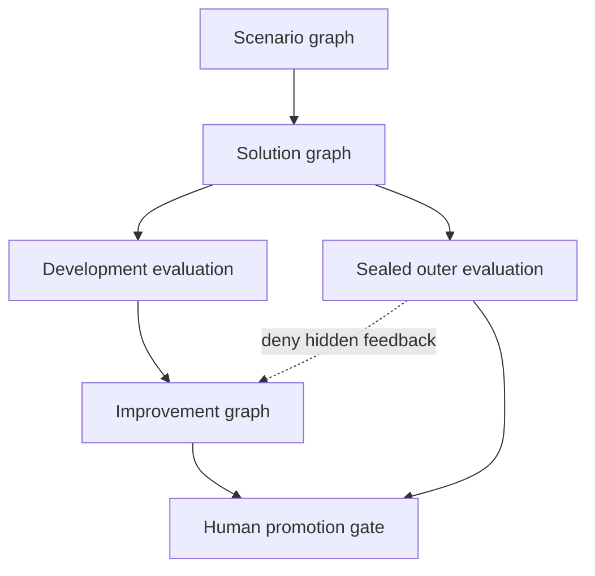

# Engineering DAGs and DueCare-style harnesses

**Status:** executable mechanism foundation, researched and updated 2026-08-12.

This document turns the universal graph model into a practical engineering
coverage plan. The repository now has an open 95-category task taxonomy, 31
dependency-free executable programs, 247 executable node definitions, and a
strict six-graph evaluation-harness bundle. Seven of the programs are new
showcases for geotemporal enrichment, user journeys, synthetic tabular data,
synthetic LLM curricula, grounded document extraction, reinforcement learning,
and LLM evaluation/red teaming.

The claim that a finite catalogue can cover 90–95% of engineering work is a
**coverage hypothesis**, not a measured result. The catalogue is deliberately
multi-label, hierarchical, and replaceable. Unseen work should compose existing
obligations, add a namespaced category, or introduce a typed adapter without
changing compiler semantics.

## The coverage model

Do not create one rigid template for every apparent use case. Describe a task on
two independent axes:

1. **Operation family:** acquire, prepare, integrate, generate, learn, evaluate,
   serve, operate, govern, or involve a human.
2. **Context and modality:** tabular, temporal, geospatial, geotemporal, event,
   document, image, audio, code, graph, model, LLM, agent, service, or UI.

Then attach cross-cutting contracts for security, privacy, provenance,
freshness, cost, latency, human approval, and evaluation isolation. For example,
“validate a city on a date and add local events” becomes:

`prepare.normalize + prepare.verify + integrate.enrich.geospatial +
integrate.enrich.temporal + integrate.enrich.geotemporal + govern.provenance`

This is more reusable than a monolithic `city-event-enricher` category.

### Seed task catalogue

The checked-in registry contains 95 seed categories under ten roots. Counts
include each root itself.

| Root | Count | Representative obligations |
|---|---:|---|
| `dag.acquire` | 5 | batch, stream, web/API, document/media ingestion |
| `dag.prepare` | 13 | parse, schema, profile, clean, impute, outlier handling, conflict resolution, verify, normalize, deduplicate, entity resolution, split |
| `dag.integrate` | 10 | join, reconcile, aggregate, temporal, geospatial, geotemporal, identity, and knowledge enrichment |
| `dag.generate` | 10 | synthetic tabular/text/media/adversarial data, augmentation, labels, scenarios, reports |
| `dag.learn` | 25 | features, linear/tree/boosted-tree/neural/transformer/tabular-attention/RL models, regression, classification, ranking, forecasting, clustering, anomaly, graph, causal, LLM, RAG, fine-tuning |
| `dag.evaluate` | 13 | data/model/software regression/metamorphic/judge/LLM/RAG/agent/safety/human/online/outer evaluation |
| `dag.serve` | 7 | API, frontend, backend, plugin/skill/tool, automation, deployment |
| `dag.operate` | 4 | observation, incidents, migration/backfill |
| `dag.govern` | 5 | privacy, security, compliance, provenance |
| `dag.human` | 3 | annotation, review, approval |

Categories guide retrieval and starting-point selection. They never grant a
node authority, make incompatible ports compatible, or bypass an oracle.

### Reusable context overlays

| Overlay | Cheap fingerprint attributes | Typical route changes |
|---|---|---|
| Tabular | rows, columns, types, nulls, cardinality, skew, correlation, duplicate rate, target shape | parser, imputer, encoder, splitter, learner, calibrator |
| Temporal | timezone, granularity, gaps, seasonality, lag, event-time/processing-time split, late-data rate | timezone resolution, as-of join, window, watermark, temporal split |
| Geospatial | address completeness, CRS, geometry type, match ambiguity, boundary version, H3 resolution | canonicalizer, geocoder, spatial predicate, nearest-neighbor fallback, boundary gate |
| Geotemporal | spatial attributes plus effective interval, local date, DST ambiguity, event validity | timezone-aware as-of spatial join and correction policy |
| Event/journey | identity stability, ordering, duplicates, session gap, transition sparsity, censoring | sessionizer, state model, funnel, anomaly branch |
| Document | format, page count, OCR need, layout complexity, table density, language, source blocks | parser/OCR/layout route, schema projection, grounding gate |
| LLM/agent | turns, tools, context size, language, consequence, attack family, judge agreement | scenario mix, solver, deterministic graders, blinded panel, approval barrier |
| Service/UI | API/schema version, state, retries, accessibility, browser/device, rollout risk | contract test, adapter, canary, synthetic transaction, rollback |

## Executable showcases

Each showcase is network-free and dependency-free. It exposes two candidates
per semantic slot: a compiler-valid negative control and a stricter route that
passes an independent verifier. The fixtures prove graph mechanics; they do not
claim production accuracy, official-data authority, privacy guarantees, or
benchmark superiority.

| Example | Slots | Demonstrated flow | Passing route verifies |
|---|---:|---|---|
| `geotemporal-enrichment` | 5 | normalize → reference match → timezone → time features → city/date context | canonical address, explicit local-fixture authority, UTC conversion, provenance-bearing event join |
| `user-journey-modeling` | 5 | normalize/dedupe events → sessionize → transitions → funnel → anomalies | ordered sessions, funnel completion, impossible-flow finding |
| `synthetic-tabular-augmentation` | 6 | profile → aggregate latent world → generate → constraints → privacy/utility screens → lineage split | valid novel rows, utility thresholds, explicit absence of formal privacy claim, untouched holdout |
| `synthetic-llm-curriculum` | 7 | facts → multi-view examples → counterfactuals → hard negatives → benign controls → family split → gates | fact support, family isolation, lineage, no hidden chain-of-thought target |
| `grounded-document-extraction` | 6 | detect → parse layout → extract → ground → schema gate → provenance | field values tied to exact source blocks and digest |
| `reinforcement-learning-loop` | 5 | validate environment → generate policies → estimate → select → outer comparison | finite fixture environment, explicit policy choice, holdout not used for selection |
| `duecare-llm-evaluation-harness` | 7 | scenarios → SUT → deterministic grades → blinded panel → claims → improvement proposal → sealed receipt | direct/benign/adversarial cases, atomic scores, judge disagreement, prohibited claims, feedback firewall |

Run them through the bounded child-process adapter:

```bash
solutiongraph examples run geotemporal-enrichment --runtime subprocess
solutiongraph examples run user-journey-modeling --runtime subprocess
solutiongraph examples run synthetic-tabular-augmentation --runtime subprocess
solutiongraph examples run synthetic-llm-curriculum --runtime subprocess
solutiongraph examples run grounded-document-extraction --runtime subprocess
solutiongraph examples run reinforcement-learning-loop --runtime subprocess
solutiongraph examples run duecare-llm-evaluation-harness --runtime subprocess
```

Use `--route all --json` to retain the negative control and successful route as
separate evidence. The subprocess runtime remains lifecycle isolation, not a
hostile-code sandbox.

## DueCare-style evaluation architecture

A trustworthy harness is a bundle of separately compiled graphs. It is not one
self-grading DAG and not a loop in which the candidate can inspect its hidden
exam.



The checked-in `HarnessBundle` records exact program and registry digests,
candidate visibility, authorities, artifact flows, development and holdout
cases, isolation requirements, and claim scope. Its validator enforces:

- separate scenario, solution, development-evaluation, improvement,
  promotion, and outer-evaluation authorities;
- candidate invisibility for the outer evaluator;
- disjoint development and holdout case IDs;
- an explicit deny-only outer-evaluation-to-improvement firewall;
- no full hidden-artifact flow into any candidate-visible graph;
- human approval for promotion authority; and
- separation of improvement proposal from promotion approval.

### Graph responsibilities

| Graph | May do | Must not do |
|---|---|---|
| Scenario | construct versioned direct, benign, adversarial, metamorphic, multilingual, multi-turn, tool-use, and distribution-shift cases | silently mutate the task contract or reveal a sealed case |
| Solution/SUT | execute the candidate model, agent, tool, RAG, or ordinary engineering route | write or select its own evaluator |
| Development evaluation | run deterministic checks, fixed rubrics, judge panels, and failure attribution on development cases | claim generalization to the sealed split |
| Improvement | cluster failures and propose prompts, nodes, routes, policies, data, or budgets | approve itself or read hidden outer cases/judgments |
| Promotion | compare fixed evidence to policy and request accountable human approval | generate the proposal it approves |
| Sealed outer evaluation | run candidate-unreadable holdouts under a remote or microVM trust boundary | return raw hidden prompts or exploitable per-case feedback to the optimizer |

The bundled outer boundary is a **metadata contract and fixture**. This
repository does not provide the microVM/remote enforcement that the production
boundary declares.

### Evaluation ladder

Use the cheapest independent evidence first, preserving every atomic result:

1. Structural checks: parseability, schema, tool-call arguments, citations,
   latency, cost, refusal shape, and prohibited-string leakage.
2. Task-specific deterministic checks: exact facts, numerical tolerances,
   executable tests, state invariants, or reference matches.
3. Property and metamorphic checks: paraphrase, ordering, irrelevant-context,
   scale/unit, locale, timezone, and equivalent-input invariance.
4. Blinded rubric graders: multiple families where possible, randomized order,
   explicit abstention, and retained disagreement.
5. Calibrated human review: high-consequence cases, judge disagreements, novel
   failure clusters, and promotion decisions.
6. Sealed outer evaluation: never used to tune the candidate whose claim it
   supports.

An LLM judge is an ordinary nondeterministic node, not ground truth. Record its
model/provider, prompt digest, sampling configuration, candidate visibility,
rubric, inputs, outputs, abstention, and cost. Evaluate judges against
human-labeled calibration cases and adversarial judge cases before assigning
them promotion weight.

### Red-team scenario matrix

The scenario graph should generate a balanced, versioned matrix instead of only
the most spectacular attacks.

| Dimension | Suggested strata |
|---|---|
| Intent | direct task, benign neighbor, ambiguous request, clearly disallowed request |
| Attack | instruction conflict, prompt injection, indirect hostile document, encoding/obfuscation, multi-turn escalation, tool-result poisoning |
| Capability | knowledge, reasoning, coding, retrieval, tool use, state, multimodal, refusal/recovery |
| Context | no context, clean retrieval, stale retrieval, conflicting sources, irrelevant distractor, excessive context |
| Population | language, locale, accessibility, domain-expert and general-user formulations |
| Consequence | reversible low impact, costly reversible, irreversible/high impact, human-approval required |
| Regression | prior failures, fixed benign controls, metamorphic siblings, newly generated cases, sealed holdouts |

Red-team outputs should be analyzed before governance or product decisions.
Case count, attack novelty, or a high attack-success rate alone is not evidence
of either system safety or red-team quality.

### Feedback without leakage

The improvement graph receives development failures and, at most, policy-safe
aggregate/digest outer signals. A useful improvement record contains:

- parent candidate/graph digest and exact evidence receipt IDs;
- failure cluster and affected task obligations;
- proposed mutation operator and changed slots;
- expected benefit, information gain, cost, and new risk;
- compiler/admission result;
- development evaluation result; and
- separate promotion decision with human identity when required.

Never feed raw hidden cases, reference answers, grader rationales that reveal
answers, or per-case outer scores into proposal generation. Retain a fresh
outer split for each material campaign generation.

## Common engineering DAG recipes

These are semantic obligations, not mandated products or libraries.

### Data cleaning and verification

`snapshot → parse → infer/validate schema → profile → normalize → detect issues
→ repair/quarantine → deduplicate/entity-resolve → post-repair checks → publish
with lineage`

Useful interchangeable nodes include strict/coercing parsers, deterministic and
model-assisted semantic typing, simple/multiple/model-based imputation,
univariate/multivariate outlier detection, constraint repair, conflict
resolution, exact/fuzzy/entity-graph deduplication, and sampling/full-scan
validators. Keep detection separate from repair and verify a second pass is
idempotent. One check should express one property where practical.

### Data merging, reconciliation, and enrichment

`normalize keys → generate candidates → score matches → resolve ambiguity →
join/as-of join → reconcile conflicts → validate cardinality → field-level
provenance → quarantine`

Record expected join cardinality, orphan rate, fan-out explosions, top-two
match margin, source authority, freshness/effective interval, license, and the
resolution rule for every conflicting field. A source connector is an effectful
node with explicit network, credential, cost, rate-limit, and retention policy.

### GIS and time enrichment

Split the work into explicit obligations:

1. Parse and canonicalize name/address/city/state/postal components.
2. Match against a named, versioned authority and preserve candidates.
3. Distinguish `matched by an address-range geocoder` from `verified physical
   structure or deliverability`.
4. Attach coordinates, match precision, geography vintage, source, and license.
5. Validate CRS and run the declared spatial predicate or nearest-neighbor rule.
6. Resolve timezone and DST ambiguity from the spatial result.
7. Convert event time, not ingestion time, and retain both.
8. Perform an as-of spatial/temporal join against versioned events or boundaries.
9. Re-run boundary, freshness, and impossible-travel checks.

H3 is useful for candidate generation, partitioning, and multi-resolution
aggregation, but geographic containment is approximate. Exact boundary claims
need a geometry predicate against an authoritative geometry and CRS.

### User actions and flows

`validate event schema → deduplicate → identity stitch → event-time order →
sessionize → state transitions → funnel/retention/cohort → anomaly/path mining →
privacy gate → aggregate artifact`

Make session gaps, allowed lateness, identity confidence, censoring, bot policy,
and state-machine invariants explicit. Keep raw user-level events out of broad
optimizer history; store approved aggregates and data-family identities.

### Backend, frontend, plugin, and skill workflows

- Backend: API contract → authentication/authorization → business state
  transition → persistence/outbox → idempotency/retry → observability →
  contract/integration/load/security checks.
- Frontend: route/state model → component/render → accessibility → interaction
  journey → visual/DOM regression → browser/device matrix → telemetry and
  rollback.
- Plugin/skill/tool: capability manifest → input schema → permission decision →
  execution → output schema → side-effect receipt → adversarial argument tests →
  revocation/version compatibility.

Effectful actions should use explicit approval, idempotency, compensation, and
post-action verification. Optimization cannot grant permission.

## ML, synthetic data, and reinforcement learning

### Model-family routes

The taxonomy now distinguishes linear, tree, boosted-tree, neural, transformer,
tabular-attention, ensemble, uncertainty, and reinforcement-learning routes.
Treat these as candidate families under common feature, split, metric, policy,
and resource contracts. Add task-specific families such as survival, graph
neural network, recommender, or Bayesian model as namespaced extensions.

Split before fitting any data-dependent transform. Group, entity, time, or
geography-aware splits should prevent near-duplicate and family leakage.
Feature engineering, imputation, scaling, selection, calibration, and model
fitting need a train-only fit boundary and an untouched final evaluation.

### Synthetic tabular and non-tabular data

Use a gated augmentation graph:

`authorize source → profile/constraints → choose generator → condition/sample →
schema and logical gates → duplicate/memorization/privacy audits → subgroup and
tail coverage → train-on-synthetic/test-on-real utility → lineage-aware split →
human/policy approval`

Separate at least four objectives:

- fidelity to useful marginal and joint structure;
- coverage of rare, tail, boundary, and adversarial strata;
- downstream utility on untouched real data; and
- privacy risk under an explicit threat model.

Statistical similarity or a generic privacy metric is not a formal privacy
guarantee. If differential privacy is claimed, record the mechanism,
accountant, adjacency definition, epsilon/delta, composition, clipping, and
threat model. Generated examples retain source/license lineage and must not
silently cross task-family or holdout boundaries.

### Synthetic LLM training and testing

Prefer a fact-first curriculum:

`approved facts/policies → multiple task views → controlled transforms → hard
negatives/counterfactuals → benign controls → answer/rationale policy → family
split → fact/license/privacy/duplication gates → SFT/preference/RL data → sealed
evaluation`

Keep instruction, response, preference, critique, tool trace, safety label, and
provenance as distinct typed artifacts. Do not train on hidden evaluator cases,
grader answer keys, or private chain-of-thought. Measure novelty and real-task
utility; volume alone is not success.

### Reinforcement learning

Model environment validation, policy proposal, rollout/trajectory collection,
reward computation, policy update, off-policy evaluation, safety constraints,
and outer evaluation as separate graphs or bounded structured nodes. Freeze the
environment/version, seed policy, reward function, action authority, horizon,
termination/truncation meaning, and data split. Reward-model or LLM-judge
changes create a new evaluator identity.

The local RL example uses a finite fixture only. Real online RL requires an
external environment, budget enforcement, rollback/kill switches, and human
approval for consequential actions.

## Document inputs and outputs

The grounded document example separates parsing from extraction and extraction
from grounding:

`ingest bytes → detect type → OCR/layout/table parse → canonical document model
→ extract candidates → tie values to source spans/blocks → validate output
schema → render/export → round-trip and provenance checks`

Adapters such as Docling can populate the canonical document artifact, while
the graph retains exact parser/model/configuration identities. OCR confidence,
reading order, table cells, page coordinates, and source hashes should survive
into the verifier. For generated PDF/DOCX/HTML outputs, add visual rendering,
accessibility, link, schema, and round-trip checks rather than accepting file
creation as success.

## Extending the project safely

1. Add or reuse a multi-label task category; do not branch compiler behavior on
   the label.
2. Define one semantic slot per independently replaceable obligation with exact
   ports, cardinality, success contract, effects, and authority.
3. Author multiple source-bound nodes and finite parameter bindings. Include an
   honest negative control when it is useful for teaching or benchmarking.
4. Compile against the complete registry snapshot. Search budgets may limit
   evaluation but not candidate visibility.
5. Add independent positive, negative, boundary, metamorphic, and holdout cases.
6. Package exact task/program/registry/node/case/oracle closure and preserve
   receipts for every attempted route.
7. Add history only as a prior: retain random/history-blind starts, measure
   negative transfer, and allow quick abandonment of bad historical routes.
8. For effectful, LLM, or generated-code work, declare trust boundaries and
   external enforcement rather than implying the Python runtime supplies them.

The main extension surfaces are:

| Surface | Current object |
|---|---|
| Task taxonomy | `TaskCategoryRegistry` |
| Task/data similarity | `TaskFingerprint`, `TaskEmbedding`, similarity channels |
| Historical starts and effort | `HistoricalMemory`, `HistoryInformedPlanner`, `EffortPolicy` |
| Atomic implementations | `NodeSpec`, `Candidate`, node packs and registries |
| Graph meaning | `ProgramGraph`, semantic slots, templates, topology families |
| Runtime integration | `RuntimeAdapter`, artifact stores, checkpoints, provenance |
| Controlled evidence | task/solution packs, benchmark suites, independent oracles |
| Linked harnesses | `HarnessBundle`, `HarnessGraph`, `HarnessFlow` |

## Prioritized next increments

### P0 — deepen the local reference packs

- Add executable cleaning/imputation/conflict-resolution, temporal-windowing,
  GIS boundary, API-contract, frontend journey, and document-render examples.
- Promote shared showcase operations into focused reusable node packs with
  discovery descriptors instead of one teaching registry.
- Package the seven showcases as immutable task/solution packs and benchmark
  suites with repeated seeds and holdouts.
- Add harness receipt schemas for atomic judgments, judge panels, failure
  clusters, promotion decisions, and sanitized outer summaries.

### P1 — explicit external adapters

- Census Geocoder plus authoritative boundary/vintage adapters, IANA timezone
  data, GeoPandas/OGC predicates, and optional H3 indexing.
- Great Expectations, Dagster, dbt, or equivalent contract/result adapters;
  Beam-compatible event-time/window semantics.
- Docling-backed document conversion; mature tabular/ML/synthetic-data nodes;
  Inspect-compatible tasks/scorers and PyRIT-compatible red-team scenarios.
- OpenTelemetry trace/metric/log projection and production artifact/registry
  backends.

Every adapter must snapshot external identity, expose effects and permissions,
and distinguish connector availability from task success.

### P2 — production evidence and enforcement

- Candidate-unreadable remote or microVM evaluation, network/filesystem policy,
  secrets isolation, quotas, retention, and audit identity.
- Human review queues, appeals, multi-party promotion, policy versions, and
  rollback/revocation.
- Cross-project benchmarks to measure catalogue coverage, historical-transfer
  lift, negative transfer, cost/latency, reliability, and subgroup performance.
- Drift-triggered re-evaluation and holdout rotation without contaminating the
  optimizer.

## Research anchors

The implementation borrows patterns, not dependencies, from the following
primary sources:

- [DueCare harness pattern](https://github.com/TaylorAmarelTech/duecare/blob/main/docs/harness_pattern.md) and [capability-gap blueprint](https://github.com/TaylorAmarelTech/duecare/blob/main/docs/architecture/capability_gap_blueprint.md): uniform harness contracts, evidence planes, feedback loops, and explicit capability gaps.
- [NIST AI 600-1](https://nvlpubs.nist.gov/nistpubs/ai/NIST.AI.600-1.pdf): context-specific red teaming, structured human feedback, post-hoc effectiveness checks, and integration into risk-management improvement.
- [Inspect AI tasks](https://inspect.aisi.org.uk/tasks.html): reusable evaluation tasks composed from datasets, solvers, and scorers.
- [PyRIT](https://github.com/Azure/PyRIT) and [OpenAI Evals](https://github.com/openai/evals): reusable red-team/evaluation orchestration and registry patterns.
- [Census Geocoder](https://geocoding.geo.census.gov/geocoder/): programmatic address-to-geography matching; match authority must remain explicit.
- [GeoPandas spatial joins](https://geopandas.org/en/stable/docs/reference/api/geopandas.sjoin.html), [H3 indexing caveat](https://h3geo.org/docs/highlights/indexing/), [IANA Time Zone Database](https://www.iana.org/time-zones), and [OGC Simple Features](https://www.ogc.org/standards/sfa/): explicit spatial predicates, CRS/time identity, and approximate-versus-exact boundaries.
- [Apache Beam programming guide](https://beam.apache.org/documentation/programming-guide/): event time, watermarks, triggers, lateness, and completeness/latency/cost tradeoffs.
- [Dagster asset checks and data contracts](https://docs.dagster.io/guides/test/data-contracts), [Great Expectations Checkpoints](https://docs.greatexpectations.io/docs/core/trigger_actions_based_on_results/create_a_checkpoint_with_actions/), and [dbt model contracts](https://docs.getdbt.com/docs/mesh/govern/model-contracts): independently executable data-property checks and contract gates.
- [SDV quality evaluation](https://docs.sdv.dev/sdv/evaluation/data-quality) and [SDMetrics privacy metrics](https://docs.sdv.dev/sdmetrics/data-metrics/privacy): separate validity, statistical quality, utility, and privacy evidence.
- [scikit-learn leakage guidance](https://scikit-learn.org/stable/common_pitfalls.html): split before data-dependent preprocessing and preserve untouched evaluation data.
- [Docling document converter](https://docling-project.github.io/docling/reference/document_converter/): configurable multi-format conversion into a canonical document artifact.
- [Gymnasium environment API](https://gymnasium.farama.org/api/env/) and [Hugging Face TRL](https://huggingface.co/docs/trl/index): explicit environment/trajectory and post-training algorithm seams.
- [Self-Instruct](https://arxiv.org/abs/2212.10560): bootstrapped instruction-data generation with filtering; useful as a generator pattern, not an automatic quality guarantee.

## Claim boundary

The new artifacts demonstrate composability, strict validation, negative
controls, subprocess execution, independent fixture verification, and a
feedback-firewall contract. They do **not** establish production GIS/address
accuracy, real model-training lift, formal privacy, robust red-team coverage,
hostile-code isolation, regulatory compliance, or empirical 90–95% use-case
coverage. Those claims require the external adapters, enforcement, and
controlled benchmark evidence described above.
