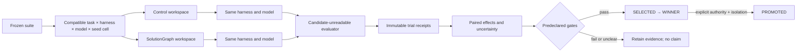

# LLM coding-agent A/B benchmark arena

This repository now contains an executable, harness-neutral arena for measuring
whether SolutionGraph context helps a coding model produce accepted solutions.
It is deliberately an experiment system rather than a leaderboard: the task,
prompt, public case, sealed evaluator, harness, model, budget, seed, and
repetition are frozen, while the treatment arm alone receives digest-pinned
SolutionGraph context.

The bundled smoke runs ten task families and twenty paired fixture trials in a
few seconds. It validates workspace construction, context separation, harness
delivery, sealed-case scoring, artifact diagrams, append-only receipts,
paired analysis, and offline reporting. The fixture calls no model and cannot
support an efficacy claim. Real model evidence begins only after an operator
enables pinned command harnesses and provides an enforcing isolation boundary.

## Ten diverse task families

| Task ID | Engineering problem | Independent score | What varies |
|---|---|---|---|
| `agent-task.data-cleaning` | Normalize and deduplicate customer rows | Exact cleaned record set | Missing values, names, phones, duplicate evidence |
| `agent-task.data-conflict-validation` | Reconcile claims without hiding disagreement | Exact resolved/conflict ledger | Source confidence, ties, missing claims |
| `agent-task.geotemporal-enrichment` | Add place and local-time attributes | Exact enrichment and error set | City/state/ZIP validity, time zones, DST |
| `agent-task.tabular-regression` | Fit a deterministic linear regressor | RMSE-derived score and threshold | Feature scales, intercepts, multiple features |
| `agent-task.imbalanced-classification` | Select a threshold under class imbalance | F1 and minority recall | Score distributions, ties, rare positives |
| `agent-task.time-series-forecast` | Forecast a dated numeric series | MAE-derived score and threshold | Trend, level, short histories |
| `agent-task.grounded-document-extraction` | Extract claims with source anchors | Exact grounded records | Multiple sections, absent claims, citations |
| `agent-task.idempotent-webhook` | Model retry-safe backend event handling | Exact action/state ledger | Duplicates, ordering, conflicts, failures |
| `agent-task.llm-evaluation-harness` | Aggregate blinded DueCare-style judgments | Exact gates and sanitized feedback | Judge disagreement, severity, holdout boundaries |
| `agent-task.graph-experiment` | Compare compatible control/mutated DAG routes | Exact compatibility, Pareto, and champion set | Invalid wiring, quality/latency/cost tradeoffs |

Every task has one candidate-readable development case and at least two cases
that are absent from the candidate workspace. The checked-in task catalog
publishes only case digests, not sealed payloads or expected values. Because the
reference evaluator still lives in this checkout, “sealed” is a lifecycle
boundary, not confidentiality from hostile same-host code.

## Experimental unit



The prompt text is identical across arms. Both arms receive the same task
contract, starter file, public case, public test, artifact requirements, model,
harness, budget, seed, and repetition. Only the treatment workspace contains a
`context/` pack with repository protocols, a matching template, a task
fingerprint, randomized sprouts, and a task graph. Pair order is deterministically
counterbalanced to reduce a simple control-first time bias.

Context proposes starts; it never grants an import, capability, valid state, or
accepted score. Static checks, protected-file digests, fresh evaluation
processes, deterministic replay, sealed cases, and task oracles remain
independent gates.

## Five-minute mechanism test

```bash
python -m pip install -e ".[dev]"
solutiongraph agent-bench tasks
solutiongraph agent-bench smoke --output .artifacts/agent-benchmark-smoke
solutiongraph agent-bench journal-verify \
  .artifacts/agent-benchmark-smoke/trial-receipts.jsonl
```

Or use the Python example:

```bash
python examples/agent_benchmark_quickstart.py \
  --output-dir .artifacts/agent-benchmark-smoke-python
```

Open `report.html` directly. It contains acceptance by task, overall paired
effects, validity threats, evidence identities, SVG task diagrams, and the
underlying Mermaid projections. Treat `report.json` and the hash-chained JSONL
receipts as the evidence authority; HTML and diagrams are explanatory views.

## Configure real harnesses and models

Generate an editable strict suite:

```bash
solutiongraph agent-bench example-config \
  --output agent-benchmark.local.json
solutiongraph agent-bench plan agent-benchmark.local.json
```

The example includes disabled adapters for OpenCode, Aider, and an arbitrary
private CLI, plus disabled small, medium, large, and frontier model profiles.
Edit the JSON to:

1. pin the exact harness version and model revision;
2. replace model labels and scalar settings;
3. enable intended harnesses and models;
4. declare `compatible_model_ids` for each harness;
5. list only credential environment-variable names that harness needs;
6. set wall-time, output, context, token, and cost budgets;
7. use at least three seeds/repetitions for an initial real comparison;
8. choose an honest claim scope and record limitations;
9. keep promotion disabled until an external trust boundary exists.

Previewing the full allocation has no side effects. Running a command harness
requires an explicit acknowledgement:

```bash
solutiongraph agent-bench run agent-benchmark.local.json \
  --output .artifacts/agent-benchmark-real \
  --allow-external
```

`--max-trials N` is an explicit pilot budget. The manifest records every
unvisited trial and the report is partial; it does not silently convert a pilot
into a complete experiment.

OpenCode documents its headless `opencode run`, `--model`, `--dir`, `--file`,
and structured-output flags in its [official CLI reference](https://opencode.ai/docs/cli/).
Aider documents `--model`, `--message-file`, and automation flags in its
[official options reference](https://aider.chat/docs/config/options.html).
Pin and locally verify the installed versions because a command example is not
a compatibility guarantee. Other systems—including private CLIs or model
wrappers—use the generic no-shell `command_argv` adapter; names have no special
authority inside the core.

Harnesses may write `agent-usage.json` with any of `input_tokens`,
`output_tokens`, `total_tokens`, `cost_units`, and `tool_calls`. These become
receipt metrics. Reported input/output/cost values above the frozen limits make
the trial ineligible. Provider-enforced limits and billing still require
provider evidence; a local declaration alone is not enforcement.

## Evidence and analysis

Each trial advances only through the ordered prefix:

```text
ATTEMPTED → DELIVERED → VALID → SCORED → ACCEPTED
```

Selection is a separate event derived from immutable receipts:

```text
SELECTED → WINNER → PROMOTED
```

A candidate never edits its receipt, evaluator, protected task files, or prior
history. The local journal fsyncs every record and chains its content digest.
It is tamper-evident local storage, not authenticated WORM storage.

The report pairs exact task/harness/model/seed/repetition cells and computes:

- accepted-run rate;
- task-oracle score;
- wall-clock seconds, oriented so lower is better;
- development and sealed-case pass rates;
- deterministic-replay rate;
- artifact, documentation, diagram, and protected-file completeness;
- optional usage/cost metrics in individual receipts;
- deterministic bootstrap intervals, win/tie rates, a suite-wide default
  practical-effect gate, and metric-specific overrides such as a wider
  `wall_seconds` margin for scheduler noise.

Task-level effects prevent one easy family from hiding failures elsewhere.
Overall effects answer only for the sampled suite. “Practically equivalent”
means the interval lies within the declared effect margin; “inconclusive” is
not evidence of equality. A winner requires quality superiority without
acceptance inferiority. Promotion additionally requires explicit suite
authorization, a non-fixture claim scope, and every supporting receipt to name
an enforcing `microvm` or `remote` isolation class.

Wall time can be noisy and external model aliases can drift. Declare a
`practical_effects.wall_seconds` override in the frozen suite, use pinned
revisions where the provider supports them, counterbalanced paired cells,
multiple seeds, comparable concurrency, warm-up policy, and a recorded runner
environment. Do not normalize regret across unrelated metrics unless the
normalization and attainable reference are defensible.

## Notebook workflow

`notebooks/06_llm_harness_ab_arena.ipynb` walks through:

1. inspecting the ten task contracts and Mermaid graphs;
2. examining the frozen compatible matrix;
3. materializing one control/treatment pair and checking identical prompt
   digests plus distinct context digests;
4. running the twenty-trial deterministic smoke;
5. loading receipt/report JSON and plotting a small text summary;
6. generating an editable real-harness suite without executing it.

The notebook is deliberately stdlib-only and safe for CI. It does not call a
model, install a harness, use credentials, or claim an uplift.

## Connecting public, open-ended, and Kaggle-style tasks

The ten local tasks test common engineering mechanisms quickly. They should be
supplemented—not relabeled—with external benchmark adapters:

- Kaggle or [MLE-bench](https://github.com/openai/mle-bench) for end-to-end ML
  engineering. MLE-bench defines 75 Kaggle competitions, an agent-agnostic
  interface, container tooling, and grading commands. Its guidance recommends
  repeated seeds. Dataset licenses, Kaggle credentials, download, execution,
  and submission remain outside this repository's side-effect-free manifest
  adapter.
- [SWE-bench](https://www.swebench.com/SWE-bench/guides/evaluation/) for
  repository patches graded by containerized tests. Keep issue text, base
  commit, patch, image, tests, and scorer identities frozen per cell.
- DueCare-style LLM evaluation and red teaming for linked scenario,
  solution, development-evaluation, improvement, promotion, and sealed outer
  graphs. Preserve atomic judgments, blinded panels, failure clusters,
  aggregate-only outer feedback, and human deployment authority.
- Internal open-ended pipelines for GIS/time enrichment, document processing,
  synthetic data, RL, APIs, or frontend systems. Define a portable task bundle
  with candidate-readable development cases and externally owned sealed cases,
  then pass it to `run_agent_benchmark(..., tasks=...)`.

For Kaggle-style work, score both outcome and engineering quality: official
competition metric, accepted submission, reproducibility, data leakage checks,
runtime, cost, determinism, artifact closure, and policy compliance. Never use
public leaderboard feedback as a hidden holdout, and never let the candidate
write the grading code.

## Operator and test-agent runbook

Before execution:

- inspect `solutiongraph agent-bench plan` and confirm no accidental Cartesian
  explosion or incompatible harness/model pair;
- freeze the source revision, suite digest, task/evaluator digests, model and
  harness revisions, settings, tools, credentials by variable name, budgets,
  isolation, and concurrency policy;
- keep the prompt and public materials identical across paired arms;
- move sealed evaluators and inputs outside the candidate host for adversarial
  code;
- predeclare practical-effect, noninferiority, winner, and promotion gates;
- run the fixture smoke and verify its expected equivalence result.

During execution:

- do not edit an allocated workspace, suite, or evaluator;
- retain failures, timeouts, invalid outputs, usage evidence, and partial runs;
- avoid sharing candidate artifacts between arms;
- stop only at a declared safety/resource gate, not because results look bad;
- record external incidents or provider drift as limitations.

After execution:

- verify the journal before reading aggregate conclusions;
- compare task-level and overall paired intervals, not just averages;
- inspect sealed-case, determinism, and protected-integrity metrics;
- review code and diagrams as artifacts, never as proof of correctness;
- publish the suite, source identities, run manifest, receipts, report, and
  limitations needed to reproduce the claim;
- keep `PROMOTED` behind a human or production policy authority.

## Current limits

- The core invokes command harnesses but does not install, authenticate, or
  certify OpenCode, Aider, private agents, model providers, Kaggle, or graders.
- The built-in evaluator uses fresh processes and reduced environments for
  lifecycle isolation. It is not safe against hostile generated code.
- Sealed repository cases are absent from trial workspaces but are visible to a
  process that can traverse the checkout. Real confidential holdouts need a
  remote evaluator or microVM boundary.
- Static import checks are quality gates, not a security mechanism.
- The smoke's reference implementation bypasses candidate execution for speed;
  it tests benchmark plumbing, not candidate behavior or model quality.
- Model size labels are operator metadata. The framework infers no capability
  from `small`, `large`, or `frontier`.
- No external model experiment or Kaggle submission is checked into this
  repository, so no model ranking or SolutionGraph uplift is claimed here.
