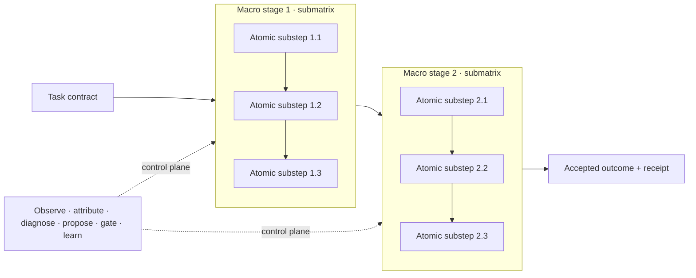
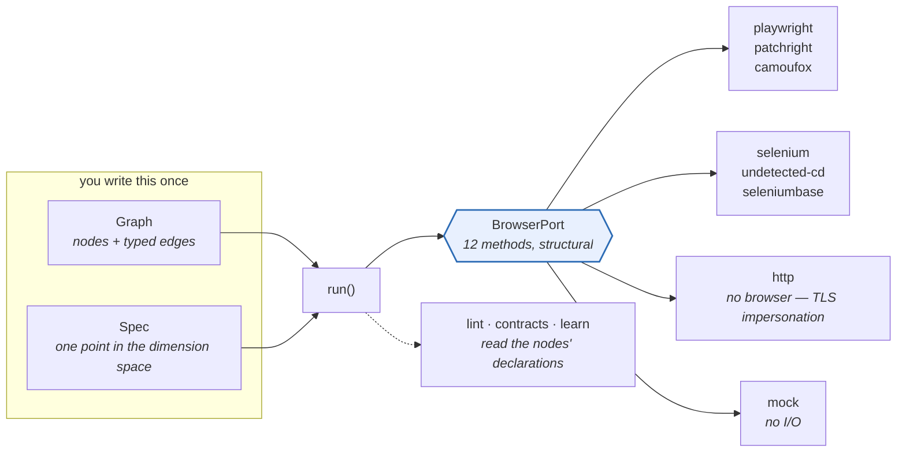
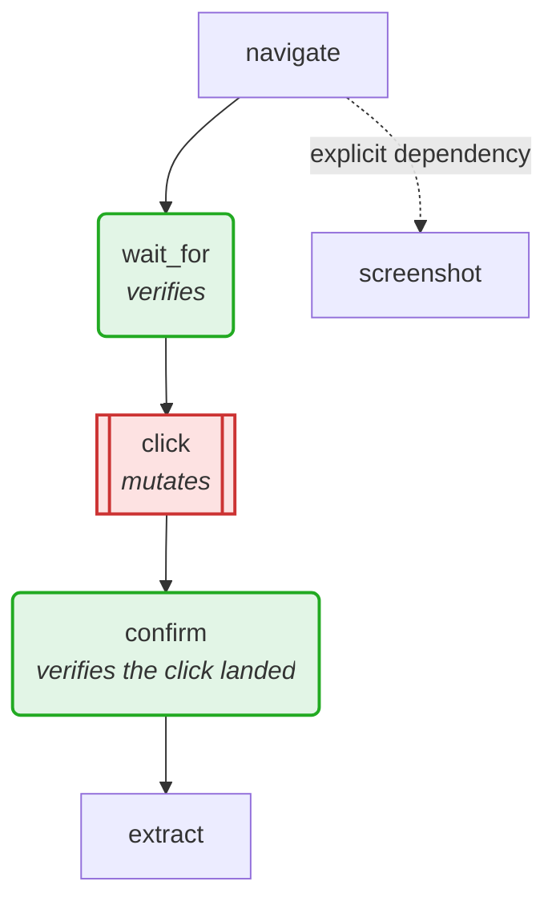

# Universal Node Graph — Flexible Solutioning

[](https://github.com/Amarel-Taylor-Scott/universal-node-graph-flexible-solutioning/actions/workflows/ci.yml)
[](LICENSE)
[](https://www.python.org/)
[](pyproject.toml)
[](READINESS.md)
[](https://www.kaggle.com/code/taylorsamarel/browsergraph-composable-browser-automation)

Version 0.6 is a working developer preview of a different way to build software:
compile each task into an ordered graph search space, expose every compatible
implementation for every atomic substep, and learn which complete route best
satisfies the task's quality, speed, cost, reliability, and policy objectives.

It is ready for typed graph modeling, trusted local experiments, coding-harness
integration, and extension development. It is not a production multi-tenant
platform or a hostile-code sandbox. The exact supported, experimental, and
unavailable surfaces are listed in [READINESS.md](READINESS.md).

## Start in five minutes

```bash
git clone https://github.com/Amarel-Taylor-Scott/universal-node-graph-flexible-solutioning.git
cd universal-node-graph-flexible-solutioning
python -m pip install -e .
solutiongraph doctor
python examples/control_vs_mutated_graph_experiment.py
```

That last command builds a fixed one-node control graph and a two-node mutation,
admits two routes in the control topology and four in the mutation, executes all
six under the same verifier, and reports the accepted Pareto/champion evidence.
It runs locally with no optional dependency or network call. Read
[the graph-experiment guide](GRAPH_EXPERIMENTS.md) to switch from exhaustive
grid execution to bounded beam, seeded sprouts, learned priors, or additional
topology mutations.

Choose a path:

- **Try examples:** [examples/README.md](examples/README.md)
- **Build a task or node:** [GETTING_STARTED.md](GETTING_STARTED.md)
- **Understand the architecture:** [UNIVERSAL_NODE_GRAPH_SPEC.md](UNIVERSAL_NODE_GRAPH_SPEC.md)
- **Find the right guide:** [DOCUMENTATION.md](DOCUMENTATION.md)
- **Read the repository-wide review:** [CODE_REVIEW_2026-08-12.md](CODE_REVIEW_2026-08-12.md)

The framework does not prescribe a fixed six-step pipeline or a fixed node
catalogue. Macro stages and atomic substeps are task data; node definitions,
parameter bindings, contracts, routes, objectives, and feedback are separate
typed objects that can grow without redesigning the viewer or compiler.

The `solutiongraph` package is the domain-neutral compiler core. It defines
strict semantic programs, a content-addressed node ABI, negotiated node
discovery, sparse descriptions and exact embedding spaces, closed-world
registry snapshots, reusable semantic templates, complete admission, frozen
plans, prior/beam/sprout/exhaustive search, adaptive resource allocation,
immutable evidence, Pareto ranking, and observational prior learning. Version
0.6 adds a task-contract and portable solution-pack layer, a source-bound Python
node-authoring SDK, a dependency-free reusable node library, repeatable
benchmark suites, and offline evidence reports. These sit above the 0.5 control,
topology, checkpoint, streaming, saga, multi-fidelity, compatibility, and
provenance foundations.
`browsergraph` is explicitly one concrete runtime adapter and stress test.

`UniversalSolver` now joins those primitives into one guarded operation: full
registry admission, explicit multi-round search, plan freezing, receipt-backed
experiments, observational belief updates, hard acceptance/objective gates,
Pareto reporting, champion selection, and separately benchmarked diverse
fallback routes. The [Universal DAG Arena](UNIVERSAL_DAG_ARENA.md) catalogues
52 cross-domain problem families. Thirty-six families map to 40 executable local
programs; twelve more are strict semantic templates and four require
credentialed external connectors.

The unreleased task-intelligence layer adds an open, multi-label DAG taxonomy,
progressive task/data fingerprints, failure-preserving historical retrieval,
diverse historical and history-blind starting points, arbitrary effort
policies, matched-budget negative-transfer detection, exact plan/lane/receipt
attribution, and content-addressed history-closure snapshots. Historical outcomes
remain advisory priors: they never bypass admission, compilation, execution,
or acceptance gates. See
[TAEDRI_TASK_FINGERPRINT_HISTORY_INFORMED_SEARCH.md](TAEDRI_TASK_FINGERPRINT_HISTORY_INFORMED_SEARCH.md).

The engineering-showcase layer applies those primitives to thirteen additional
task families, including conflict-aware data contracts, event-time windowing,
GIS boundaries, idempotent APIs, frontend release journeys, document rendering,
geotemporal enrichment, user-journey modeling, synthetic data, grounded document
extraction, reinforcement learning, and DueCare-style LLM evaluation/red teaming. The LLM
harness is modeled as six separately identified graphs with authority,
visibility, development/holdout, human-promotion, and sealed-feedback
boundaries. Atomic judgments, blinded panels, failure clusters, aggregate-only
outer summaries, and human promotion decisions are strict evidence objects. See
[ENGINEERING_DAG_AND_DUECARE_HARNESS_SHOWCASE.md](ENGINEERING_DAG_AND_DUECARE_HARNESS_SHOWCASE.md).

The data-science lifecycle pack adds ten six-stage executable graphs for
profiling/drift, feature reduction, imbalanced classification, robust
regression, temporal backtesting, text modeling, clustering/anomalies,
explainability/stability, ensembles, and model release/rollback. Its 60 nodes
expose three candidates per stage, so each example admits 729 composable routes
while the release gate runs a rejected control and three accepted evidence
routes. See
[DATA_SCIENCE_AI_ML_PIPELINE_EXAMPLES.md](DATA_SCIENCE_AI_ML_PIPELINE_EXAMPLES.md)
and the preserved
[560-technique Taedri inventory](TAEDRI_DATA_SCIENCE_TECHNIQUE_TAXONOMY.md).

For LLM-generated improvement campaigns, the core also provides immutable
candidate ancestry, hard campaign budgets, append-only promotion decisions,
and explicit evaluator trust boundaries. The harness may generate new nodes or
graphs, but generated code still has to enter quarantine, compile, execute in
an appropriate isolation boundary, and pass an independent fixed oracle.

The repository also includes a strict reference execution seam. It can recheck
and run trusted local Python plans in-process or through a bounded subprocess,
content-address outputs, activate only compiler-frozen fallbacks, apply an
independent verifier, and immediately append receipts to a tamper-evident JSONL
journal. The subprocess adapter provides lifecycle isolation, timeout, a strict
JSON/bytes ABI, and optional POSIX resource limits; it is not a hostile-code
sandbox. Untrusted generated code still requires an enforcing microVM, Wasm,
or remote trust boundary.

The reference runtime can resume an exact completed prefix from a durable,
content-addressed checkpoint. Identity mismatches are rejected; local resume is
not presented as distributed exactly-once execution. `solutiongraph
conformance` exercises the advanced control, topology, streaming, recovery,
compensation, multi-fidelity, and provenance mechanisms from an installed
wheel.

```text
Task
└── Macro stage / visible submatrix
    └── Atomic substep / ordered column
        └── Candidate node / vertically stacked choice
            └── Concrete parameter binding
```

Every complete solution selects exactly one compatible candidate per atomic
substep. Optimization is a control plane that proposes a new valid route; it
is not mixed into the execution path as another step.

## What is included

| Capability | Proof in this repository |
|---|---|
| Hierarchical task decomposition | 6 example macro-stage submatrices containing 21 typed atomic substeps |
| Complete candidate visibility | 154 reusable node families expanded into 634 concrete candidates |
| Combinatorial route space | 1,610,460,741,842,511,132,974,400,000,000 complete routes |
| Contract-aware topology | 16,601 runnable adjacent-substep transitions; incompatible edges are rejected |
| Parallel solutions | Five complete reference routes plus a live custom route |
| Local and global optimization | Recommend one substep, optimize one macro submatrix, or propose a complete route |
| Evidence and learning | Typed receipts, feedback channels, fallbacks, independent verification, and inspectable decision traces |
| Portable specifications | JSON Schema for node manifests and versioned workbench data |
| Reusable node ecosystem | Strict executable contracts, optional descriptors/documents/embeddings, negotiated search, discovery receipts, snapshots, and node packs |
| Source-bound Python authoring | Callable signature validation, source-derived implementation digests, stable candidate bindings, and exact finite candidate expansion |
| Reusable standard library | 19 dependency-free text/data nodes, 32 exact bindings, discovery sidecars, and a portable node pack built through the public authoring SDK |
| Portable task and solution packs | Stable task meaning, case/oracle identity, exact program/registry/node-pack closure, fixed baselines, and benchmark-suite digests |
| Cross-domain templates | 31 checked-in templates containing 544 atomic obligations across data, ML, documents, web, media, services, operations, security, business, science, knowledge, claims, fraud, compliance, geospatial, audio, supply chain, scheduling, migration, SRE, and moderation |
| Domain-neutral compilation | Strict slots, ports, effects, permissions, full snapshot admission, diagnostics, and content-addressed frozen plans |
| Structured control flow | One-arm conditional execution with skipped receipts; deterministic composite and explicit bounded-loop lowering into compiler-valid DAGs |
| Alternative topology search | Versioned topology families search different compiler-validated graph shapes as well as node bindings, with complete accounting |
| Control-versus-mutation experiments | Frozen dataclass configuration, exact fixed control, comparable topology/route grids, common cases/seeds, control deltas, Pareto ranking, and complete-grid evidence |
| Honest route search | Fast prior, bounded beam, seeded sprouts, adaptive promotion, and uncapped streaming exhaustive modes with coverage/accounting reports |
| Executed multi-fidelity search | Successive-halving rungs invoke a caller evaluator and retain every promotion decision and resource unit |
| Experimental evidence | Append-only receipts, reproducible experiment designs, Pareto fronts, and uncertainty-bearing learned priors |
| Universal route solver | Quick, balanced, broad, and explicit exhaustive profiles; multi-round learning; hard gates; champion and fail-diverse fallback selection |
| History-informed task intelligence | Open DAG taxonomy, progressive fingerprints, independent retrieval channels, uncertainty-bearing route priors, diverse start portfolios, protected history-blind lanes, arbitrary effort policies, plan/lane/receipt attribution, immutable memory closure, and negative-transfer assessment |
| Linked evaluation harnesses | Exact scenario, solution, development-evaluation, improvement, promotion, and sealed outer-evaluation graph identities plus typed judgments, panels, failure clusters, sanitized outer summaries, human approvals, and feedback firewalls |
| Universal DAG Arena | 52 task families, 36 executable fixture families, 12 additional template families, four credentialed-connector families, and 40 runnable programs |
| Engineering showcase pack | Thirteen additional executable fixtures and 154 source-bound nodes covering data contracts, event-time windows, GIS boundaries, APIs, frontend release gates, document rendering, geotemporal enrichment, user journeys, synthetic data, grounded documents, reinforcement learning, and DueCare-style evaluation/red teaming |
| Data-science lifecycle pack | Ten executable six-stage fixtures, 60 source-bound nodes, 180 exact candidates, 729 admitted routes per graph, and accepted robust, alternate, and hybrid paths across profiling, feature engineering, modeling, evaluation, explainability, ensembling, and MLOps |
| Reproducible benchmark arena | Six solution packs, 24 immutable cases, fixed controls, quick/balanced solver arms, holdouts, explicit claim scopes, JSON evidence, and self-contained HTML reports |
| Generated-graph campaigns | Population-DAG ancestry, proposal digests, explicit candidate/trial/cost/fidelity budgets, evaluator isolation contracts, and evidence-backed decisions |
| Reference execution | Frozen-plan reconstruction, runtime/effect/permission policy, implementation-digest checks, bounded retry, frozen fallback, circuit breaker, artifacts, verification, and receipts |
| Lifecycle process execution | Strict subprocess wire ABI, wall-clock termination, optional POSIX CPU/memory limits, and recorded adapter/isolation identity |
| Durable local evidence | Fsync-backed, duplicate-rejecting, content-chained JSONL receipt journal with full verification |
| Durable local execution | Exact-identity prefix checkpoints, content-addressed output rehydration, and crash/resume conformance in the reference executor |
| Streaming and effects | Finite event-time windows, watermarks, late-data/retraction receipts, plus reference saga compensation for effectful nodes |
| Interoperable provenance | Machine-readable W3C PROV, OpenLineage, and in-toto/SLSA provenance projections from one run receipt |
| Harness onboarding | Transactional `solutiongraph init` workspace generation from any bundled semantic template |
| Executable domain skeleton | 47 dependency-free programs spanning web, documents, images, data, ML, identity, reconciliation, privacy, operations, security, science, recommendation, numerical computing, streaming, GIS, APIs, frontend release gates, document rendering, synthetic data, reinforcement learning, MLOps, and LLM harnesses using 379 executable nodes |
| Cross-agent adoption | Canonical `AGENTS.md`, Claude/Gemini/Copilot adapters, `llms.txt`, and twelve focused workspace Agent Skills |
| Real runtime proof | BrowserGraph executes the same node graph across deterministic, browser, HTTP, model, and mock adapters |

## Compile and search a universal graph

The universal core contains no browser imports and uses only the Python standard
library. This example builds a two-slot document graph with two implementations
per slot, checks every candidate against every slot, searches all four routes,
and freezes the winner to an exact plan digest:

```bash
python -m pip install -e .
python examples/solutiongraph_quickstart.py
```

```python
from solutiongraph import Compiler, SearchBudget, SearchEngine, SearchMode

space = Compiler().admit(program, registry)  # full admission over this snapshot
report = SearchEngine().search(
    space,
    beliefs,
    SearchBudget(SearchMode.EXHAUSTIVE, result_limit=10),
)
plan = Compiler().compile(
    program, registry, space, report.proposals[0].selection
)
print(plan.digest, report.evaluation_coverage)
```

## Solve and execute 47 framework programs

The examples use small standard-library implementations so the complete
compile → execute → verify → receipt path runs from a fresh checkout. They are
real mechanism executions over real fixture payloads, not production benchmark
claims for mature web, OCR, vision, data, or ML libraries.

```bash
solutiongraph examples list
solutiongraph arena list
solutiongraph arena show arena.usps-address-verification
solutiongraph solve golden-customer-table --profile balanced
solutiongraph solve address-reference-verification --profile broad
solutiongraph arena run --profile quick
solutiongraph conformance
solutiongraph verify --catalog-root catalog --runtime in-process
solutiongraph verify --catalog-root catalog --runtime subprocess
```

Every task has multiple frozen routes and every important slot exposes its full
admitted candidate column. Forty-four declared controls are intentionally rejected
by independent oracles, preserving negative evidence while alternative routes
pass across 120 declared routes. The address examples use explicit offline
reference fixtures and never claim that a fixture is an official USPS
response. Persist artifacts with:

```bash
solutiongraph examples run tabular-regression \
  --runtime subprocess \
  --artifact-dir .artifacts/tabular-regression \
  --receipt-journal .artifacts/receipts.jsonl --json
solutiongraph ledger verify .artifacts/receipts.jsonl
```

## Run controlled solution-space benchmarks

Six bundled solution packs compare fixed controls with bounded solver policies
against the same immutable cases, seeds, oracle, program, and registry. Generate
both machine-readable evidence and a self-contained visual report:

```bash
solutiongraph packs list
solutiongraph benchmarks list
solutiongraph benchmarks run benchmark.stdlib-data-quality \
  --runtime subprocess \
  --artifact-dir .artifacts/stdlib-benchmark \
  --receipt-journal .artifacts/benchmark-receipts.jsonl \
  --report-html .artifacts/stdlib-benchmark.html \
  --report-json .artifacts/stdlib-benchmark.json
python examples/solution_pack_benchmark_quickstart.py \
  --output-dir .artifacts/solution-pack-quickstart
```

The standard-library suite exposes 1,728 compiler-valid routes. Its deliberately
small quick arm can finish without an accepted route; the anchored balanced arm
finds an accepted holdout-confirmed route while correctly leaving optimality
unproven. Read the [benchmark protocol](BENCHMARK_PROTOCOL.md),
[task/solution-pack protocol](TASK_AND_SOLUTION_PACK_PROTOCOL.md), and
[adoption guide](ADOPTION_GUIDE.md) before making broader claims.

Open the five notebooks in `notebooks/`, or read
[the executable-example guide](REAL_WORLD_EXAMPLES.md),
[the Arena guide](UNIVERSAL_DAG_ARENA.md), and the
[frozen-plan execution protocol](EXECUTION_PROTOCOL.md). `ReferenceExecutor`
exposes `RuntimeAdapter`, `ArtifactStore`, and receipt-sink protocols so a
harness can add container, microVM, Wasm, browser, model, remote-job, human,
object-store, or distributed implementations without changing program semantics.

Start with the [normative specification](UNIVERSAL_NODE_GRAPH_SPEC.md), then
read the [primary-source research synthesis](RESEARCH_FOUNDATIONS.md). The
[coding-agent harness guide](LLM_HARNESS.md) explains how the repository keeps
Codex, Claude Code, Gemini CLI, GitHub Copilot, Cursor, and Windsurf aligned
without duplicating one enormous prompt.

For the shortest path from clone to a custom template, use the
[getting-started guide](GETTING_STARTED.md):

```bash
python -m pip install -e .
solutiongraph doctor
solutiongraph verify --catalog-root catalog --runtime subprocess
solutiongraph init my-solution --template template.document-intelligence
solutiongraph templates list
solutiongraph templates show template.document-intelligence
```

## Reusable nodes and semantic templates

The [node repository protocol](NODE_REPOSITORY_PROTOCOL.md) standardizes how
independent repositories publish executable contracts, optional human/search
descriptions, any number of exact named embedding representations, and portable
node packs. A capability handshake degrades safely from vector/hybrid search to
lexical, filters, exact lookup, or enumeration. Discovery produces a coverage
receipt and immutable snapshot; the compiler then examines every candidate in
that stated universe. The [node authoring guide](NODE_AUTHORING_GUIDE.md) shows
how to wrap importable Python functions with source-derived digests and expand
finite parameters into visible candidate bindings.

The [solution template protocol](SOLUTION_TEMPLATE_PROTOCOL.md) standardizes
macro-stage submatrices, atomic semantic slots, safe pass-through candidates,
and bounded refinement loops. The generated [catalogue](catalog/) currently
contains 31 cross-domain templates, 544 atomic obligations, six portable node
packs, 52 Arena task contracts, six portable solution packs, 24 benchmark cases,
six benchmark suites, one strict linked-graph harness bundle, and one typed
harness-evidence example.
Templates can be inspected or authored without writing Python:

```bash
solutiongraph templates list
solutiongraph templates validate examples/custom-template-blueprint.json
solutiongraph templates create examples/custom-template-blueprint.json \
  --output /tmp/example-template.json
solutiongraph catalog export --output catalog
python examples/discovery_and_templates.py
```

Search metadata is deliberately sparse. The reference pack publishes no fake
embeddings; its registry advertises exact, lexical, and enumeration modes, and
the harness negotiates those modes without affecting node validity.

For an agent or new domain adapter, follow the [agent playbook](AGENT_PLAYBOOK.md)
and the focused workspace skills: `create-solution-template`,
`author-node-pack`, `execute-solution-graph`, `benchmark-solution-graph`,
`design-autoresearch-campaign`, `design-topology-family`,
`author-structured-workflow`, `solve-universal-dag`, `model-solution-graph`,
`package-solution-graph`, `run-benchmark-arena`, and `expand-node-library`.
They require a task contract and independent oracle, typed template refinement,
receipt-backed discovery, compilation before search, and evidence-backed claims.

## Open the interactive explorers

The viewers are self-contained HTML files: download one and open it in any
modern browser. No server, account, CDN, or build step is required.

| Explorer | Purpose |
|---|---|
| [Universal DAG explorer](examples/universal-dag-explorer.html) | Strictly left-to-right nested submatrices, every node in every atomic step, structured-control semantics, route overlays, contracts, filters, and feedback |
| [Template and node catalogue](examples/catalog-template-explorer.html) | 31 cross-domain templates, atomic slots by submatrix, registry handshake boundary, and five reference node packs |
| [Benchmark evidence report](examples/universal-dag-benchmark-report.html) | Fixed controls and bounded solver policies, left-to-right champion routes, holdout state, route coverage, and complete embedded evidence |
| [Full solution studio](examples/universal-graph-workbench.html) | All candidates, route rows, exhaustive adjacent network, comparison, builder, and feedback views |
| [Compact hierarchical explorer](examples/universal-node-graph-workbench.html) | Select one macro-stage submatrix at a time and see all of its substeps, node families, bindings, and route lines |
| [Multi-file projection suite](examples/workbench-suite/index.html) | Separate matrix, network, comparison, builder, and feedback entry points |
| [Canonical demo data](examples/workbench-demo.json) | Complete machine-readable version-2 workbench used by the viewer |

Generate fresh artifacts from the canonical Python model:

```bash
pip install -e .
browsergraph workbench -o universal-graph-workbench.html
browsergraph workbench --suite workbench-suite
```

## The strict conceptual model



Inside each atomic-substep column, every admitted compatible candidate is
stacked vertically. Route lines move in one direction only—left to right on
wide screens and top to bottom on narrow screens. A macro-stage proposal may
change only its own submatrix while preserving the rest of the route.

Read the [normative specification](UNIVERSAL_NODE_GRAPH_SPEC.md) for the strict
programming model, the [complete universal-system blueprint](UNIVERSAL_GRAPH_SYSTEM.md)
for the broader architecture, or the focused [workbench implementation guide](WORKBENCH.md)
for viewer schemas and examples.

## BrowserGraph: the executable proof

BrowserGraph is the concrete runtime underneath this generalized workbench.
It proves the abstraction against a demanding domain: any browser engine ×
binary × transport × display × stealth × behavior combination, driven by
reusable graph nodes with optional Ollama-powered steps.

Write one browser graph and run it on Playwright, Patchright, Selenium,
undetected-chromedriver, SeleniumBase, nodriver, Camoufox, HTTP, or a mock
without changing the graph.

**Core is stdlib-only.** Engines are optional extras, so `pip install
browsergraph` is small and the test suite runs anywhere — no browser, no network.

**Try it without installing anything:** the
[Kaggle notebook](https://www.kaggle.com/code/taylorsamarel/browsergraph-composable-browser-automation)
runs the whole tour in a browser-less environment.

### How it fits together



Nodes never touch an engine. They talk to `BrowserPort`, and that seam is the whole
reason one graph runs everywhere — including on the engine that has no browser at all.

### Explore the complete graph search space from the CLI

The [hierarchical stage-matrix explorer](WORKBENCH.md) extends that seam beyond
browser engines. Six conceptual macro stages expand into 21 ordered, typed
substeps. Each macro stage is a visible submatrix; every atomic candidate is
stacked inside the substep it can accomplish. Colored lines connect one choice
per substep for several complete routes. The bundled demo expands 154 node
definitions into 634 atomic bindings and
1,610,460,741,842,511,132,974,400,000,000 possible routes—without hiding
several actions inside one oversized step or treating optimization as execution.

```bash
browsergraph workbench -o browsergraph-workbench.html
```

The output is a self-contained offline studio with five synchronized views:
every candidate grouped beneath its macro stage and substep, an exhaustive left-to-right path
network, complete routes as parallel rows, a step-by-step route builder with
policy and contract feedback, inspectable objective contributions, route-wide
proposals, Pareto comparison, and a separate receipt-driven optimization loop.
Click any candidate to replace exactly one atomic substep in a Custom route.

```bash
browsergraph workbench --suite examples/workbench-suite
```

### A graph, and the question a diagram should answer



Red changes remote state; green checks an outcome. A graph with red and no green after
it is what **BG003** flags — and it is the shape that produced 551 "successful" sends and
zero posts. `graph.to_mermaid()` emits this for any graph; `graph.to_html()` renders it
interactively, hover-for-contract, in a notebook.

### One graph, or no browser at all

Most pages are server-rendered and need no browser. `Engine.HTTP` fetches them
with a real browser's TLS fingerprint (`curl-cffi`), which is the layer anti-bot
vendors check *before any JavaScript runs*:

```
                        https://www.python.org, best of 3
HTTP        0.14s   ->  'Welcome to Python.org'
PLAYWRIGHT  1.08s   ->  'Welcome to Python.org'     # 7.7x slower, same answer
```

It refuses `eval_js`, `type` and `screenshot` rather than silently no-opping —
a driver that pretends surfaces later as missing data with no explanation.

---

## Install

```bash
pip install browsergraph                 # core: mock engine, graphs, sampling
pip install browsergraph[playwright]     # + playwright
pip install browsergraph[selenium]       # + selenium & undetected-chromedriver
pip install browsergraph[all]            # everything

playwright install chromium              # browser binaries, if using playwright
```

Check what your machine can actually run:

```bash
browsergraph doctor
```

```
[ok  ] python>=3.10                3.12.3
[ok  ] engine:playwright           import playwright
[MISS] engine:camoufox             import camoufox
       fix: pip install camoufox[geoip]
[ok  ] binary:system chrome        /usr/bin/google-chrome
[MISS] display:xvfb                not installed
       fix: apt install xvfb  (needed for unattended headed runs)
[ok  ] ollama:reachable            http://localhost:11434 (3 models)
[ok  ] ollama:model                glm-5.2
```

Every missing check carries the command that fixes it.

---

## Quick start

```python
from browsergraph import Graph, Spec, Engine, Stealth, Behavior, run
from browsergraph.nodes.actions import Navigate, Click, Extract
from browsergraph.drivers import build

spec = Spec(engine=Engine.PATCHRIGHT,
            stealth=Stealth.UNDETECTED,
            behavior=Behavior.humanlike())

graph = (Graph("scrape")
         .add(Navigate("https://example.com"))
         .add(Click("#accept", optional=True))
         .add(Extract("h1", into="heading")))

result = run(graph, spec, build(spec))
print(result.summary(), result.context.data["heading"])
```

Swap `Engine.PATCHRIGHT` for `Engine.SELENIUM_UC` and the same graph runs on
undetected-chromedriver.

### As config, not code

```yaml
# login.yaml
spec:
  engine: selenium_uc
  binary: system_chrome
  stealth: undetected
  behavior: humanlike
  llm: {mode: selector, model: glm-5.2}
nodes:
  - {kind: navigate, url: "https://example.com"}
  - {kind: wait_for, selector: "#login"}
  - {kind: type, selector: "#user", text: "someone"}
  - {kind: click, selector: "#login"}
  - {kind: extract, selector: "h1", into: heading}
```

```bash
browsergraph run login.yaml --json
browsergraph run login.yaml --engine playwright    # same graph, other engine
```

---

## Docker

```bash
docker compose up --build          # service on :8800 + ollama
docker compose run --rm browsergraph doctor
```

One image, two modes — `ENTRYPOINT` is the CLI, `CMD` is `serve`:

```bash
docker run -p 8800:8800 browsergraph                       # HTTP service
docker run --rm browsergraph combos --engine selenium_uc   # one-shot CLI
```

```bash
curl localhost:8800/health
curl localhost:8800/doctor
curl -X POST localhost:8800/run -d '{
  "spec": {"engine": "playwright"},
  "nodes": [{"kind": "navigate", "url": "https://example.com"}]
}'
```

Build args pick what's baked in:

```bash
docker build --build-arg EXTRAS=selenium --build-arg INSTALL_BROWSERS= .
```

Two settings that matter and are easy to miss: `shm_size: 1gb` (Chrome crashes
on Docker's 64 MB default) and an explicit `mem_limit` (a browser will happily
consume the host).

---

## Ollama setup

LLM nodes are **optional** — graphs run fully scripted with no model. When you
want one:

```bash
export OLLAMA_HOST=http://localhost:11434   # or a remote/cloud endpoint
export OLLAMA_MODEL=glm-5.2
export OLLAMA_API_KEY=...                   # sent as Bearer, for gateways
```

| Variable | Default | Notes |
|---|---|---|
| `OLLAMA_HOST` | `http://localhost:11434` | In Docker use `http://ollama:11434`, or `host.docker.internal` for a host install |
| `OLLAMA_MODEL` | `glm-5.2` | `browsergraph doctor` warns if it isn't pulled |
| `OLLAMA_API_KEY` | *(unset)* | Only needed by gateways requiring auth |
| `BG_LLM_MODE` | `none` | `none / selector / verify / plan / agent` |

Modes, cheapest first:

- **`none`** — fully scripted, zero tokens
- **`selector`** — model resolves a selector **only when the scripted one fails**,
  so a working graph costs nothing
- **`verify`** — model checks the outcome after acting
- **`plan`** — model plans steps up front
- **`agent`** — model drives the loop

If the model is unreachable, LLM nodes **fail loudly** rather than guessing. A
hallucinated selector that half-works is worse than a clean failure.

---

## Engines

Engines that cannot co-install (camoufox pins its own playwright) run in their
own virtualenv via a worker process — see [ISOLATION.md](ISOLATION.md):

```bash
browsergraph envs create --name camoufox
```
```python
Spec(engine=Engine.CAMOUFOX, binary=Binary.FIREFOX, isolated=True)
```

| Engine | Install | Binaries | Notes |
|---|---|---|---|
| `playwright` | `playwright` | chromium, chrome, brave, firefox, webkit | Fastest, most detectable |
| `playwright_stealth` | `playwright-stealth` | chromium family | Patched navigator |
| `patchright` | `patchright` | chromium family | Drop-in stealth playwright |
| `camoufox` | `camoufox[geoip]` | firefox | Hardened firefox; local only |
| `selenium` | `selenium` | chromium family, firefox | Baseline webdriver |
| `selenium_uc` | `undetected-chromedriver` | chrome family | Not grid-compatible |
| `seleniumbase` | `seleniumbase` | chrome family | UC mode plus tooling |
| `nodriver` | `nodriver` | chrome family | UC successor, no webdriver binary |
| `cdp` | `websockets` | chromium family | Raw DevTools |
| `mock` | — | any | In-memory, for tests and dry runs |

Verified live on this machine: playwright, patchright, selenium, selenium_uc in-process, camoufox isolated — all passing the same cross-engine conformance suite.

`browsergraph engines` shows which are usable right now.

---

## Dimensions and sampling

```bash
browsergraph dimensions              # every axis and its values
browsergraph combos --why            # runnable combinations + rejection reasons
browsergraph sample                  # pairwise covering array
```

Incompatible combinations are rejected **with reasons**, so a smaller sweep is
explained rather than mysterious:

```
selenium + webkit          → selenium has no webkit driver
playwright + undetected    → needs an evasion engine (patchright, selenium_uc, …)
selenium_uc + grid         → cannot run on selenium grid
headed + remote transport  → a remote browser can't use this host's display
```

Full enumeration explodes, so `sample` builds a **pairwise covering array** —
every value-pair exercised in tens of runs instead of thousands. Most failures
are two-value interactions, so this catches them at a fraction of the cost.

Presets: `fast`, `human`, `undetected`, `camoufox`, `stealth_remote`,
`llm_agent`, `test`.

See [DIMENSIONS.md](DIMENSIONS.md) for the axes still worth adding — network/TLS
fingerprinting, session warmth, challenge handling, and verification — and why
verification matters most.

---

## Architecture

```
core:      Spec (dimensions) + Graph (DAG) + Context (state)
ports:     BrowserPort — 12 methods every engine implements
drivers:   playwright / selenium / mock adapters
nodes:     actions (navigate, click, type, …) + llm (selector, verify)
```

**Action nodes talk only to `BrowserPort`, never to an engine.** That is what
makes "any engine × any action" real rather than two implementations that drift.
Adding an engine means writing one adapter and touching no nodes.

## Prerequisites

| Need | When | Install |
|---|---|---|
| Python ≥ 3.10 | always | — |
| Engine package | non-mock runs | `pip install browsergraph[<engine>]` |
| Browser binary | non-mock runs | `playwright install chromium`, or system Chrome/Firefox |
| `DISPLAY` | `display=headed` | a real X session |
| `xvfb` | unattended headed runs | `apt install xvfb` |
| `ffmpeg` | video capture | `apt install ffmpeg` |
| Ollama | LLM nodes only | [ollama.com](https://ollama.com) + `ollama pull <model>` |
| `shm_size ≥ 1gb` | Chrome in Docker | compose setting |

`browsergraph doctor` checks all of these and prints the fix for each miss.

## Every engine, every browser, headless and headed

Measured, not declared — this is a real launch matrix against a served page, one row per
combination that the validator accepts. `browsergraph doctor` reports the same for your
machine.

| engine | chromium | chrome | firefox | brave | headless | headed | xvfb |
|---|---|---|---|---|---|---|---|
| playwright | ✅ | ✅ | ✅ | ✅ | ✅ | ✅ | ✅ |
| playwright_stealth | ✅ | ✅ | — | ✅ | ✅ | ✅ | ✅ |
| patchright | ✅ | ✅ | — | ✅ | ✅ | ✅ | ✅ |
| selenium | ✅ | ✅ | ✅ | ✅ | ✅ | ✅ | ✅ |
| selenium_uc | — | ✅ | — | ✅ | ✅ | ✅ | ✅ |
| zendriver *(CDP)* | — | ✅ | — | ✅ | ✅ | ✅ | ✅ |
| pydoll *(CDP)* | — | ✅ | — | ✅ | ✅ | ✅ | ✅ |
| http *(no browser)* | n/a | n/a | n/a | n/a | ✅ | — | ✅ |

WebKit runs through playwright once its system libraries are present
(`sudo playwright install-deps webkit`). `nodriver` is implemented and routed, but a
published build of that package ships non-UTF-8 source and cannot be imported — the error
says so and points at `zendriver`, a maintained fork of the same design.

### Finding a browser a driver will accept

`shutil.which("firefox")` is not an answer. On Ubuntu it returns `/usr/bin/firefox`, a
**shell script** wrapping the snap, and geckodriver rejects it:

```
InvalidArgumentException: binary is not a Firefox executable
```

That message names neither the cause nor the fix, and the fix —
`/snap/firefox/current/usr/lib/firefox/firefox` — is not guessable. On the machine this
was developed on, **three of four** installed browsers are wrappers on PATH.
`browsergraph.binaries` resolves the real program and says what it did:

```
[ok] binary:firefox   using /snap/firefox/current/usr/lib/firefox/firefox
                      (PATH had /usr/bin/firefox, a wrapper script a driver cannot use)
```

### CDP-native engines

`nodriver`, `zendriver` and `pydoll` speak the DevTools protocol directly — no WebDriver,
no `navigator.webdriver`, no driver binary whose version must track the browser. They are
all **async**, and `BrowserPort` is deliberately synchronous, so each instance owns a
private event loop on its own thread. That is the mirror image of the notebook fix below:
one exists because these engines *need* a loop, the other because Playwright's sync API
refuses to run inside one.

## Getting a browser to actually run

The commonest first failure is not a bug in your graph — it is a browser that installed
and will not start. `ensure_browser` never trusts an installer's exit code; it re-launches
after every step, because launching is the only evidence that counts.

```bash
browsergraph bootstrap        # probe -> pip -> binary -> system libs -> system Chrome
```

```
[ok  ] browser already launches
browser ready: playwright (playwright-bundled)
```

On a slim container the same command installs the shared libraries Chromium needs,
falls back to a Chrome already on `PATH`, and — if all of it fails — says exactly what
is missing and which command fixes it. Container flags (`--no-sandbox`,
`--disable-dev-shm-usage`) are added automatically when running as root, because
Chrome's sandbox cannot initialise there at all.

## When a configuration fails, the next one is tried

```python
from browsergraph.strategy import escalate
result = escalate(graph, ladder(Spec()), build, url=url)
```

```
  1. http        ok=False  timeout        wait_retry
  2. http        ok=False  timeout        wait_retry
  3. playwright  ok=True
succeeded on attempt 3
```

Each failure is *diagnosed*, and the diagnosis chooses what to try next: a missing
element on an engine with no JavaScript runtime suggests a different engine, not a longer
wait. Retries are bounded per spec — an unbounded retry never reaches the rest of the
ladder. A terminal diagnosis (challenge, block) stops immediately rather than escalating
into a ban, and `SiteMemory` puts the winner first next time.

## Contracts

Every check in this library reads a node's own declarations — the linter trusts
`mutates`, the scheduler trusts `reads`/`writes`. A node that misdeclares itself does not
fail; it silently switches those checks off. So declarations are enforced at all three
moments where that is possible: when the class is defined, when nodes are composed into a
graph, and while the graph runs.

```python
class Bad(Node):
    kind = "bad"
    writes = ("url")     # ContractError at import: a missing comma — this is a str
```

```bash
browsergraph nodes                    # every node kind and its contract
browsergraph graph g.yaml --mermaid   # a diagram; mutating nodes red, verifying green
```

See [CONTRACTS.md](CONTRACTS.md).

## Notebooks

Jupyter, Kaggle and Colab run every cell inside an asyncio loop, which Playwright's sync
API refuses to start in. `browsergraph` detects that and drives the adapter from a worker
thread, so `engine=playwright` works in a notebook with no extra setup — screenshots and
video included. There is a [runnable tour notebook](notebooks/browsergraph-tour.ipynb).

## Documentation

| | |
|---|---|
| [DOCUMENTATION.md](DOCUMENTATION.md) | role-based map to the shortest relevant guide |
| [ARCHITECTURE.md](ARCHITECTURE.md) | the Protocol-vs-base-class seam |
| [UNIVERSAL_GRAPH_SYSTEM.md](UNIVERSAL_GRAPH_SYSTEM.md) | the complete universal solution-graph architecture and implementation blueprint |
| [TAEDRI_TASK_FINGERPRINT_HISTORY_INFORMED_SEARCH.md](TAEDRI_TASK_FINGERPRINT_HISTORY_INFORMED_SEARCH.md) | task attributes, common DAG taxonomy, historical retrieval, intelligent sprouts, optimizer/effort portfolios, schemas, and rollout plan |
| [WORKBENCH.md](WORKBENCH.md) | hierarchical macro-stage/substep model, schemas, viewer, and extension examples |
| [ROADMAP.md](ROADMAP.md) | evidence-driven implementation phases and release gates |
| [READINESS.md](READINESS.md) | exact supported, experimental, unsafe, and future release surfaces |
| [STRUCTURED_CONTROL_PROTOCOL.md](STRUCTURED_CONTROL_PROTOCOL.md) | branches, composites, bounded loops, maps, reductions, barriers, and lowering |
| [TOPOLOGY_SEARCH_PROTOCOL.md](TOPOLOGY_SEARCH_PROTOCOL.md) | explicit graph-shape alternatives, route accounting, and topology experiments |
| [GRAPH_EXPERIMENTS.md](GRAPH_EXPERIMENTS.md) | fixed control graphs, explicit mutations, compatible route grids, and evidence comparison |
| [STREAMING_PROTOCOL.md](STREAMING_PROTOCOL.md) | event time, windows, watermarks, lateness, emissions, and reference limits |
| [PROVENANCE_AND_RESUME.md](PROVENANCE_AND_RESUME.md) | checkpoints, exact resume identity, W3C PROV, OpenLineage, and SLSA exports |
| [EXTENDING_ARENA.md](EXTENDING_ARENA.md) | turn a task family into an honest executable fixture or connector |
| [AUTORESEARCH_REVIEW.md](AUTORESEARCH_REVIEW.md) | verified AutoResearch/package review, evaluator trust boundary, campaign lineage, and Cholesky node decomposition |
| [CONTRACTS.md](CONTRACTS.md) | what a node promises, and the three moments it is checked |
| [DIMENSIONS.md](DIMENSIONS.md) | axes worth adding, and why verification matters most |
| [ISOLATION.md](ISOLATION.md) | conflicting engines in separate virtualenvs |
| [PLUGINS.md](PLUGINS.md) | the open plugin format |

## Development

```bash
pip install -e ".[dev]"
pytest -q
mypy browsergraph --ignore-missing-imports
ruff check browsergraph solutiongraph tests/test_solutiongraph*.py scripts
```

MIT.

## Origin and scope

This repository extends the MIT-licensed
[BrowserGraph proof of concept](https://github.com/aidonerightcorp/browsergraph)
into a generalized hierarchical solution-graph system. The Python package
retains the `browsergraph` name for compatibility while the repository explores
the broader universal-node-graph architecture.
