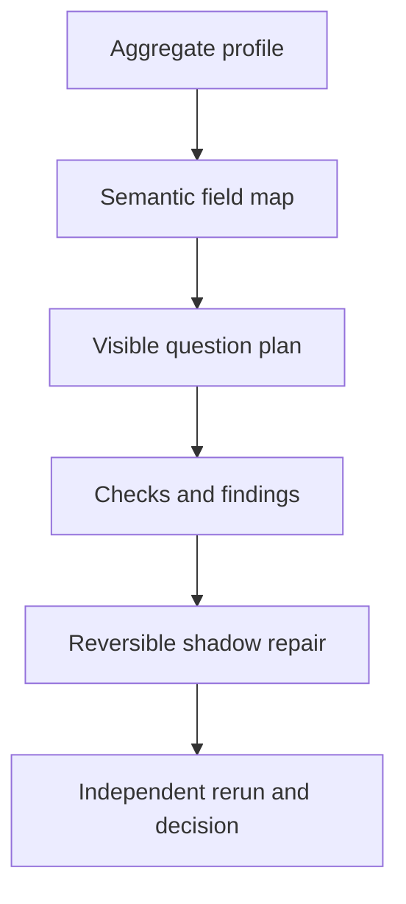

# Semantic interrogation and reversible repair protocol

Status: reference implementation, protocol version 0.1.

This protocol turns reusable data-quality knowledge into versioned question
banks without confusing a question with executable code or treating a standards
link as proof. It supports generic tabular data, organizations, postal
addresses, contact points, time, geography, people, products, transactions,
documents, and ML datasets. The bundled implementation contains 46 semantic
concepts, 11 question packs, 86 declarative questions, 43 deterministic check
adapters, and eight individually importable typed node implementations.

## Five-minute run

```bash
python -m pip install -e .
solutiongraph concepts map examples/data/dirty_organizations.json
solutiongraph questions plan examples/data/dirty_organizations.json --effort E3
solutiongraph questions run examples/data/dirty_organizations.json \
  --effort E3 --random-seed 17 --output-dir .artifacts/interrogation
```

The final command writes machine-readable JSON, Markdown with a Mermaid graph,
and a self-contained script-free HTML report. Patch values are redacted from
reports. The repair engine still retains exact before values in its in-memory
proposal so a shadow application can be reversed.

## Architecture



The layers have separate authorities:

| Layer | Contract | Authority |
|---|---|---|
| Meaning | `ConceptDefinition`, `QuestionDefinition`, `QuestionPack` | Describes what to ask and what evidence is required |
| Observation | `DatasetProfile`, `SemanticFieldMap` | Aggregate evidence and conservative field-name mapping |
| Planning | `InterrogationBudget`, `QuestionPlan` | Selects eligible checks while retaining every question visibly |
| Execution | `CheckRegistry`, `QuestionReceipt`, `FindingSet` | Runs code whose implementation digest is recorded |
| Repair | `RepairProposal`, `PatchOperation`, `RepairApplicationReceipt` | Proposes reversible changes and applies them only to a shadow copy |
| Verification | `VerificationReceipt` | Uses a separate verifier identity to promote, quarantine, reject, abstain, or report no change |
| Learning | `QuestionUtilityMemory` | Stores observational utility; it never grants compatibility or truth |

`QuestionDefinition` is deliberately not `NodeSpec`. A question nominates one
or more required capabilities. A check adapter or ordinary graph node provides
that capability. This allows new deterministic code, an external authority,
an LLM adjudicator, or a human review process to answer the same stable question
without changing its meaning.

## Effort policies and visibility

Every plan contains all 86 questions. Budgeting changes `selected`, `deferred`,
`blocked`, and `not-applicable` status; it does not implement an architectural
top-k catalogue.

| Effort | Eligible modes | Cost tier | Selected-question cap | Search behavior |
|---:|---|---:|---:|---|
| E1 | deterministic | 1 | 12 | Fast risk-first screen with a protected random fraction |
| E3 | deterministic | 3 | 30 | Deeper cross-field and dataset checks |
| E5 | deterministic, external | 5 | 60 | External checks only when capabilities and permissions exist |
| E7 | deterministic, external, LLM | 7 | 100 | Adds structured model adjudication when explicitly configured |
| E10 | all, including human | 10 | exhaustive | Runs every applicable and authorized question |

An external, LLM, or human requirement remains blocked unless both its
capability and required permission are supplied. Higher effort never bypasses
the effect and permission model.

## Current question-bank coverage

| Pack | Typical obligations |
|---|---|
| Generic tabular | placeholders, Unicode, whitespace, types, duplicates, identifiers, missingness, cardinality, numeric outliers, conflict review, source consistency, privacy patterns |
| Organization | role, official/legal/brand naming, suffixes, casing, duplicate entities, identifier and domain consistency, temporal status |
| Postal address | role, required components, postal/region/country consistency, delivery-line form, PO boxes, shared addresses, authoritative address evidence |
| Contact point | email syntax/domain, authority overclaim, E.164-compatible phone form, country consistency, reuse, role accounts, language |
| Date and time | parsing ambiguity, timezone, ordering, future values, DST, precision, point-in-time leakage, coverage drift |
| Geography | coordinate range/defaults, boundaries, vintages, geocoding method, geotemporal lineage |
| Person | components, placeholders, scripts, duplicate identity, privacy boundaries |
| Product | identifiers, brands, variant grain, duplicates, temporal status |
| Transaction | IDs, amounts, currency, reconciliation, state transitions, duplicates, future leakage |
| Document | identity, URLs, text quality, grounding, conflicts, prompt-injection patterns |
| ML dataset | target validity/balance, split contamination, leakage, imputation boundary, drift, feature stability, prediction contamination, privacy |

Schema.org URIs and standards references provide vocabulary and interpretation.
They do not certify an entity, address, phone number, or email address. Official
or credentialed verification must be represented by an external node with
explicit network effects, permissions, source vintage, and receipts.

## Repair policy

The reference repairer is intentionally narrower than the question bank. It
automatically proposes only transformations that do not require guessing:

- trim edge whitespace and collapse repeated horizontal whitespace;
- NFC normalization and removal of non-printing controls;
- lower-case only the domain portion of a syntactically valid email candidate;
- normalize an already explicit international telephone number without
  inferring a country;
- upper-case an already short region code without assigning a jurisdiction;
- convert only unambiguous year-first dates to ISO 8601;
- add an organization comparison key while preserving the legal/display name.

Uncertain operations can be emitted as review/quarantine annotations through
`safe-and-review`, but they are not applied unless the caller explicitly opts
in. Source data is never mutated. Before-value digests prevent stale patches,
and `reverse_repair_shadow` must reconstruct the original dataset digest.

The verifier reruns the exact selected source-question identities against the
shadow profile. It compares stable finding signatures, checks that every cell
change was declared, rejects partial or unexplained applications, and applies a
strict or balanced decision policy. It has its own implementation digest and
`independence.separate-controller` identity.

## Learning from history

`QuestionUtilityMemory` is append-only. Each observation records task
fingerprint identity, context tags, whether a finding was useful, whether a
repair was proposed/promoted, false-correction evidence, latency, human time,
cost, and source receipt. The planner uses an uncertainty-bearing posterior as
one priority term. It also preserves a random exploration fraction and every
question's visible status, so history cannot collapse the system into one
memorized route.

For stronger evidence, compare planning policies as ordinary graph experiments:

1. freeze the same dataset cases, semantic mapper, question catalogue, checks,
   verifier, and seeds;
2. assign a history-blind control and one or more history-informed policies;
3. record question coverage, useful finding yield, false-correction rate,
   human minutes, latency, external/model cost, and promotion rate;
4. retain rejected and unmatched observations;
5. promote only after holdout confirmation and a practical-effect gate.

Observational history alone does not prove that a question caused an
improvement.

## Typed node pack and route search

`solutiongraph.interrogation.node_pack` exports the eight node definitions, 43
exact parameter-bound candidates, the registry, descriptors, manifest, and an
11-slot feedback-loop program. The compiler admits 8,640 compatible complete
routes across profiling bounds, mapping policy, effort, planning strategy,
exploration seed, repair mode, review application, and verification strictness.
No edge performs an implicit conversion.

Each implementation lives in its own module under
`solutiongraph/interrogation/nodes/`, so a team can replace one layer or add a
candidate without editing a monolith. The bundled program deliberately uses
the same node family twice for source and shadow profiling/mapping/execution.

## Adding a concept, question, or check

1. Add a stable `ConceptDefinition` in
   `solutiongraph/question_packs/concepts.py`. Prefer a canonical URI, aliases,
   value type, parent concepts, jurisdictions, and exact standards references.
2. Add a `QuestionDefinition` to the narrowest pack. State scope, severity,
   preconditions, required evidence, abstention conditions, privacy class, and
   repair families.
3. Point the question to a capability, not an implementation filename.
4. Implement the check as a top-level, deterministic adapter or as a fully
   typed ordinary node. Hash and receipt its implementation.
5. If it requires a network, model, or person, declare its effect and permission
   and preserve source/model/reviewer identity.
6. Add fixtures for pass, fail, abstain, ambiguous mapping, privacy minimization,
   repair reversal, and independent verification.
7. Export the catalogue and run the complete release gate.

```bash
solutiongraph doctor
solutiongraph catalog export --output catalog
pytest -q
solutiongraph verify --catalog-root catalog --runtime in-process
```

## Security, privacy, and claim boundary

- Profiles store aggregates and hashes, not raw samples.
- Findings disclose bounded row identities and value digests, not sample values.
- Portable reports redact patch before/after values.
- Raw records and exact patches still require normal access control; a hash is
  not anonymization.
- The dependency-free check registry is deterministic mechanism code, not a
  production postal, corporate, identity, or deliverability authority.
- LLM output is untrusted evidence. It must conform to a schema, retain prompt,
  model, and input identities, and pass deterministic or human gates before a
  repair can be promoted.
- The local Python runtime is suitable for trusted fixtures. Generated or
  hostile code needs an enforcing sandbox or separate trust domain.

## Portable artifacts

The catalogue projects every concept, pack, question, node, descriptor,
registry, and manifest. Ten additional strict JSON Schemas cover concept
definitions, dataset profiles, semantic maps, question definitions and packs,
question plans, finding sets, repair proposals, verification receipts, and full
interrogation reports.
