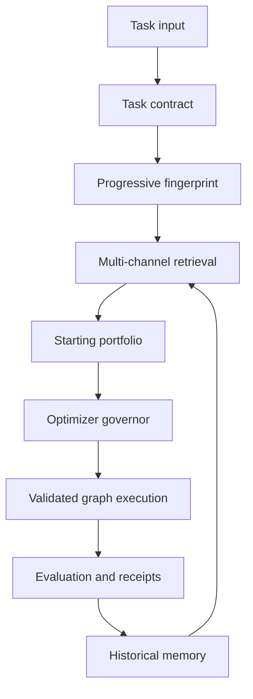
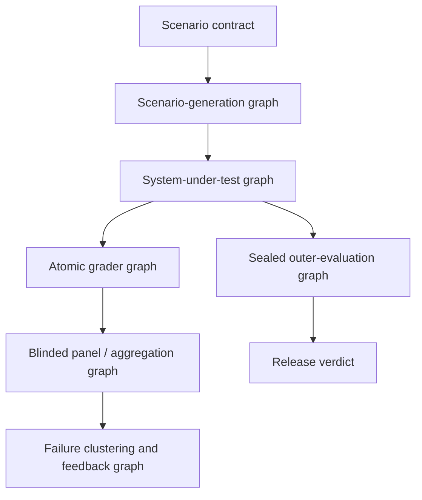

# Taedri Task Fingerprints and History-Informed Search

## Intelligent starting points, sprouts, optimizer portfolios, and effort policies

**Status:** Proposed architecture and implementation specification
**Scope:** Taedri universal node-graph solution system
**Terminology note:** This document assumes “Kadri” in the originating request refers to **Taedri**.

---

## 1. Executive recommendation

Taedri should add a first-class **Task Intelligence and Historical Search Prior** subsystem. Its job is not to pick one supposedly best old solution. Its job is to turn everything known about a new task into a diverse, uncertainty-aware starting portfolio for the graph search system.

The subsystem should contain six cooperating parts:

1. **Task Contract Compiler** — determines what is being predicted or optimized, the legal data boundary, metrics, constraints, and required output.
2. **Progressive Task Profiler** — builds a versioned fingerprint from cheap metadata, sampled statistics, target structure, feature relationships, landmark models, embeddings, and runtime probes.
3. **Historical Prior Retriever** — finds relevant successful routes, failed routes, graph fragments, optimizer behavior, and comparable task episodes through multiple retrieval channels.
4. **Starting-Point and Sprout Composer** — creates compatible whole-graph starts and targeted mutations from retrieved evidence while preserving diversity.
5. **Adaptive Optimizer Governor** — chooses and funds a portfolio of optimizers based on task characteristics, evidence strength, observed search behavior, and the selected effort policy.
6. **Outcome and Evidence Memory** — stores what was attempted, why it was attempted, what happened, what it cost, and how confidently any lesson can transfer.

The governing principle is:

> **History supplies priors, not commands. Every historical recommendation must retain uncertainty, diversity, history-blind controls, random escape routes, and an explicit mechanism for detecting negative transfer.**



This extends the existing Taedri runtime target:

`task input → task contract → task fingerprint → retrieval query → candidate nodes → compatibility decision → starting graph → validation → execution → evaluation → receipt → learning record`

It also fits the existing canonical typed metagraph IR, simultaneous topology/configuration search, Adaptive Stage Governor, and optimizer-portfolio design.

---

## 2. Non-negotiable design invariants

### 2.1 Preserve unlimited capability

- No fingerprint field, task taxonomy, optimizer list, or effort profile is a closed enumeration.
- Unknown task types and unseen modalities must be representable through extensible namespaced attributes.
- Historical retrieval can add or prioritize candidates but must not prohibit other valid graph structures.
- Effort levels are configurable budget policies, not hard ceilings on topology, nodes, depth, models, data size, or experimentation.
- Every stored task, route, graph, fragment, episode, observation, and hypothesis receives a stable versioned identity.

### 2.2 Treat learning as evidence, not folklore

- Store wins, losses, failures, timeouts, invalid graphs, and neutral results.
- A winner explanation is a hypothesis until supported by ablation or repeated evidence.
- Separate what was observed from what Taedri inferred.
- Retain contradictory evidence and cohort-specific effects.
- Compare routes under matched data, split, metric, hardware, software, and budget conditions whenever possible.
- Never compare raw scores across tasks whose metrics or score scales differ.

### 2.3 Prevent information leakage

- Profiles used to choose a route must be computed only from information legally available at that decision point.
- Target-aware statistics must be computed on training data and, when used inside model selection, within the appropriate outer split.
- Test labels, future timestamps, private leaderboard outcomes, or downstream results cannot enter a pre-run fingerprint.
- Meta-learning evaluation must hold out entire tasks or dataset families, not merely rows from tasks already present in history.

### 2.4 Preserve escape routes

Every search portfolio should contain, when budget permits:

- a deterministic canonical baseline;
- at least one history-blind candidate;
- at least one structurally diverse or random candidate;
- a way to abandon a poor historical prior quickly;
- a way to revisit a previously rejected family when new evidence changes its expected value.

### 2.5 Make computation progressive

Do not spend heavily profiling a task before knowing whether the information will change a decision. Compute fingerprints in layers and stop when the expected value of more profiling is below its cost.

---

## 3. Core definitions

| Term | Definition |
| --- | --- |
| **Task** | A versioned contract covering inputs, outputs, metric, constraints, data boundary, and execution context. |
| **Task fingerprint** | A versioned, missing-aware collection of deterministic, statistical, semantic, relational, and dynamic attributes describing a task. |
| **Route** | A full solution policy: graph topology, nodes, node configurations, data/split policy, optimizer policy, ensemble policy, resource policy, and stopping policy. |
| **Graph fragment** | A reusable compatible subgraph with typed inputs/outputs, applicability evidence, and provenance. |
| **Starting point** | A complete validated initial route or graph supplied to search. |
| **Sprout** | A new candidate produced by mutation, recombination, repair, contrast, ablation, or novelty generation from one or more starting points. |
| **Optimizer** | A search mechanism operating over graph topology, fragments, configurations, schedules, or some combination of them. |
| **Effort policy** | A multidimensional budget and evidence policy governing profiling, retrieval, starts, search, evaluation, repetition, and learning. |
| **Episode** | One task-route execution with immutable environment, budget, results, costs, failures, traces, and receipts. |
| **Nogood** | A context-qualified route, fragment, setting, or transition that repeatedly fails or is dominated under specified conditions. |

---

## 4. Progressive fingerprint layers

Taedri should retain its K0–K8 knowledge discipline and attach an explicit availability mask and provenance record to every value.

| Layer | Knowledge available | Typical computations | Main decisions enabled |
| --- | --- | --- | --- |
| **K0 — Contract** | Request, task declaration, metric, constraints | Task family, output shape, metric semantics, resource limits | Legal candidate space and canonical baselines |
| **K1 — Schema** | File/table metadata and schema | Rows, columns, types, keys, sizes, cardinality sketches | Feasible nodes, memory plan, basic route family |
| **K2 — Univariate profile** | Training feature values | Missingness, moments, quantiles, entropy, tails, sparsity | Imputation, transformations, model-family priors |
| **K3 — Target profile** | Training target | Balance, skew, modes, censoring, noise indicators | Losses, sampling, transforms, calibration |
| **K4 — Relationships** | Sampled feature/target and feature/feature relations | Correlation, mutual information, redundancy, drift, group/time structure | Feature selection, interaction search, split policy |
| **K5 — Landmarkers** | Results of cheap legal probe models | Baseline scores, learning curves, residual signatures, fit cost | Warm-start routes and optimizer selection |
| **K6 — Embeddings** | Text/schema/profile/sample encodings | Domain, schema, distribution, graph, and task embeddings | Semantic and learned nearest-task retrieval |
| **K7 — Runtime probes** | Early execution behavior | Failures, memory, improvement slope, noise, invalid rate | Reallocate optimizer budget and repair search |
| **K8 — Completed evidence** | Full episode outcomes | Robust score, cost, stability, ablations, route attribution | Promotion, rollback, priors, nogoods, causal hypotheses |

### 4.1 Compute-cost tiers

These labels are relative rather than fixed wall-clock guarantees.

| Tier | Intended cost | Examples |
| --- | --- | --- |
| **A — Metadata/streaming** | Schema-only or one streaming pass | Shapes, types, missingness, cardinality sketches, moments, target counts |
| **B — Sampled statistical** | Small stratified/reservoir samples | Correlations, mutual information estimates, drift, multimodality, duplicate estimates |
| **C — Budgeted probes** | Short model fits or learned encoders | Landmarkers, interaction probes, learning curves, dataset embeddings |
| **D — Dynamic/post-run** | Produced during search or full evaluation | Optimizer response, failure signatures, stability, ensemble diversity, ablations |

All fields should record `compute_tier`, sample method, sample size, random seed, timestamp, code version, uncertainty or error estimate, and whether the value is exact, estimated, inferred, or unavailable.

---

## 5. Canonical attribute catalog

The following fields are deliberately broader than regression and classification. Names are illustrative canonical keys, not a closed schema.

### 5.1 Task contract and objective

| Suggested fields | How to compute | Why it matters | Tier |
| --- | --- | --- | --- |
| `task.family` | Declared plus contract inference: regression, binary/multiclass/multilabel/ordinal classification, ranking, forecasting, anomaly detection, clustering, recommendation, survival, generation, optimization, control, retrieval, graph prediction, or composite | First-level retrieval and baseline selection | A |
| `task.subfamily` | Examples: count regression, quantile regression, zero-inflated regression, panel forecasting, learning-to-rank, extreme multilabel | Refines loss, model, and validation priors | A |
| `task.unit_of_prediction` | Row, person, transaction, entity-time, image, document, edge, graph, sequence, group, query-item pair | Prevents invalid splits and feature leakage | A |
| `task.output_kind` | Scalar, vector, probability, class, rank, interval, distribution, sequence, set, graph, generated artifact | Determines terminal nodes and evaluators | A |
| `task.output_dimensions` | Count or shape of target outputs | Affects model head, memory, and metrics | A |
| `task.horizon` | Forecast/control horizon or null | Drives temporal validation and lag design | A |
| `task.metric.family` | Error, likelihood, discrimination, ranking, calibration, overlap, utility, constraint satisfaction, composite | Required for comparable outcomes | A |
| `task.metric.direction` | Maximize or minimize | Prevents reversed learning | A |
| `task.metric.decomposable` | Whether it can be computed per row/group/time | Influences early stopping and sampling | A |
| `task.metric.sensitivity` | Outlier-, rank-, threshold-, class-, tail-, or calibration-sensitive | Guides loss and robust evaluation | A/B |
| `task.metric.baseline_score` | Canonical legal baseline under the same split | Anchor for cross-task normalized lift | C |
| `task.constraints` | Latency, memory, training time, inference cost, privacy, fairness, interpretability, monotonicity, determinism, deployment target | Filters or penalizes routes | A |
| `task.allowed_data_boundary` | Train only, external data permitted, transductive features permitted, future data prohibited, etc. | Hard leakage and compliance boundary | A |
| `task.required_uncertainty` | None, calibrated probability, prediction interval, quantiles, conformal set | Selects calibration and MAPIE/conformal fragments | A |
| `task.online_or_batch` | Online, streaming, near-real-time, batch | Model/runtime architecture | A |
| `task.multiobjective_vector` | Quality, cost, latency, stability, novelty, fairness, energy, explainability | Enables Pareto search | A |

### 5.2 Physical shape, scale, and storage

| Suggested fields | How to compute | Why it matters | Tier |
| --- | --- | --- | --- |
| `data.n_rows_train`, `data.n_rows_test` | Metadata or scan | Runtime and model-family feasibility | A |
| `data.n_columns_raw`, `data.n_features_candidate` | Schema | Dimensionality regime | A |
| `data.rows_per_feature` | `n_rows / max(n_features,1)` | High-dimensional/small-sample risk | A |
| `data.features_per_row` | Dense width or average nonzero width | Sparse versus dense routing | A |
| `data.size_bytes`, `data.row_width_bytes` | File/table metadata and sample | Memory/resource prediction | A |
| `data.density`, `data.sparsity` | Nonzero or nonempty cell fraction | Sparse learners and storage | A |
| `data.n_tables`, `data.n_files`, `data.n_partitions` | Source inventory | Join/relational route need | A |
| `data.compression_ratio_estimate` | Sample compressed versus raw size | I/O and cache planning | A/B |
| `data.train_test_size_ratio` | Row counts | Transductive/drift caution and compute planning | A |
| `data.entity_count_estimate` | Key cardinality sketch | Panel, grouping, and cold-start behavior | A |
| `data.average_records_per_entity` | Rows divided by estimated entities | Longitudinal feature feasibility | A |
| `data.maximum_group_size`, `data.group_size_quantiles` | Group counts/sketches | Split balance and memory | A/B |
| `data.streaming_required` | Compare size to memory/resource contract | Chooses out-of-core nodes | A |

### 5.3 Feature-type composition

For every type, store both count and fraction.

| Suggested fields | How to compute | Why it matters | Tier |
| --- | --- | --- | --- |
| `types.numeric_continuous.*` | Type inference plus cardinality/spacing | Scaling, transforms, model selection | A |
| `types.numeric_integer.*` | Declared/inferred integer types | Count versus category ambiguity | A |
| `types.categorical_nominal.*` | Declared/inferred category/string | Encoding and high-cardinality strategy | A |
| `types.ordinal.*` | Contract/data dictionary or inferred ordered levels | Order-preserving encoding | A |
| `types.boolean.*` | Two-value nonmissing columns | Sparse/simple signal | A |
| `types.datetime.*` | Parse confidence and declared schema | Temporal features and split policy | A |
| `types.duration.*` | Units plus numeric/date inference | Specialized transformations | A |
| `types.text_short.*`, `types.text_long.*` | Length/token distributions | TF-IDF/embedding/language routes | A/B |
| `types.identifier.*` | Near-unique, pattern, key declarations | Leakage prevention and relational features | A/B |
| `types.geospatial.*` | Coordinates, addresses, geocodes, polygons | Spatial validation/enrichment | A/B |
| `types.image.*`, `types.audio.*`, `types.video.*` | MIME/schema/array shapes | Modality-specific graphs | A |
| `types.sequence.*`, `types.array.*` | Nested schema and length profile | Sequence/set encoders | A/B |
| `types.graph_node.*`, `types.graph_edge.*` | Relational schema | Graph learners and split logic | A |
| `types.mixed_or_ambiguous_fraction` | Type-inference disagreement | Cleaning effort and robust encoders | B |
| `types.units_detected`, `types.unit_conflict_rate` | Names, metadata, magnitude patterns | Conversion and quality routes | B/C |

### 5.4 Regression-target structure

| Suggested fields | How to compute | Why it matters | Tier |
| --- | --- | --- | --- |
| `target.mean`, `median`, `std`, `mad`, `iqr` | Streaming/exact summary | Scale, robust losses, transforms | A |
| `target.min`, `max`, `quantiles` | Quantile sketch | Bounds and tail behavior | A |
| `target.skewness`, `kurtosis` | Moments or robust estimates | Log/Box-Cox/robust route priors | A |
| `target.cv`, `target.robust_cv` | Standard or MAD relative to center | Relative-noise regime | A |
| `target.zero_fraction`, `negative_fraction`, `positive_fraction` | Counts | Hurdle/count/positive-target models | A |
| `target.unique_count`, `unique_ratio`, `integer_like` | Cardinality sketch and tolerance | Count/ordinal versus continuous ambiguity | A |
| `target.mass_point_count`, `largest_mass_fraction` | Frequency sketch | Spikes and mixture/hurdle behavior | A/B |
| `target.tail_weight_left`, `tail_weight_right` | Tail quantile ratios, robust tail index | Tail-aware losses and transforms | B |
| `target.outlier_fraction_mad`, `outlier_fraction_iqr` | Robust thresholds | Robust estimators and metrics | A/B |
| `target.mode_count_estimate` | Histogram/KDE peaks, dip test, bimodality coefficient | Mixture-of-experts or segmentation prior | B |
| `target.entropy_binned` | Adaptive histogram entropy | Effective output complexity | B |
| `target.bounded_lower`, `bounded_upper` | Contract plus observed support | Link function and clipping | A |
| `target.censoring_type`, `censoring_fraction` | Contract/flags/support patterns | Survival/Tobit routes | A/B |
| `target.heteroscedasticity_probe` | Residual variance versus fitted values or feature bins from cheap model | Quantile, weighted, or variance modeling | C |
| `target.transform_candidates` | Score normality/stability after safe log, signed-log, Yeo-Johnson, quantile transforms | Creates target-transform sprouts | B |
| `target.segment_distribution_variance` | Target summaries by legal group/time/domain | Hierarchical or stratified modeling | B |

### 5.5 Classification, ordinal, and multilabel targets

| Suggested fields | How to compute | Why it matters | Tier |
| --- | --- | --- | --- |
| `target.n_classes` | Unique labels | Model head and metric | A |
| `target.class_counts`, `class_fractions` | Counts/sketches | Weighting and sampling | A |
| `target.imbalance_ratio` | Largest class / smallest nonzero class | Rare-class handling | A |
| `target.class_entropy`, `effective_class_count` | Entropy and `exp(entropy)` | More informative than class count alone | A |
| `target.minority_sample_count` | Minimum class support | Fold feasibility | A |
| `target.class_support_quantiles` | Quantiles across classes | Long-tail classification | A |
| `target.ordinality_confidence` | Contract or ordered-label consistency | Ordinal losses and encoders | A/B |
| `target.label_cardinality` | Mean labels per example | Multilabel head and thresholding | A |
| `target.label_density` | Cardinality / number of labels | Multilabel sparsity | A |
| `target.label_cooccurrence_density` | Cooccurrence graph density | Classifier chains/label graph | B |
| `target.rare_label_fraction` | Labels below support threshold | Tail-label strategies | A |
| `target.hierarchical_label_depth` | Label taxonomy metadata | Hierarchical losses | A |
| `target.ambiguous_or_soft_label_fraction` | Soft distributions, multiple annotators, or disagreement | Noise-aware training | A/B |
| `target.prior_shift_train_test` | Label-free estimate only when legally supportable; otherwise post-label evidence | Reweighting/calibration | C/D |

### 5.6 Feature-distribution summaries

Because datasets have variable numbers of columns, do not retain only one average. For any per-feature statistic `z_j`, store a distributional rollup:

`count, mean, std, min, q05, q10, q25, median, q75, q90, q95, max, fraction_low, fraction_high, histogram_or_sketch`

Also keep the top and bottom feature IDs by each statistic, subject to privacy rules.

| Suggested fields | How to compute per feature, then pool | Why it matters | Tier |
| --- | --- | --- | --- |
| `feature_stats.mean_distribution` | Feature means after type-appropriate normalization | Global centering pattern | A/B |
| `feature_stats.variance_distribution` | Variance/MAD/IQR | Near-constant and scale regimes | A |
| `feature_stats.skewness_distribution` | Numeric skew | Transform need | B |
| `feature_stats.kurtosis_distribution` | Numeric kurtosis | Heavy-tail robustness | B |
| `feature_stats.zero_fraction_distribution` | Numeric zeros/empty indicators | Sparse/hurdle structure | A |
| `feature_stats.outlier_fraction_distribution` | MAD/IQR thresholds | Robust preprocessing | B |
| `feature_stats.mode_count_distribution` | Sampled histogram/KDE peaks | Multimodality/segmentation | B/C |
| `feature_stats.entropy_distribution` | Numeric binned or categorical entropy | Effective information | B |
| `feature_stats.unique_ratio_distribution` | Approximate distinct / nonmissing | ID, category, continuous regimes | A |
| `feature_stats.range_to_iqr_distribution` | `(max-min)/IQR` with guards | Tail and error sensitivity | A/B |
| `feature_stats.normality_score_distribution` | Robust normality proxies; avoid overreliance on p-values at large n | Linear/Gaussian priors | B |
| `feature_stats.monotonic_spacing_distribution` | Sorted-value gap statistics | Quantization/count/sensor patterns | B |
| `feature_stats.bounded_fraction` | Detect common ranges such as `[0,1]`, percentages, nonnegative values | Link and transform candidates | A/B |
| `feature_stats.top_feature_profile` | Repeat profiles for top features under several cheap landmarkers | Tailors transformations to likely signal | C |

“Most important features” must not be defined by a single full-data model. Use multiple cheap out-of-fold landmarkers, record importance stability, and compute the profile within training folds.

### 5.7 Missingness and observation patterns

| Suggested fields | How to compute | Why it matters | Tier |
| --- | --- | --- | --- |
| `missing.overall_fraction` | Missing cells / cells | Basic imputation regime | A |
| `missing.row_fraction_distribution` | Missing fraction per row | Row-quality segmentation | A |
| `missing.column_fraction_distribution` | Missing fraction per column | Drop/impute/indicator decisions | A |
| `missing.fully_missing_columns`, `fully_missing_rows` | Counts | Immediate repair | A |
| `missing.pattern_count_estimate` | Hash row missingness bitsets/sketches | Structured missingness | A/B |
| `missing.pattern_entropy` | Entropy of common missingness patterns | Whether missingness is systematic | B |
| `missing.co_missing_graph_density` | Pairwise missing-indicator association on sample | Grouped sensors/forms | B |
| `missing.target_association_distribution` | MI/correlation/AUC of missing indicators with training target | Missing-not-at-random signal | B |
| `missing.train_test_delta_distribution` | Difference in per-column missingness | Shift and pipeline mismatch | A/B |
| `missing.sentinel_value_candidates` | Repeated extremes or tokens such as `-999`, `unknown` | Hidden missingness cleaning | B |
| `missing.block_length_distribution` | Consecutive missing runs in ordered/time data | Time-series imputation | B |
| `missing.by_group_variance` | Missing rates across legal groups/entities/time | Hierarchical bias and drift | B |

### 5.8 Cardinality, rarity, duplicates, and sparsity

| Suggested fields | How to compute | Why it matters | Tier |
| --- | --- | --- | --- |
| `cardinality.unique_count_distribution` | HyperLogLog or exact counts | Encoding and ID detection | A |
| `cardinality.unique_ratio_distribution` | Unique / nonmissing | Continuous/category/key separation | A |
| `cardinality.singleton_fraction_distribution` | Fraction of values appearing once | Memorization and cold-start risk | A/B |
| `cardinality.rare_category_mass_distribution` | Mass below configurable support | Robust categorical encoding | B |
| `cardinality.zipf_slope_distribution` | Rank-frequency slope | Long-tail categories/text | B |
| `cardinality.unseen_test_category_fraction` | Test values absent from train, without target use | Cold-start encoding | A/B |
| `duplicates.exact_row_fraction` | Hash rows | Leakage, weighting, and deduplication | A |
| `duplicates.near_row_fraction` | LSH/sample nearest-neighbor duplicates | Leakage and data quality | B/C |
| `duplicates.cross_split_fraction` | Hash/LSH overlap between legal splits | Critical leakage signal | A/B |
| `duplicates.conflicting_target_rate` | Same legal feature signature, different target | Irreducible/noisy labels | B |
| `sparsity.nonzero_distribution` | Nonzeros per row/column | Sparse model feasibility | A |

### 5.9 Redundancy, collinearity, and effective dimension

| Suggested fields | How to compute | Why it matters | Tier |
| --- | --- | --- | --- |
| `dependence.pearson_abs_distribution` | Numeric pair sample/sketch | Linear redundancy | B |
| `dependence.spearman_abs_distribution` | Numeric pair sample | Monotonic redundancy | B |
| `dependence.categorical_association_distribution` | Cramér’s V, Theil’s U, or MI | Categorical redundancy | B |
| `dependence.mixed_type_association_distribution` | Correlation ratio/MI/type-aware tests | Mixed-schema relationships | B/C |
| `dependence.high_corr_edge_density` | Fraction above several thresholds | Redundancy graph density | B |
| `dependence.correlation_graph_components` | Connected components/cliques/degree stats | Feature-group selection | B |
| `dependence.vif_distribution` | Sampled/regularized VIF | Linear instability | B/C |
| `dependence.condition_number` | Scaled matrix approximation | Numerical stability | B |
| `dependence.effective_rank` | Entropy/stable rank of sampled covariance | True dimensionality | B |
| `dependence.pca_components_80_90_95` | Randomized PCA on sample | Compression opportunity | B/C |
| `dependence.duplicate_feature_fraction` | Hash or equality sample | Remove redundant columns | A/B |
| `dependence.near_duplicate_feature_fraction` | High association plus value agreement | Pruning and leakage review | B |
| `dependence.redundancy_to_feature_ratio` | Redundant groups / features | Directly supports route selection | B |
| `dependence.target_conditioned_redundancy` | Redundancy among top legal univariate signals | Ensemble/selection choices | C |

### 5.10 Feature-to-target signal and learnability

All target-aware fields must be computed within the permitted training context.

| Suggested fields | How to compute | Why it matters | Tier |
| --- | --- | --- | --- |
| `signal.linear_assoc_distribution` | Correlation/ANOVA/logistic univariate scores | Linear signal regime | B |
| `signal.rank_assoc_distribution` | Spearman/Kendall or rank-based class separation | Monotonic nonlinear signal | B |
| `signal.mutual_information_distribution` | Type-aware MI on sample | General univariate relevance | B/C |
| `signal.univariate_cv_score_distribution` | Cheap per-feature legal CV probes | Usable individual signal | C |
| `signal.top_k_concentration_curve` | Fraction of aggregate importance in top k | Sparse versus diffuse signal | C |
| `signal.n_features_above_noise_floor` | Compare to permuted-target null | Effective signal count | C |
| `signal.importance_stability` | Rank agreement across folds/seeds/landmarkers | Whether warm starts can trust selected features | C |
| `signal.monotonic_feature_fraction` | Stable monotonic partial/bin trends | Monotonic models/transforms | B/C |
| `signal.category_target_strength_distribution` | Smoothed between-category target variance | Target encoding potential | B/C |
| `signal.text_baseline_strength` | Short TF-IDF linear landmarker | Whether text dominates | C |
| `signal.id_like_strength` | Out-of-fold probe versus naive full-data association | Flags ID leakage or entity memory | C |

### 5.11 Nonlinearity and interaction structure

| Suggested fields | How to compute | Why it matters | Tier |
| --- | --- | --- | --- |
| `interaction.linear_vs_tree_lift` | Difference between cheap linear and shallow-tree CV | Nonlinear-model prior | C |
| `interaction.additive_vs_interaction_lift` | GAM/additive probe versus small tree/boosting probe | Interaction need | C |
| `interaction.pairwise_gain_distribution` | Limited pair additions or tree split gains | Candidate crossing/features | C |
| `interaction.conditional_mi_distribution` | Sampled top-feature pairs | Nonredundant interactions | C |
| `interaction.h_statistic_sample` | Approximate Friedman H on cheap model | Interaction strength | C |
| `interaction.xor_probe_score` | Synthetic-style diagnostic on candidate binary pairs | Detects signal invisible to univariate filters | C |
| `interaction.depth_response_curve` | Shallow-tree performance by depth | Required interaction order proxy | C |
| `interaction.group_cross_strength` | Feature×group/entity/time probe lift | Hierarchical/contextual models | C |

### 5.12 Geometry, overlap, clusters, and intrinsic dimension

| Suggested fields | How to compute | Why it matters | Tier |
| --- | --- | --- | --- |
| `geometry.intrinsic_dimension_estimate` | PCA participation ratio or nearest-neighbor estimator | Manifold versus full-dimensional search | B/C |
| `geometry.hopkins_statistic` | Sampled clustering tendency | Clustering/mixture routes | B |
| `geometry.clusterability_scores` | Small k-means/GMM silhouette and stability sweep | Segmented models | C |
| `geometry.local_density_distribution` | kNN distances on normalized sample | Outliers and density-based models | B/C |
| `geometry.class_overlap_knn` | Neighbor label disagreement | Classification difficulty/noise | C |
| `geometry.fisher_ratio_distribution` | Between/within-class separation | Linear separability | B |
| `geometry.margin_proxy` | Cheap linear/SVM margin statistics | Boundary complexity | C |
| `geometry.hubness` | kNN occurrence skew in high dimensions | Distance-model reliability | C |
| `geometry.connected_components` | Similarity graph components | Disjoint populations | C |

### 5.13 Outliers, anomalies, and noise

| Suggested fields | How to compute | Why it matters | Tier |
| --- | --- | --- | --- |
| `outliers.univariate_mad_fraction_distribution` | Robust per-feature rule | Scaling/winsorization | B |
| `outliers.multivariate_score_distribution` | Isolation Forest/robust distance on sample | Anomaly handling | C |
| `outliers.high_leverage_fraction` | Approximate leverage/Cook-like diagnostics | Linear robustness | C |
| `noise.duplicate_label_conflict_rate` | Duplicate feature signatures with different labels | Direct label-noise signal | B |
| `noise.oof_disagreement_rate` | Ensemble of cheap out-of-fold models | Suspicious labels/hard rows | C |
| `noise.estimated_label_error_fraction` | Calibrated Cleanlab-style or consensus estimate | Noise-aware loss/filter sprouts | C |
| `noise.residual_tail_metrics` | Cheap model out-of-fold residuals | Robust loss/mixture models | C |
| `noise.residual_autocorrelation` | Residuals in legal order/time | Missing dynamics | C |
| `noise.seed_score_variance` | Repeated cheap landmarkers | Evaluation noise and optimizer racing | C |
| `noise.fold_score_variance` | Legal CV fold dispersion | Stability-aware selection | C |
| `noise.aleatoric_proxy` | Local outcome variance among similar rows | Uncertainty modeling | C |

### 5.14 Temporal structure

| Suggested fields | How to compute | Why it matters | Tier |
| --- | --- | --- | --- |
| `time.has_event_time`, `has_ingestion_time` | Schema/type inference | Establishes legal ordering | A |
| `time.coverage_duration` | Max minus min legal timestamp | Seasonality feasibility | A |
| `time.resolution_distribution` | Timestamp gaps | Aggregation and lag choices | A/B |
| `time.regularity_score` | Gap variability and expected-grid coverage | Forecasting method choice | B |
| `time.duplicate_timestamp_rate` | Counts by entity/time | Aggregation need | A |
| `time.gap_length_distribution` | Consecutive time gaps | Imputation and model family | B |
| `time.trend_strength_distribution` | Decomposition or robust slope by target/top features | Detrending | B/C |
| `time.seasonality_strengths` | ACF/periodogram/decomposition for candidate periods | Lag and seasonal models | B/C |
| `time.autocorrelation_signature` | ACF/PACF selected lags | AR/window architecture | B |
| `time.stationarity_proxies` | Rolling mean/variance drift and budgeted tests | Differencing and adaptive models | B/C |
| `time.change_point_count` | Budgeted change-point detector | Regime-switching models | C |
| `time.forecastability_proxy` | Spectral entropy or baseline predictability | Effort allocation | B/C |
| `time.n_entities`, `history_length_distribution` | Panel grouping | Global/local model blend | A/B |
| `time.cold_start_entity_fraction` | Test entities absent or short in train | Metadata/hierarchical routes | A/B |
| `time.target_lag_strengths` | Legal train-only autocorrelation/cross-correlation | Lag feature priority | B |
| `time.leakage_risk_score` | Future-derived names, suspicious correlations, invalid ordering | Blocks unsafe features | B/C |

### 5.15 Geospatial structure

| Suggested fields | How to compute | Why it matters | Tier |
| --- | --- | --- | --- |
| `geo.coordinate_valid_fraction` | Range/format/CRS checks | Cleaning and trust | A/B |
| `geo.crs_confidence`, `geo.resolution` | Metadata and coordinate patterns | Distance correctness | A/B |
| `geo.bounding_box`, `coverage_area_proxy` | Legal coordinate summaries | Scope and projection | A |
| `geo.unique_location_ratio` | Cardinality sketches | Repeated-location effects | A |
| `geo.location_density_distribution` | Grid/geohash counts | Hotspots and sampling | B |
| `geo.spatial_autocorrelation` | Moran’s I or variogram proxy on sample | Spatial models and CV | C |
| `geo.cluster_count_stability` | DBSCAN/HDBSCAN/grid probes | Region segmentation | C |
| `geo.border_or_edge_fraction` | Points near coverage boundary | Extrapolation risk | B/C |
| `geo.train_test_coverage_overlap` | Grid/geohash overlap | Spatial domain shift | B |
| `geo.distance_to_train_distribution` | Nearest training location | Extrapolation/cold-start | B/C |
| `geo.space_time_interaction_strength` | Region×time target/residual variation | Joint spatiotemporal graphs | C |

### 5.16 Relational, multi-table, graph, and hierarchy structure

| Suggested fields | How to compute | Why it matters | Tier |
| --- | --- | --- | --- |
| `relational.table_count`, `edge_count` | Schema graph | Join/aggregation topology | A |
| `relational.key_confidence_distribution` | Uniqueness, coverage, declared constraints | Safe joins | A/B |
| `relational.join_coverage_distribution` | Key overlap sketches | Missing enrichment risk | B |
| `relational.orphan_rate_distribution` | Unmatched keys | Quality and imputation | B |
| `relational.fanout_distribution` | Child rows per parent | Aggregation cardinality | A/B |
| `relational.join_depth`, `cycle_count` | Schema graph traversal | Complexity and leakage risk | A |
| `relational.many_to_many_risk` | Key multiplicity on both sides | Row explosion prevention | A/B |
| `relational.temporal_join_required` | Effective-date or event-time columns | Point-in-time correctness | A |
| `relational.point_in_time_violation_rate` | Sampled as-of validation | Leakage | B/C |
| `graph.node_count`, `edge_count`, `density` | Graph schema/data | GNN versus tabular summaries | A/B |
| `graph.degree_distribution`, `assortativity`, `component_count` | Graph statistics | Graph model family | B |
| `graph.homophily_target_proxy` | Train-only labeled edges | GNN usefulness | B/C |
| `hierarchy.level_count`, `branching_distribution` | Declared/inferred group hierarchy | Hierarchical pooling | A/B |
| `hierarchy.within_between_variance_ratio` | Grouped target/features | Mixed-effects/global-local blend | B |
| `hierarchy.unseen_group_fraction` | Legal train/test comparison | Cold-start planning | A/B |

### 5.17 Split, evaluation, leakage, and benchmark reliability

| Suggested fields | How to compute | Why it matters | Tier |
| --- | --- | --- | --- |
| `evaluation.split_family` | Random, stratified, group, temporal, spatial, adversarial, nested, custom | Route comparability | A |
| `evaluation.fold_count`, `repeat_count`, `seed_count` | Contract/config | Variance and cost | A |
| `evaluation.fold_size_distribution` | Split metadata | Small-fold risk | A |
| `evaluation.class_or_target_balance_by_fold` | Training fold summaries | Split quality | A/B |
| `evaluation.group_overlap_rate` | Entity/key overlap across folds | Leakage | A/B |
| `evaluation.temporal_overlap_or_gap` | Timestamp ranges | Forecast validity | A |
| `evaluation.duplicate_overlap_rate` | Row hashes/LSH | Leakage | A/B |
| `evaluation.metric_fold_variance` | Out-of-fold results | Selection reliability | C/D |
| `evaluation.metric_seed_variance` | Repeated candidates | Noise-aware optimizer choice | C/D |
| `evaluation.rank_stability` | Candidate ranks across folds/seeds | Whether “winner” is reliable | D |
| `evaluation.minimum_detectable_lift` | Variance plus sample size | Stops meaningless micro-optimization | C/D |
| `evaluation.public_private_gap_history` | Competition evidence, never as test-label feature | Leaderboard overfit risk | D |
| `evaluation.baseline_strength` | Canonical baseline relative to historical comparable tasks | Difficulty and headroom | C |

### 5.18 Train/test, domain, and concept drift

| Suggested fields | How to compute without test labels | Why it matters | Tier |
| --- | --- | --- | --- |
| `drift.missingness_delta_distribution` | Train versus test missing rates | Pipeline shift | A/B |
| `drift.numeric_psi_js_wasserstein_distribution` | Sampled univariate comparisons | Covariate shift | B |
| `drift.categorical_js_unseen_distribution` | Frequency sketches | Category drift | B |
| `drift.embedding_distance` | Pooled train/test embedding difference | Multivariate/modal shift | C |
| `drift.domain_classifier_auc` | Cross-validated train-versus-test classifier | Multivariate shift | C |
| `drift.mmd_or_energy_distance` | Sampled multivariate statistic | General shift | C |
| `drift.correlation_structure_delta` | Compare sampled association sketches | Relationship shift | B/C |
| `drift.time_window_signature` | Rolling feature/target profiles within train | Nonstationarity | B/C |
| `drift.group_composition_delta` | Group/entity proportions | Population shift | B |
| `drift.extrapolation_fraction` | Test values outside robust train ranges | Tree/linear extrapolation risk | B |
| `drift.concept_drift_proxy` | Time/group variation in legal out-of-fold residuals | Adaptive/segmented routes | C |

### 5.19 Data quality, provenance, and trust

| Suggested fields | How to compute | Why it matters | Tier |
| --- | --- | --- | --- |
| `quality.parse_error_rate_by_type` | Type coercion failures | Cleaning nodes | A |
| `quality.schema_violation_count` | Contract/range/regex/constraint checks | Route reliability | A/B |
| `quality.invalid_range_fraction` | Domain/schema bounds | Repair and trust | A/B |
| `quality.unit_inconsistency_rate` | Metadata/pattern/value comparisons | Conversion | B/C |
| `quality.date_anomaly_rate` | Impossible/future/reversed dates | Leakage and repair | A/B |
| `quality.key_violation_rate` | Null/duplicate/foreign-key checks | Join safety | A/B |
| `quality.row_completeness_distribution` | Valid/nonmissing fields per row | Segmentation/filtering | A |
| `quality.source_count`, `source_agreement` | Provenance metadata and overlapping fields | Trust weighting | A/B |
| `quality.collection_method` | Declared: sensor, human entry, transaction, scrape, generated, synthetic, merged | Noise and bias prior | A |
| `quality.label_source`, `annotator_count` | Metadata | Label-noise model | A |
| `quality.label_delay_distribution` | Event-to-label time | Online/temporal leakage | A/B |
| `quality.synthetic_fraction`, `augmentation_lineage` | Provenance | Evaluation and weighting | A |
| `quality.schema_drift_count` | Partition/version schema comparison | Pipeline repair | A/B |
| `quality.provenance_confidence` | Completeness and verifiability score | Prior attenuation | A/B |

### 5.20 Semantic topic, domain, and source attributes

Do not force one domain label. Store a probability distribution and allow multiple simultaneous topics.

| Suggested fields | How to compute | Why it matters | Tier |
| --- | --- | --- | --- |
| `semantic.domain_labels` | Declared metadata plus classifier over task description/schema | Domain-level historical backoff | A/C |
| `semantic.industry_labels` | Multi-label taxonomy with confidence | Industry-specific priors | C |
| `semantic.modality_labels` | Tabular, text, image, audio, video, graph, time-series, mixed | Route families | A |
| `semantic.task_description_embedding` | Embed normalized task statement and objective | Semantic retrieval | C |
| `semantic.schema_text_embedding` | Embed column/table names, descriptions, units, target description | Topic/schema retrieval | C |
| `semantic.column_embedding_distribution` | Embed each column description then pool | Fine-grained schema similarity | C |
| `semantic.source_embedding` | Source description, collection method, public dataset metadata | Similar data-generation process | C |
| `semantic.sensitivity_labels` | PII/PHI/financial/location/biometric/etc. from contract and scanners | Privacy-preserving route filters | A/C |
| `semantic.language_distribution` | Text language ID | Text model and tokenizer | B |
| `semantic.entity_type_distribution` | NER or schema inference on sampled text | Domain features and privacy | C |

### 5.21 Dataset and task embeddings

Embeddings should complement, not replace, interpretable fingerprint fields.

| Embedding | Suggested construction | Retrieval value | Cost |
| --- | --- | --- | --- |
| `embedding.task_text` | Task statement + unit of prediction + target semantics + metric + constraints | Similar intent/objective | Low |
| `embedding.schema_set` | Encode each column/table descriptor, then permutation-invariant mean/attention/DeepSets pooling | Similar schemas with different column order | Low/medium |
| `embedding.profile_vector` | Normalize deterministic meta-features, add missing mask, project with PCA/autoencoder/metric learner | Similar statistical regimes | Low/medium |
| `embedding.feature_distribution_set` | Encode each feature’s type and distribution sketch, then set-pool with mean, variance, and quantile pooling | Similar “shape of data” independent of feature count | Medium |
| `embedding.target` | Encode target type, histogram/quantile sketch, imbalance, tails, and modes | Similar output shape | Low |
| `embedding.target_conditioned` | Encode feature-target association summaries and cheap out-of-fold residual signatures | Similar learnability | Medium/high |
| `embedding.missingness` | Encode missing-rate vector sketch and co-missing graph | Similar observation process | Medium |
| `embedding.dependence_graph` | Graph embedding of columns as nodes and type-aware associations as edges | Similar redundancy/interaction topology | Medium/high |
| `embedding.row_sample_set` | Privacy-safe, normalized, stratified row encodings pooled as a set; avoid raw identifiers/text secrets | Similar joint distributions | High |
| `embedding.temporal_signature` | ACF, spectral, trend, seasonality, gap, and panel summaries | Similar forecasting dynamics | Medium |
| `embedding.relational_schema_graph` | Encode tables, keys, edge types, fanout, temporal constraints | Similar multi-table problems | Medium |
| `embedding.route` | Typed graph topology + node families + configuration bins + policies | Similar solutions and diverse selection | Medium |
| `embedding.trajectory` | Sequence of graph edits, scores, failures, and costs | Similar search behavior | Medium/high |
| `embedding.failure` | Error class, failed node context, data signature, resource state | Failure avoidance and repair | Low/medium |

Every embedding record should include:

- encoder identity and version;
- input-field manifest and preprocessing version;
- vector dimension and normalization;
- training-data provenance for learned encoders;
- privacy classification;
- availability mask;
- timestamp and expiration/recompute policy;
- distance calibration statistics;
- drift warning when comparing vectors from incompatible encoder versions.

### 5.22 Cheap landmark models

Landmarkers answer “what kinds of structure appear learnable?” more directly than raw statistics.

| Landmarker | Useful returned attributes |
| --- | --- |
| Constant/mean/median/prior | Baseline score and irreducible starting reference |
| Univariate best feature | Strength and stability of concentrated signal |
| Linear/ridge/elastic net | Linear learnability, regularization response, coefficient stability |
| Logistic/linear SVM | Linear separability, margin, calibration |
| Naive Bayes | Conditional-independence usefulness for sparse/text-like data |
| Decision stump/shallow tree | Threshold signal and required depth response |
| Small random forest/extra trees | Interaction/nonlinearity signal, seed stability |
| Small boosted-tree model | Strong tabular baseline, iteration curve, residual profile |
| k-nearest neighbors | Local geometry usefulness and scale sensitivity |
| GAM/spline probe | Smooth additive nonlinear signal |
| TF-IDF linear probe | Text dominance and sparse route value |
| Simple seasonal/lag baselines | Temporal predictability and forecastability |

For each landmarker, store out-of-fold score, normalized lift over the task baseline, fit/inference time, peak memory, fold/seed variance, calibration where relevant, residual/segment signatures, and failure state. A landmarker timeout or failure is itself a useful attribute.

### 5.23 Runtime and search-dynamics attributes

| Suggested fields | How to compute | Why it matters | Tier |
| --- | --- | --- | --- |
| `runtime.load_time`, `profile_time`, `fit_time`, `inference_time` | Receipts | Future cost prediction | D |
| `runtime.peak_ram`, `peak_vram`, `disk_io`, `cache_hit_rate` | Runtime telemetry | Resource routing | D |
| `runtime.compile_time`, `graph_validation_time` | Compiler receipts | Topology search cost | D |
| `runtime.failure_rate_by_node_family` | Episode aggregation | Safer starts | D |
| `runtime.nondeterminism_score` | Repeated identical-run variation | Repetition policy | D |
| `search.time_to_first_valid` | Search trace | Optimizer feasibility | D |
| `search.time_to_first_improvement` | Search trace | Warm-start value | D |
| `search.improvement_slope` | Score versus spend | Continue/stop/reallocate | D |
| `search.plateau_length` | No-improvement budget | Escape mutation trigger | D |
| `search.score_volatility` | Candidate/seed/fold variation | Robust racing | D |
| `search.invalid_graph_rate` | Validation failures / proposals | Optimizer and grammar quality | D |
| `search.mutation_acceptance_rate` | Accepted improvements / mutations | Local search health | D |
| `search.family_switch_gain` | Gains after model/topology family changes | Need for broad exploration | D |
| `search.surrogate_calibration` | Predicted versus realized candidate utility | Trust in Bayesian/meta-model | D |
| `search.optimizer_regret` | Best attainable observed minus optimizer-selected result under matched budget | Optimizer learning target | D |
| `search.ensemble_diversity` | OOF prediction correlation/disagreement | Ensemble opportunity | D |
| `search.history_prior_regret` | Best history-blind result minus best history-seeded result, oriented consistently | Negative-transfer tracking | D |

---

## 6. A compact, fixed-length meta-feature vector

Taedri needs both rich structured profiles and a compact vector for indexing and meta-models. A practical fixed-length vector can concatenate:

1. task-contract one-hot or learned encodings;
2. log-scaled shape and resource features;
3. type fractions;
4. target sketches;
5. pooled per-feature distribution summaries;
6. missingness, cardinality, redundancy, and drift rollups;
7. landmarker scores, costs, variances, and failure masks;
8. semantic/domain probabilities;
9. selected embeddings or projections;
10. an explicit availability mask and uncertainty vector.

For a variable-length set of feature profiles `f_1 … f_p`, use multiple pooling operators rather than a plain mean:

```text
pool(F) = concat(
  mean(F), std(F), min(F), max(F),
  quantile(F, .10), quantile(F, .25), median(F),
  quantile(F, .75), quantile(F, .90),
  threshold_fractions(F), learned_set_pool(F)
)
```

This captures “average feature characteristics” while preserving heterogeneity, rare extremes, and clusters of feature behavior.

### 6.1 Fingerprint stability

Compute a stability estimate for sampled fields by repeating the profile on two or more deterministic subsamples when budget permits. Store:

- point estimate;
- standard error or bootstrap interval;
- sample fraction and strategy;
- cross-sample rank correlation;
- instability flag;
- exact-versus-approximate indicator.

An unstable fingerprint should reduce the weight of exact nearest-neighbor retrieval and increase diversity/exploration.

---

## 7. Historical memory model

History should not be one flat table of task winners. It should be an evidence graph with at least these entities:

| Entity | Required contents |
| --- | --- |
| `TaskContract` | Objective, metric, constraints, data boundary, output requirements |
| `TaskFingerprint` | Layered attributes, embeddings, masks, provenance, fingerprint version |
| `DatasetFamily` | Known lineage, variants, duplicates, derived datasets, contamination groups |
| `Route` | Full versioned search/graph/component/ensemble/history/model/budget policy |
| `Graph` | Canonical typed metagraph IR and content hash |
| `GraphFragment` | Typed reusable subgraph and compatibility contract |
| `StartCandidate` | Source channel, parents, transformations, expected utility, novelty |
| `Episode` | Immutable run conditions, result, cost, trace, failures, receipts |
| `Outcome` | Raw metric, oriented metric, normalized lift, robustness, constraint results |
| `Observation` | Direct measured fact with provenance |
| `Hypothesis` | Inferred explanation and confidence |
| `Nogood` | Context-qualified failure/dominance pattern |
| `PromotionRecord` | Candidate→experimental→trusted→deprecated/rolled-back transitions |

### 7.1 Store more than the winner

For each task, retain:

- top routes and their Pareto positions;
- mediocre but diverse routes;
- failed and invalid routes;
- candidates eliminated early and the fidelity at elimination;
- graph mutations and parent-child lineage;
- per-fold, per-seed, per-segment, and per-resource results;
- predictions or prediction sketches when permitted;
- route components that contributed complementary errors;
- optimizer proposals that were rejected before execution;
- budget allocation decisions and their information gain;
- explicit reasons for stop, prune, promote, repair, or rollback.

The search system learns as much from “this route fails on high-cardinality, drifting, small-sample regression” as from a global winner.

---

## 8. Comparable outcome normalization

Raw RMSE, AUC, F1, log loss, Kaggle scores, business utility, and latency are not directly comparable. Each episode should retain raw metrics, but historical learning should operate on normalized task-relative outcomes.

### 8.1 Orient all metrics

```text
oriented_score = raw_score       if larger_is_better
oriented_score = -raw_score      if smaller_is_better
```

### 8.2 Store several task-relative measures

- **Relative lift over canonical baseline** with metric-appropriate safeguards.
- **Robust standardized lift:** `(oriented_score - baseline_median) / max(baseline_MAD, epsilon)`.
- **Within-task percentile or rank** among matched-budget candidates.
- **Probability of beating the canonical baseline** across folds/seeds.
- **Probability of being Pareto-nondominated** for quality, cost, latency, and stability.
- **Worst-fold/worst-segment lift** and lower confidence bound.
- **Area under best-score-versus-budget curve**, not only final score.
- **Time/compute to acceptance threshold**.

Do not let a route trained with 100× more compute teach the system that it is universally better than a cheaper route. Budget and environment are part of the treatment.

### 8.3 Route utility

A flexible starting utility can be represented as:

```text
U(route | task, effort) =
    E[quality_lift]
  - λ_cost × E[cost]
  - λ_risk × failure_risk
  - λ_instability × score_variance
  + λ_info × expected_information_gain
  + λ_novelty × useful_novelty
  + λ_constraint × constraint_satisfaction
```

The coefficients are effort-, task-, and user-policy-dependent. Taedri should preserve the full predicted outcome vector and Pareto frontier rather than collapsing everything permanently to one scalar.

---

## 9. Multi-channel historical retrieval

Retrieval should use independent channels followed by calibrated late fusion. Each channel returns candidates, similarity, uncertainty, evidence volume, and potential conflicts.

| Channel | What it matches | Example value |
| --- | --- | --- |
| **Exact** | Same contract/fingerprint hash or known dataset family | Reproducibility, reruns, variants |
| **Taxonomic** | Task family, subfamily, modality, metric, domain | Strong simple backoff |
| **Structural** | Shapes, types, sparsity, target shape, groups/time/relations | Cross-domain transfer |
| **Statistical** | Deterministic profile-vector distance | Similar data-generating regimes |
| **Semantic** | Task/schema/domain embeddings | Similar topic and meaning |
| **Graph** | Data schema/dependence graph similarity | Similar topology needs |
| **Landmarker** | Cheap-model performance signature | Similar learnability |
| **Trajectory** | Similar early search and runtime behavior | Dynamic optimizer transfer |
| **Failure** | Similar node/route failures or resource patterns | Nogood avoidance and repair |
| **Causal/ablation** | Effects supported by controlled comparisons | Higher-confidence reusable choices |

### 9.1 Hierarchical backoff

The system should back off gracefully when an exact joint cohort is sparse:

1. exact task/dataset family;
2. task family + domain + structural cluster + target shape;
3. task family + domain + structural cluster;
4. task family + structural cluster;
5. task family + domain;
6. task family;
7. structural/landmarker nearest neighbors across domains;
8. domain;
9. global route and optimizer priors.

Use empirical-Bayes shrinkage or another uncertainty-aware method so a route with one spectacular historical win does not dominate a route with dozens of solid results.

### 9.2 Missing-aware similarity

For channel `c`, compare only mutually available fields and reduce confidence when coverage is low:

```text
similarity_c = weighted_similarity(shared_fields)
coverage_c   = shared_reliable_weight / possible_reliable_weight
effective_c  = similarity_c × coverage_c × provenance_quality_c
```

A fused retrieval score can begin as:

```text
retrieval_score(route) =
  Σ_c gate_c(task, coverage, history_size) × effective_c × route_posterior_c
  - negative_transfer_risk
  + diversity_credit
```

The gates can start as auditable rules and later be learned from leave-one-task-out history.

### 9.3 Dataset-family deduplication

Before meta-learning, cluster renamed, resampled, lightly transformed, or competition-derived versions of the same dataset. Otherwise, Taedri will appear to generalize while merely recognizing a duplicate. Use schema hashes, row/column sketches, source metadata, near-duplicate signatures, and lineage.

---

## 10. Starting-point portfolio construction

The retriever should return evidence. The composer should turn that evidence into a balanced portfolio of valid starting graphs.

### 10.1 Starting-point families

1. **Canonical deterministic baseline** — compiled from the task contract without historical influence.
2. **Nearest-task route replay** — a compatible historical route with required repairs and updated node versions.
3. **Joint-cohort champion** — strong on the matching task+domain+structure cohort.
4. **Cross-domain structural champion** — similar statistical/landmarker signature from another domain.
5. **Component consensus route** — assembled from fragments that repeatedly help in matching contexts.
6. **Pareto specialist** — quality-, cost-, latency-, stability-, calibration-, or interpretability-specialized.
7. **Failure-aware repaired route** — starts near a promising historical route but removes its known context-specific failure.
8. **Contrast route** — deliberately chooses a different model/topology family from the leading prior.
9. **Novelty/MAP-Elites route** — fills an underexplored behavioral or structural niche.
10. **History-blind optimizer-native start** — produced without outcome history.
11. **Random or quasi-random valid route** — sampled through the typed grammar and compatibility validator.
12. **User/harness supplied route** — preserved as a separate provenance channel.

### 10.2 Do not transplant an entire winner blindly

Historical reuse can occur at several granularities:

- validation/split policy;
- data-quality and leakage checks;
- feature transformation fragments;
- feature-family-specific branches;
- model family;
- loss and sampling policy;
- calibration/uncertainty fragment;
- ensemble architecture;
- optimizer type and schedule;
- resource/runtime configuration;
- stopping and promotion rules.

The composer should estimate transferability for each component and build compatible hybrids. A route that won because of a particular target transform may still donate its validation and calibration fragments even if its model family is inappropriate.

### 10.3 Diversity selection

Measure diversity across multiple views:

- graph edit distance;
- node-family Jaccard distance;
- topology embedding distance;
- configuration distance;
- optimizer-family distance;
- historical lineage distance;
- expected prediction/residual disagreement;
- behavioral niche or MAP-Elites cell;
- source-channel diversity.

Select a portfolio with greedy farthest-point, submodular coverage, DPP-style selection, or Pareto diversity. Do not select ten near-identical boosted-tree routes simply because all score highly under the same prior.

---

## 11. Intelligent sprout generation

A sprout should have an explicit rationale, parentage, expected effect, uncertainty, and novelty score.

### 11.1 Sprout operators

| Operator | Description | Best use |
| --- | --- | --- |
| **Clone-and-nudge** | Perturb important continuous/discrete settings around a strong route | Local exploitation |
| **Typed crossover** | Combine compatible fragments from two or more strong/diverse routes | Reuse complementary evidence |
| **Component substitution** | Swap one model, transform, loss, encoder, or calibration family | Controlled comparison |
| **Topology expansion** | Add a branch, residual model, specialist, enrichment, or ensemble member | Underfit/heterogeneous tasks |
| **Topology contraction** | Remove dominated, unstable, expensive, or redundant fragments | Efficiency and robustness |
| **Ablation sprout** | Remove one suspected contributor | Causal evidence |
| **Contrast sprout** | Switch to a substantially different family or inductive bias | Escape local/history bias |
| **Repair sprout** | Fix a typed validation, resource, data-quality, or nogood conflict | Recover promising failures |
| **Target-shape sprout** | Add hurdle, mixture, quantile, ordinal, calibration, transform, or tail specialist | Complex targets |
| **Feature-profile sprout** | Add type-/missingness-/tail-/interaction-specific branches | Heterogeneous features |
| **Drift-aware sprout** | Reweight, adapt, adversarially validate, or segment | Distribution shift |
| **Resource-aware sprout** | Approximate, stream, quantize, cache, or change fidelity | Tight compute/latency limits |
| **Ensemble-diversity sprout** | Add a candidate predicted to make complementary errors | Ensemble gain |
| **Nogood-counterfactual sprout** | Revisit a rejected family while changing the context that caused failure | Avoid permanent false bans |
| **Random grammar sprout** | Sample a valid graph without historical reward guidance | Open-ended discovery |

### 11.2 Node-local intelligence

Each node can retain a small local applicability model using:

- its local input/output type signatures;
- relevant slice of the global task fingerprint;
- upstream/downstream node context;
- historical success/failure episodes;
- resource state;
- current optimizer trajectory.

The local model can answer:

- Is this node valid here?
- What configuration ranges are plausible?
- Which sibling node is a useful contrast?
- What upstream repair would make this node viable?
- What downstream consumer benefits from its output?
- How uncertain is the recommendation?

Local node recommendations remain advisory to the global governor and cannot override hard typed-port, leakage, or contract validation.

### 11.3 Sprout provenance

Every sprout should record:

```yaml
sprout_id: sprout_...
parents: [route_..., fragment_...]
operator: typed_crossover
retrieval_channels: [structural, landmarker, semantic]
rationale_claims: [claim_...]
changed_nodes: [...]
expected_outcome_vector:
  quality_lift: {mean: 0.0, uncertainty: 0.0}
  cost: {mean: 0.0, uncertainty: 0.0}
  failure_risk: 0.0
novelty_scores: {...}
compatibility_receipt: receipt_...
history_blind: false
randomness:
  generator: ...
  seed: ...
```

---

## 12. Optimizer selection and the optimizer-of-optimizers

Taedri should separate:

- **outer/meta optimization:** chooses optimizer portfolio, budgets, starting points, fidelity, and stopping;
- **topology optimization:** adds/removes/reconnects graph fragments;
- **configuration optimization:** tunes node and route settings;
- **evaluation optimization:** chooses folds, seeds, fidelity, promotion, and racing;
- **ensemble optimization:** selects/blends complementary candidates.

### 12.1 Attribute-to-optimizer priors

| Observed signature | Optimizers to emphasize | Reason |
| --- | --- | --- |
| Small, mostly continuous, moderately smooth configuration space | Bayesian optimization, TPE, SMAC | Sample-efficient tuning |
| Conditional, categorical, hierarchical configuration space | TPE/SMAC, evolutionary search | Handles conditional parameters |
| Large discrete graph-topology space | Beam, evolutionary/genetic, MCTS, GFlowNet research | Structured combinatorial exploration |
| Strong historical neighbors with calibrated transfer | Warm-start Bayesian/TPE/SMAC, local search around retrieved routes | Exploit reliable priors |
| Sparse or contradictory history | Random/quasi-random, deterministic portfolio, MAP-Elites | Avoid false confidence |
| Noisy folds/seeds or small sample | Robust racing, repeated measures, Bayesian noise models | Avoid optimizer chasing noise |
| Expensive evaluations with meaningful partial fidelity | Successive halving/ASHA/Hyperband, multi-fidelity BO | Allocate compute efficiently |
| Strong interaction/nonlinearity | Evolutionary, boosted surrogate, MCTS, broad topology mutations | Local coordinate tuning may fail |
| Many feasible niches and multiple objectives | MAP-Elites, NSGA-II/Pareto evolutionary search | Preserve diverse specialists |
| Frequent invalid proposals | Typed grammar search, beam with validation, repair-first evolutionary | Improve valid-candidate yield |
| Early plateau after historical warm starts | Contrast/random sprouts, family switching, novelty search | Escape prior-induced basin |
| Strong ensemble opportunity | Greedy residual selection, diversity-aware evolutionary/beam search | Optimize complementary errors |
| Unknown or mixed regime | Portfolio with contextual-bandit allocation | Learn which optimizer fits |

### 12.2 Adaptive budget allocation

The Adaptive Stage Governor should treat optimizers as competing arms with context. A reward can include:

```text
reward =
    realized_quality_lift
  + information_gain
  + useful_novelty
  + robustness_gain
  - compute_cost
  - invalidity_cost
  - failure_cost
```

Allocate an initial minimum budget to required control and diversity lanes, then reallocate based on calibrated improvement rate, uncertainty, and remaining opportunity. Never starve the history-blind lane solely because historical candidates score well at low fidelity.

---

## 13. Effort levels as multidimensional policies

Effort must not be represented only as “number of trials.” It is a vector covering:

- fingerprint depth and sampling precision;
- number and diversity of starting graphs;
- retrieval depth and channel count;
- topology breadth and depth;
- configuration search budget;
- optimizer portfolio breadth;
- evaluation fidelity, folds, seeds, and repeats;
- ensemble exploration;
- ablation and robustness testing;
- semantic/model participation;
- runtime isolation and receipts;
- stopping, fallback, promotion, and rollback thresholds;
- learning-record completeness.

### 13.1 Suggested default profiles

These are starting defaults, not caps. The governor can expand or contract them from predicted value, resource availability, and user policy.

| Policy | Profiling | Starting portfolio | Search behavior | Evaluation and learning |
| --- | --- | --- | --- | --- |
| **Effort 1** | K0–K2 plus minimal K3/K4; sampled, cheap | Canonical baseline + highest-confidence historical start + one history-blind/diverse challenger when feasible | Shallow local/configuration search; limited family switches; fast fallback if prior fails | Single legal validation plan; promote only clear wins; full basic receipt |
| **Effort 5** | K0–K5; selected embeddings | Several historical, compositional, repaired, contrast, and random/history-blind starts | Two or more optimizer families; multi-fidelity racing; modest topology mutations | Recheck finalists across folds/seeds; basic ablations; negative-transfer record |
| **Effort 10** | K0–K7 with stability estimates | Broad multi-channel and Pareto-diverse portfolio | Adaptive optimizer bandit; topology + configuration co-search; family switching; ensemble sprouts | Repeated finalists, segment robustness, calibration, cost/stability Pareto set, meaningful ablations |
| **Effort 100** | Deep progressive profiling and learned embeddings where useful | Large evolving population spanning history, cross-domain structure, novelty cells, adversarial contrasts, and random grammar | Long-horizon portfolio including evolutionary/MCTS/MAP-Elites/multi-fidelity and research optimizers; recursive sprouts | Strong matched-budget repetitions, broad robustness, causal ablations, ensemble frontier, promotion/rollback evidence |
| **Maximum / self-learning** | Value-of-information-driven with no arbitrary fixed depth | Continuously replenished diverse archive | Persistent adaptive research program across tasks, models, seeds, budgets, and environments | Cross-task meta-evaluation, temporal holdouts, causal claims, policy updates, and rollback-ready versioning |

### 13.2 Suggested source allocation ranges

The exact mix should be learned. Useful initial guardrails are:

| Candidate source | Lower-effort prior | Higher-effort prior |
| --- | --- | --- |
| High-confidence historical starts | 30–50% | 20–40% |
| Historical fragment recombinations/repairs | 10–20% | 20–35% |
| Optimizer-native or deterministic history-blind starts | 20–35% | 15–30% |
| Random, quasi-random, contrast, or novelty starts | 10–25% | 15–35% |

These percentages should be soft. Increase exploration when history is sparse, retrieval channels disagree, the fingerprint is unstable, task drift is high, or early historical starts underperform. Increase exploitation when evidence is plentiful, calibrated, recent, independently replicated, and structurally close.

---

## 14. Negative-transfer detection and recovery

Historical intelligence is valuable only if Taedri can recognize when it is wrong.

### 14.1 Before execution

- Compute retrieval confidence, history volume, cohort diversity, recency, and encoder/version compatibility.
- Penalize evidence from duplicate dataset families.
- Penalize routes whose benefit is confounded with much larger budgets.
- Surface conflicting channels instead of averaging them away.
- Check route applicability and every node’s typed/data/resource contract.

### 14.2 During early execution

- Race historical starts against deterministic/history-blind controls at matched fidelity.
- Compare observed score/cost/failure to the prior predictive interval.
- Trigger a prior-miss event when outcomes are materially worse than expected.
- Reduce budget for the failing cohort or fragment, not necessarily the entire model family.
- Generate contrast, repair, and random sprouts.

### 14.3 After execution

Store:

- whether history improved time-to-first-acceptable solution;
- best-under-budget lift versus history-blind search;
- regret caused by the prior;
- which retrieval channel was misleading;
- whether the miss came from task dissimilarity, drift, version change, resource mismatch, score noise, or bad causal attribution;
- what escape route recovered performance.

Never create a permanent global ban from one failure. Nogoods must be context-qualified and reversible.

---

## 15. Example canonical schemas

### 15.1 Task fingerprint envelope

```json
{
  "fingerprint_id": "tfp_<content_hash>",
  "schema_version": "taedri.task_fingerprint.v1",
  "task_contract_id": "task_<id>@<version>",
  "dataset_family_id": "dsf_<id>",
  "knowledge_layer": "K6",
  "created_at": "<timestamp>",
  "legal_information_boundary": "train_only",
  "profile_context": {
    "split_policy_id": "split_<id>",
    "sample_method": "stratified_reservoir",
    "sample_size": 0,
    "seed": 0,
    "profiler_version": "<version>"
  },
  "task": {},
  "shape": {},
  "types": {},
  "target": {},
  "features": {},
  "missing": {},
  "dependence": {},
  "signal": {},
  "temporal": {},
  "geospatial": {},
  "relational": {},
  "drift": {},
  "quality": {},
  "semantic": {},
  "landmarkers": {},
  "embeddings": [
    {
      "kind": "profile_vector",
      "encoder_id": "<id>@<version>",
      "vector_ref": "<artifact_ref>",
      "input_manifest_hash": "<hash>",
      "privacy_class": "derived_nonreversible"
    }
  ],
  "availability_mask": {},
  "uncertainty": {},
  "provenance": [],
  "warnings": []
}
```

### 15.2 Historical episode envelope

```json
{
  "episode_id": "episode_<id>",
  "task_contract_id": "task_<id>@<version>",
  "fingerprint_id": "tfp_<hash>",
  "route_id": "route_<id>@<version>",
  "graph_id": "graph_<content_hash>",
  "start_provenance": {
    "channels": ["structural", "landmarker"],
    "parents": ["route_<id>"],
    "history_blind": false,
    "random_seed": 0
  },
  "optimizer_policy_id": "opt_<id>@<version>",
  "effort_policy_id": "effort_10@<version>",
  "budget": {},
  "environment": {
    "hardware": {},
    "software_lock": "<artifact_ref>",
    "data_snapshot": "<content_hash>"
  },
  "outcomes": {
    "raw_metrics": {},
    "oriented_metrics": {},
    "normalized_lift": {},
    "folds": [],
    "seeds": [],
    "segments": [],
    "constraints": {}
  },
  "costs": {},
  "failures": [],
  "trace_ref": "<artifact_ref>",
  "receipts": [],
  "observations": [],
  "hypotheses": [],
  "promotion_state": "experimental"
}
```

### 15.3 Retrieval result envelope

```json
{
  "query_fingerprint_id": "tfp_<hash>",
  "retrieval_policy_id": "retrieval_<id>@<version>",
  "candidate_route_id": "route_<id>@<version>",
  "channel_scores": {
    "taxonomic": {"similarity": 0.0, "coverage": 0.0, "confidence": 0.0},
    "structural": {"similarity": 0.0, "coverage": 0.0, "confidence": 0.0},
    "semantic": {"similarity": 0.0, "coverage": 0.0, "confidence": 0.0},
    "landmarker": {"similarity": 0.0, "coverage": 0.0, "confidence": 0.0}
  },
  "predicted_outcomes": {},
  "negative_transfer_risk": 0.0,
  "evidence_episode_ids": [],
  "conflicting_evidence_ids": [],
  "recommended_use": "start|fragment_donor|optimizer_prior|nogood|contrast"
}
```

---

## 16. Reference algorithm

```python
def propose_search_portfolio(task_input, effort_policy, resource_state):
    contract = compile_task_contract(task_input)

    fingerprint = profile_progressively(
        contract=contract,
        effort=effort_policy,
        stop_when=lambda next_layer: expected_value_of_information(next_layer) <= cost(next_layer),
    )

    channel_results = retrieve_independently(
        fingerprint=fingerprint,
        channels=[
            "exact", "taxonomic", "structural", "statistical", "semantic",
            "graph", "landmarker", "trajectory", "failure", "causal",
        ],
    )

    calibrated_evidence = late_fuse_with_uncertainty(
        channel_results,
        deduplicate_dataset_families=True,
        normalize_for_budget=True,
        preserve_conflicts=True,
    )

    historical_starts = compose_compatible_routes(calibrated_evidence, contract)
    control_starts = compile_history_blind_controls(contract)
    novelty_starts = sample_valid_novel_routes(contract, effort_policy)

    starts = select_diverse_portfolio(
        historical_starts + control_starts + novelty_starts,
        required_lanes=["canonical", "history_blind", "diverse_or_random"],
        effort=effort_policy,
    )

    optimizer_portfolio = choose_optimizer_portfolio(
        fingerprint=fingerprint,
        starts=starts,
        effort=effort_policy,
        resources=resource_state,
    )

    return SearchPortfolio(
        contract=contract,
        fingerprint=fingerprint,
        starts=starts,
        optimizers=optimizer_portfolio,
        reallocation_policy="contextual_bandit_with_guardrails",
        fallback_policy="prior_miss_then_contrast_repair_random",
    )
```

During execution:

```python
while budget_remaining():
    proposal = governor.select_next_candidate()
    validation = validate_typed_graph_and_contract(proposal)

    if not validation.valid:
        memory.record_invalid(proposal, validation)
        governor.learn_from_invalidity(proposal, validation)
        continue

    outcome = execute_at_selected_fidelity(proposal)
    memory.append_episode(outcome)
    governor.update(outcome)

    if historical_prior_is_miscalibrated(outcome):
        governor.increase_lane_budget(["contrast", "history_blind", "random", "repair"])

    if expected_value_of_continuation() <= expected_cost_of_continuation():
        break
```

---

## 17. Minimum viable implementation

The first implementation should be useful before any learned dataset encoder or complex meta-model exists.

### Phase 0 — Instrument what Taedri already does

- Assign stable IDs to tasks, fingerprints, routes, graph fragments, optimizers, effort policies, and episodes.
- Store exact graph/configuration/search/history/model/budget composition.
- Record canonical baselines, raw metrics, normalized lift, cost, folds, seeds, failures, and provenance.
- Preserve history-blind, random, and historical source labels.

### Phase 1 — Cheap deterministic fingerprint

Implement K0–K4 fields using streaming/sampled statistics:

- task family/subfamily, output, metric, and constraints;
- rows, columns, bytes, density, rows-per-feature;
- type fractions and cardinality summaries;
- target shape/balance/tails/modes;
- missingness, rarity, duplicates, train/test drift;
- sampled correlations, effective rank, feature-target signal;
- group, time, relational, and geospatial flags;
- provenance and quality indicators.

### Phase 2 — Auditable hierarchical retrieval

- Start with exact buckets and weighted standardized distances.
- Back off from task+domain+structure to task, structure, domain, and global priors.
- Use robust cohort statistics and empirical-Bayes shrinkage.
- Retrieve top routes, useful fragments, and nogoods.
- Add a fixed exploration/control quota.

### Phase 3 — Diverse start and sprout composer

- Replay, repair, recombine, contrast, ablate, and random-sample valid graphs.
- Enforce typed ports and full contract validation before execution.
- Select portfolio diversity using graph/configuration/source distances.
- Store parent-child lineage and rationale.

### Phase 4 — Landmarkers and adaptive optimizer governor

- Add cheap out-of-fold landmark models.
- Learn optimizer priors from fingerprint + landmarker + resource attributes.
- Reallocate budgets using observed improvement, cost, uncertainty, and novelty.
- Detect prior miss and invoke escape lanes.

### Phase 5 — Embeddings and learned retrieval

- Add task/schema/profile/target/dependence/route embeddings.
- Train metric learning only on task-level or dataset-family-level held-out evaluations.
- Calibrate each retrieval channel independently before late fusion.
- Preserve interpretable nearest-neighbor explanations.

### Phase 6 — Causal and continual learning

- Use matched-budget ablations and counterfactual comparisons.
- Promote route rules only after cross-task replication.
- Learn which profiler fields have decision value and skip unhelpful expensive fields.
- Add rollback when new evidence degrades held-out performance.

---

## 18. First-priority attribute set

If the goal is to ship quickly, implement these before sophisticated embeddings:

1. task family and subfamily;
2. metric family/direction and output kind;
3. required uncertainty, constraints, and data boundary;
4. rows, columns, rows-per-feature, bytes, density;
5. counts/fractions of numeric, categorical, text, date, ID, group, and geospatial fields;
6. target mean/median/std/MAD/IQR/skew/tails/zero mass/modes for regression;
7. class counts, entropy, imbalance, minority support for classification;
8. missing fraction distributions and co-missing patterns;
9. cardinality, singleton, rare-category, and unseen-category summaries;
10. exact/near duplicate and cross-split overlap estimates;
11. high-correlation density, effective rank, and PCA dimension estimates;
12. feature-target association distribution and top-k signal concentration;
13. train/test univariate drift and domain-classifier AUC;
14. group/entity count and group-size distribution;
15. time coverage, gap regularity, autocorrelation, trend, and seasonality flags;
16. table/key/fanout/join-depth and point-in-time join requirements;
17. schema violations, parse errors, unit/date anomalies, and provenance quality;
18. canonical baseline and a small linear/tree/boosted landmarker signature;
19. fold/seed variance and score stability;
20. resource footprint and node/route failure signatures.

This set is enough to build a useful historical starting-point recommender without waiting for a neural meta-learning system.

---

## 19. Evaluation program

### 19.1 Offline replay

Use **leave-one-task-out** and **leave-one-dataset-family-out** replay:

1. hide every episode from the held-out task/family;
2. construct its fingerprint using only legally available pre-run information;
3. retrieve and compose starts from remaining history;
4. compare against deterministic, random, and history-blind Taedri controls under matched budgets;
5. measure time-to-acceptance, best-under-budget, regret, failure rate, stability, and diversity;
6. repeat with whole domains and time periods held out.

### 19.2 Required ablations

- task type only;
- task type + domain;
- deterministic structural profile only;
- embeddings only;
- landmarker signature only;
- all channels with simple equal fusion;
- learned/calibrated fusion;
- no failure memory;
- no random/history-blind lane;
- whole-route reuse versus fragment composition;
- fixed optimizer versus adaptive optimizer portfolio;
- fixed effort settings versus Adaptive Stage Governor;
- success-only memory versus success+failure memory.

### 19.3 Success metrics

- probability of beating the canonical baseline;
- probability of beating history-blind Taedri at the same budget;
- normalized lift at Effort 1/5/10/100;
- area under best-score-versus-cost curve;
- time and tokens to first accepted solution;
- negative-transfer frequency and magnitude;
- recovery rate after prior miss;
- invalid graph and runtime failure rates;
- portfolio diversity and coverage;
- optimizer-selection regret;
- calibration of predicted route utility;
- performance on unseen task families, domains, and dataset lineages;
- storage/profile/retrieval overhead relative to saved search cost.

### 19.4 Arena reporting

Every benchmark row should identify the exact versioned composition of:

- fingerprint policy;
- retrieval channels and fusion;
- history policy;
- starting-point mix;
- sprout policy;
- optimizer portfolio;
- graph and component corpus versions;
- ensemble policy;
- model participation;
- effort and budget policy;
- validation/split policy;
- environment and harness.

“Taedri Effort 10” alone is not a reproducible system identity.

---

## 20. Major failure modes to guard against

| Failure mode | Required defense |
| --- | --- |
| Raw scores compared across incompatible metrics | Task-relative oriented lift, rank, and uncertainty |
| Dataset clones appear as generalization | Dataset-family deduplication and family-held-out tests |
| Winner-only survivorship bias | Store all candidates, failures, costs, and eliminations |
| Large-budget routes dominate priors | Condition/normalize on budget and environment |
| Target leakage in meta-features | Split-local profiling and decision-time knowledge layers |
| Public leaderboard overfitting | Separate public/private/final evidence and downweight unreliable feedback |
| Domain label becomes a stereotype | Multi-label uncertainty plus structural cross-domain retrieval |
| Embedding similarity overrides hard evidence | Calibrated late fusion, interpretable channels, and conflict preservation |
| One historical winner crowds out diversity | Portfolio source quotas and distance-aware selection |
| Random search is removed after early success | Permanent protected exploration/control lane |
| Bad route is banned forever | Context-qualified, reversible nogoods and counterfactual revisits |
| Meta-model trains on future tasks or newer node versions | Time-aware snapshots and immutable dependency versions |
| “Important feature” profile leaks full-data selection | Out-of-fold multi-landmarker importance with stability |
| Statistical tests fire on huge datasets without practical relevance | Effect sizes, uncertainty, and decision thresholds—not p-values alone |
| Too much profiling wastes the low-effort budget | Progressive value-of-information governor |
| Fingerprint silently changes across profiler versions | Content hashes, schema versions, migration, and comparability warnings |

---

## 21. Recommended initial configuration

```yaml
task_intelligence:
  fingerprint:
    progressive: true
    default_layers: [K0, K1, K2, K3, K4]
    include_availability_mask: true
    include_uncertainty: true
    train_only_target_profiles: true
    variable_feature_pooling:
      - mean
      - std
      - min
      - q10
      - q25
      - median
      - q75
      - q90
      - max
      - threshold_fractions

  retrieval:
    channels:
      - exact
      - taxonomic
      - structural
      - statistical
      - semantic
      - graph
      - landmarker
      - failure
    fusion: calibrated_late_fusion
    hierarchical_backoff: true
    preserve_channel_conflicts: true
    empirical_bayes_shrinkage: true
    dataset_family_deduplication: true

  starts:
    required_lanes:
      - canonical_deterministic
      - history_blind
      - diverse_or_random
    optional_lanes:
      - nearest_historical
      - fragment_composition
      - failure_repair
      - contrast
      - pareto_specialist
      - novelty_archive
    diversity_views:
      - graph
      - node_family
      - configuration
      - optimizer
      - lineage
      - expected_behavior

  sprouts:
    operators:
      - clone_and_nudge
      - typed_crossover
      - component_substitution
      - topology_expand
      - topology_contract
      - ablation
      - contrast
      - repair
      - target_shape
      - feature_profile
      - drift_aware
      - ensemble_diversity
      - random_grammar

  optimizer_governor:
    mode: contextual_portfolio
    protected_control_budget: true
    negative_transfer_detection: true
    reallocate_on_prior_miss: true
    reward_terms:
      - quality_lift
      - information_gain
      - useful_novelty
      - robustness
      - negative_compute_cost
      - negative_failure_cost

  learning:
    append_only_evidence: true
    store_failures: true
    store_invalid_candidates: true
    winner_claims_require_ablation: true
    reversible_nogoods: true
    promotion_and_rollback: true
```

All lists are extensible registries rather than closed enums.

---

## 22. Immediate build order

The most valuable near-term sequence is:

1. **Create the versioned task/route/episode schema and begin recording complete receipts immediately.** Without clean historical episodes, later meta-learning will learn from incomparable data.
2. **Implement the cheap K0–K4 fingerprint and dataset-family identity.** This supplies useful task-type, topic, shape, target, quality, drift, and relationship features.
3. **Add auditable hierarchical retrieval with empirical shrinkage.** Begin with rules and robust cohort statistics rather than waiting for a learned retriever.
4. **Build the diverse starting-point composer.** Include historical replay, fragment composition, contrast, repair, canonical history-blind, and random valid starts.
5. **Wire the composer into Effort 1/5/10/100 policies and the Adaptive Stage Governor.** Measure exact start counts, source mix, width, depth, fidelity, and spend.
6. **Add cheap landmarkers and dynamic negative-transfer detection.** Let Taedri identify when the historical head start is not helping.
7. **Only then train embedding and meta-optimizer models.** They will have trustworthy examples, valid task-level holdouts, and clear controls.

The central shift is from:

> “What was the best pipeline for regression?”

to:

> “Given this task contract, statistical structure, target shape, domain, data quality, resource envelope, and current uncertainty, which diverse set of route components, complete starts, sprouts, optimizers, and evaluation budgets has the best evidence-adjusted chance of producing quality, information, and robust improvement—and how quickly will we detect that the prior is wrong?”

That formulation gives Taedri a meaningful historical head start without reducing its open-ended graph-search capability.

---

## 23. Common DAG task taxonomy

Task classification should be multi-label and hierarchical. A single graph can be
`dag.acquire.web` + `dag.prepare.verify` + `dag.integrate.enrich.knowledge` +
`dag.evaluate.llm-harness`. The labels are retrieval and profiling hints, never a
closed-world admission rule.

The initial implementation contains 95 categories under ten roots:

| Root | Common child categories | Typical artifact |
|---|---|---|
| `dag.acquire` | batch, stream, web/API, document/media | source snapshot or event stream |
| `dag.prepare` | parse, schema, profile, clean, impute, outlier/conflict handling, verify, normalize, deduplicate, entity resolution, split | validated or repaired dataset |
| `dag.integrate` | join, reconcile, aggregate, temporal/geospatial/geotemporal/identity/knowledge enrichment | fused, lineage-bearing dataset |
| `dag.generate` | synthetic tabular/text/media/adversarial data, augmentation, labels, scenarios, reports | generated dataset, case, or artifact |
| `dag.learn` | features, linear/tree/boosted-tree/neural/transformer/tabular-attention/RL models, embeddings, selection, regression, classification, ranking, forecast, cluster, anomaly, graph, causal, optimize, ensemble, uncertainty, LLM, RAG, fine-tune | model, prediction, plan, or representation |
| `dag.evaluate` | data, model, software regression, metamorphic, judge, LLM harness, RAG, agent/tool use, safety/red-team, human/panel, online, sealed outer evaluation | scorecard, verdict, evidence bundle |
| `dag.serve` | API, frontend, backend, plugin/skill/tool, automation, deployment/release | delivered response or release |
| `dag.operate` | observability, incident response, migration/backfill | operational state change and receipt |
| `dag.govern` | privacy, security, compliance, provenance | authority decision or assurance evidence |
| `dag.human` | annotation, review, approval | human judgment with identity and policy context |

### 23.1 Why this remains open

The registry is replaceable and permits multiple parents, aliases, task-specific
extensions, and downstream learned classifiers. New domains can add identifiers such
as `dag.learn.survival`, `dag.evaluate.biomedical`, or
`organization.claims.manual-adjudication` without modifying the compiler. Unknown
categories are retained as namespaced attributes rather than collapsed to `other`.

### 23.2 Category-specific sprout families

| Task family | Useful local sprouts | Useful structural sprouts |
|---|---|---|
| Clean/repair | swap imputer, threshold, parser, canonicalizer, or repair policy | insert anomaly detection, split by issue type, add post-repair verification |
| Verify | swap ruleset, oracle, tolerance, sample, or authority | add independent cross-check, disagreement branch, quarantine/appeal path |
| Enrich | swap source, matcher, freshness window, or conflict rule | parallel-source fan-out, evidence merge, fallback source, provenance gate |
| Synthetic data | swap generator, privacy budget, temperature, or sampler | add constraint repair, rare-stratum branch, memorization audit, utility loop |
| Regression/classification | swap representation, learner, calibration, or loss | alternate feature branch, ensemble, subgroup specialist, abstention path |
| LLM/RAG | swap model, prompt, retriever, reranker, chunker, or context policy | add query rewrite, evidence verification, tool branch, fallback model |
| LLM evaluation | swap scenario sampler, grader, rubric, judge, or aggregation | blind/panel branch, adversarial scenario generator, sealed outer-eval graph |
| Operations | swap detector, retry/backoff, runbook, or rollback condition | add canary, approval barrier, compensation, circuit breaker, recovery graph |

Every sprout must declare its parent graph, mutation operator, affected semantic
obligations, expected information gain, added risk/cost, and compiler-validation
result. A sprout is a proposal, not permission to weaken a task contract.

---

## 24. Additional easy-to-compute attributes for non-ML and mixed DAG tasks

The earlier catalog covers statistical and tabular ML properties in depth. The
following attributes broaden the fingerprint so the same retrieval machinery works for
cleaning, verification, enrichment, generation, LLM evaluation, software, and
operations.

### 24.1 Universal graph and execution attributes

| Attribute family | Cheap examples |
|---|---|
| Graph shape | slot count, edge count, depth, width, fan-out/fan-in quantiles, branch/loop/map/reduce counts, optional-slot rate, critical-path length |
| Choice structure | candidates per slot, route-count log, constrained-route rate, candidate entropy, identity/no-op availability, fallback depth |
| Types and contracts | distinct input/output types, schema-known rate, nullable rate, unit-bearing rate, conversion count, unresolved contract count |
| Effects and authority | effectful-slot rate, permission count, external-authority count, irreversible-action count, approval-barrier count |
| Reliability | retryable-slot rate, idempotent-slot rate, compensation coverage, checkpoint coverage, circuit-breaker coverage, independent-verifier coverage |
| Resource envelope | byte volume, item count, estimated CPU/GPU/memory, network calls, token budget, latency deadline, dollar budget, concurrency ceiling |
| Observability | metric coverage, trace coverage, artifact retention, receipt completeness, unobserved-branch rate |
| Environment | runtime family/version, hardware class, region, dependency lock digest, credential/connector classes, offline/online mode |
| Search state | admitted route count, visited fraction, duplicate proposal rate, invalid sprout rate, prior entropy, optimizer disagreement, marginal gain per unit cost |

### 24.2 Data cleaning and repair

- Issue incidence by type: missing, malformed, impossible range, inconsistent unit,
  encoding error, duplicate, orphan key, contradictory record, schema drift.
- Issue co-occurrence matrix and number of distinct issue signatures.
- Per-column repairability: deterministic-rule coverage, reference-data coverage,
  model-required rate, ambiguous-repair rate, unrecoverable rate.
- Clean-to-dirty ratio, row/field quarantine rate, and repair distance from source.
- Constraint density, constraint violation severity, and constraint dependency depth.
- Before/after verification coverage, regressions introduced by repair, and
  idempotence on a second cleaning pass.
- Parser agreement across implementations and semantic-type confidence.
- Duplicate cluster size distribution, transitive inconsistency, and representative
  selection ambiguity.

### 24.3 Verification and data assurance

- Oracle kind, independence level, authority tier, freshness, and candidate readability.
- Reference coverage, gold-label density, sampling fraction, and blind-holdout fraction.
- Validator count, pairwise agreement, majority margin, and unresolved disagreement rate.
- False-positive versus false-negative consequence weights.
- Exact/property/statistical/human check mix and deterministic-check coverage.
- Tolerance geometry: scalar, interval, set, sequence, graph, probabilistic, or semantic.
- Cross-source agreement, source authority gaps, and contradiction density.
- Evidence lineage completeness and distance from the original observation.

### 24.4 Enrichment, joining, and reconciliation

- Candidate match count per entity and top-two match-score margin.
- Join-key completeness, uniqueness, stability, and normalization sensitivity.
- Expected and observed join cardinality; fan-out explosions and orphan rates.
- Enrichment coverage by field, subgroup, source, time window, and geography.
- Source authority, license, cost, latency, availability, staleness, and historical
  correction rate.
- Conflict rate between sources; conflict type, severity, and resolution confidence.
- Temporal validity overlap and as-of-join leakage risk.
- Provenance completeness for every enriched field.
- Incremental information gain and downstream utility of each added source.

### 24.5 Synthetic data and augmentation

- Generator family/version, conditioning fields, seeds, sampling temperature, and
  privacy mechanism.
- Constraint satisfaction, schema validity, exact-duplicate rate, and near-neighbor
  distance to training examples.
- Marginal and joint distribution distance; tail, rare-event, and subgroup coverage.
- Diversity, mode-collapse indicators, effective sample size, and novelty.
- Membership-inference, attribute-inference, and memorization audit results.
- Train-on-synthetic/test-on-real and train-on-real/test-on-synthetic utility.
- Label consistency, causal/temporal rule preservation, and impossible-combination rate.
- Coverage-versus-fidelity trade-off and utility per generated unit.

### 24.6 LLM, RAG, agent, and evaluation-harness attributes

| Area | Easily computed attributes |
|---|---|
| Prompt/input | token length, message count, language, format, instruction count, examples, tools, retrieved-context size, code/table/media presence |
| Output | token length, structure-valid rate, citation count, tool calls, refusal/abstention, latency, cost, truncation, entropy/log-probability when available |
| Scenario | capability family, difficulty, adversarial transform, single/multi-turn, statefulness, required authority, consequence class |
| RAG | corpus size, chunk size/overlap, retrieval depth, rank distribution, evidence coverage, answerability, citation entailment, stale-source fraction |
| Agent | tool inventory, tool-call depth, branching, recovery count, invalid-call rate, side-effect count, approval gates, final-state verification |
| Grading | grader type/version, rubric size, deterministic-check coverage, judge temperature/seed, blindedness, panel size, agreement, positional sensitivity |
| Robustness | repeat variance, paraphrase variance, order sensitivity, prompt-injection resistance, subgroup/language gaps, contamination indicators |
| Harness trust | scenario-generator separation, evaluator independence, candidate readability, sealed-holdout status, outer-eval reuse count |

Do not average all grader outputs into one scalar prematurely. Preserve atomic
dimension scores, grader identities, disagreements, invalid judgments, and the exact
aggregation policy. A learned judge is one evidence source, not the ground truth.

### 24.7 Software, repository, and migration tasks

- Language/build-system mix, dependency graph size/depth, lockfile state, and runtime
  versions.
- Test count by layer, historical duration/flakiness, failing signature, coverage delta,
  and changed-code coverage.
- Diff size, files/directories touched, ownership boundaries, public API/schema changes,
  migration reversibility, and blast radius.
- Static-analysis finding counts, type-check coverage, vulnerability severity, and
  dependency freshness.
- Failure locality, stack-trace embeddings, similar historical fixes, and revert rate.
- Data migration row count, checksum coverage, dual-read/write period, backfill lag,
  rollback point, and reconciliation error.

### 24.8 Streaming, operations, and incident tasks

- Arrival rate, burstiness, event-time lag, out-of-order rate, watermark delay, duplicate
  rate, and partition skew.
- SLO error-budget state, alert frequency, precision, correlated-alert cluster size, and
  mean detection/acknowledgment/recovery times.
- Affected services, dependency distance, recent-change proximity, rollout percentage,
  and customer/consequence severity.
- Retry amplification, queue depth, saturation, circuit state, and recovery confidence.
- Runbook coverage, automation authority, approval wait, rollback availability, and
  post-action verification completeness.

---

## 25. LLM test and evaluation harness as composable graphs

Treat the harness as multiple graphs with separate identities and evidence boundaries,
not one self-grading loop:



The minimum trustworthy harness records:

1. Scenario-family, generator, seed, transformations, artifacts, and split.
2. Exact system graph, model/prompt/tool/retrieval identities, environment, and costs.
3. Atomic graders for deterministic structure, facts, references, policy, safety,
   latency, and task-specific properties.
4. Judge/panel identities, rubric, blinding, order randomization, disagreement, and
   abstentions.
5. Aggregation policy and all unaggregated judgments.
6. Feedback lineage showing which development evidence influenced which proposal.
7. A sealed outer evaluation that never feeds its cases or judgments into the candidate
   optimizer.

Useful optimizer starts can then be retrieved at several levels: complete harness graph,
system graph, prompt/retrieval fragments, scenario mix, grader panel, or effort
allocation. Cross-level reuse must preserve typed boundaries so a good grader is not
mistaken for a good system-under-test route.

---

## 26. Current implementation mapping

The repository now contains a dependency-free foundation for the design:

| Concept | Python surface | Wire artifact |
|---|---|---|
| Open DAG taxonomy | `TaskCategory`, `TaskCategoryRegistry` | `task-category-registry.schema.json` |
| Progressive fingerprint | `FingerprintAttribute`, `TaskEmbedding`, `TaskFingerprint` | `task-fingerprint.schema.json` |
| Cheap K0 profile | `fingerprint_from_contract` | task fingerprint |
| Aggregate tabular K1–K4 profile | `profile_tabular_records` | task fingerprint |
| Immutable history snapshot | `HistoricalOutcome`, `HistoricalEpisode`, `HistoricalMemory`, `historical_episode_from_receipts` | `historical-memory.schema.json` |
| Attributed history closure | `LaneAttribution`, `close_solver_history`, `HistoricalMemoryUpdate` | `solver-result.schema.json` and `historical-memory-update.schema.json` |
| Independent retrieval channels | exact, taxonomic, structural, statistical, semantic, embedding | initialization recommendations |
| Diverse starts and optimizer mix | `HistoryInformedPlanner` | `search-initialization.schema.json` |
| Arbitrary effort policy | `effort_policy(n)` or caller-defined `EffortPolicy` | initialization effort policy |
| Negative-transfer check | `assess_negative_transfer` | assessment object |
| Guarded execution | `UniversalSolver.solve(initialization=...)` | solver result linked to initialization digest |
| Linked harness contract | `HarnessBundle`, `HarnessGraph`, `HarnessFlow` | `harness-bundle.schema.json` and catalog artifact |
| Typed harness evidence | `HarnessEvidenceBundle` and its atomic evidence records | `harness-evidence-bundle.schema.json` and catalog artifact |
| Engineering mechanisms | thirteen showcase programs and 154 nodes | independently verified positive/negative execution receipts |

The present classifier is deliberately transparent lexical/declared matching, and the
tabular profiler is deliberately aggregate-only and standard-library-only. Both are
extension seams. They establish deterministic artifacts and tests before introducing
learned classifiers, distributed profilers, or vector services.

### 26.1 Minimal API flow

```python
from solutiongraph import (
    HistoricalMemory,
    HistoryInformedPlanner,
    MemoryArtifactStore,
    UniversalSolver,
    close_solver_history,
    fingerprint_from_contract,
    profile_tabular_records,
)

fingerprint = fingerprint_from_contract(
    task_contract,
    dataset_family_id="dataset.customer-churn-v3",
)
fingerprint = profile_tabular_records(
    fingerprint,
    authorized_training_records,
    target_field="churn_score",
    sample_limit=10_000,
    random_seed=17,
)

initialization = HistoryInformedPlanner().plan(
    admitted_space,
    fingerprint,
    historical_memory,
    effort=10,              # any positive integer or a custom EffortPolicy
    random_seed=31,
)

result = UniversalSolver().solve(
    program,
    registry,
    cases=cases,
    objectives=objectives,
    initialization=initialization,
)

# Close development evidence only; sealed holdout receipts are excluded.
history_update = close_solver_history(
    historical_memory,
    fingerprint,
    result,
    objectives,
    artifact_store=MemoryArtifactStore(),
)
historical_memory = history_update.memory
```

Every start is complete, compiler-admitted, and constraint-valid before execution.
Historical beliefs stay outside frozen plan semantics. The solver records the
initialization digest, evaluates the start portfolio in the first round, and learns only
from immutable execution receipts.

---

## 27. Further improvement protocol

No single classifier, profiler, embedding, retriever, optimizer, or memory backend should
become structurally privileged.

### 27.1 Replaceable extension points

- Category registries: organization/domain/community overlays with multiple parents.
- Task classifiers: declared rules, classical multi-label models, LLM classifiers, and
  calibrated ensembles with abstention.
- Profilers: tabular, graph, text, image, audio, document, streaming, geospatial,
  software, privacy, and environment-specific modules.
- Embeddings: separate spaces for intent, schema, profile summaries, graph topology,
  failure traces, and routes; exact encoder identity is mandatory.
- Retrieval channels: sparse filters, graph/motif similarity, metric learning,
  case-based reasoning, learned-to-rank, and causal transfer estimates.
- Start composers: whole-route replay, compatible repair, motif grafting, contrast,
  random valid sampling, novelty search, and failure-directed sprouts.
- Optimizers: beam, evolutionary, bandit, Bayesian, program synthesis, topology search,
  specialist agents, and externally supplied controllers.
- Memory backends: immutable file snapshots for tests; SQL/columnar/vector/graph indexes
  for production; the evidence model remains backend-neutral.

### 27.2 Compatibility and invalidation

Historical reuse should require explicit compatibility at the task, graph, slot,
candidate, environment, evidence, and authority layers. Version changes do not imply
compatibility. Migrations must preserve the old artifact and create a new derived
artifact with a transformation receipt.

Priors must be invalidated or discounted when:

- the task contract, oracle, legal boundary, target meaning, dataset family, or
  environment changes materially;
- a candidate implementation or parameter schema changes;
- drift exceeds the policy threshold;
- historical wins fail matched-budget controls;
- evaluator contamination, leakage, or circular self-grading is detected.

---

## 28. Implementation reality ledger

| Capability | Current evidence | Still needed |
|---|---|---|
| Category registry | 95 validated seed categories and strict schema | learned multi-label classifier and domain overlays |
| Fingerprints | deterministic K0 and aggregate tabular K1–K4 profiles | specialized K5–K8 profilers, privacy accountant, distributed sampling |
| Historical retrieval | six independent local channels, uncertainty, conflict/failure retention | scalable indexes, learned calibration, task-level temporal validation |
| Starting portfolios | canonical, compatible history, repair, contrast, and random valid starts | graph-fragment/motif grafting and topology starts |
| Effort | arbitrary positive levels mapped to explicit fingerprint/search/trial budgets | online governor using marginal value and consequence |
| Solver integration | first-round start evaluation, belief merge, receipt gates, exact start/optimizer/budget/receipt lane attribution, and content-addressed development-evidence closure | concurrent durable backends, task-appropriate normalization, and retention policy |
| Negative transfer | matched-budget assessment and escape-lane recommendation | sequential detection, automatic budget reallocation, causal transfer study |
| LLM evaluation | executable seven-slot fixture, strict six-graph harness/feedback-firewall contract, and typed atomic/panel/failure/promotion/outer-summary evidence | real provider/scenario/grader adapters, rotated sealed holdouts, remote isolation, and field evidence |

The current code is a tested local foundation, not evidence that historical transfer
already improves real workloads. That claim requires the benchmark protocol below.

---

## 29. Next build increments

Completed in the current implementation: automatic episode append to a
content-addressed artifact-store snapshot, preservation of accepted and unsuccessful
development observations, exact start/optimizer/budget/receipt lane attribution, and a
hard exclusion of sealed holdout receipts from history closure.

1. **P0 — Task-level replay benchmark.** Use chronological, dataset-family-held-out task
   splits and compare history-informed starts against matched-budget history-blind,
   random, and canonical controls.
2. **P1 — Baseline calibration and retention.** Normalize outcomes within comparable
   cohorts and define immutable retention, revocation, compaction, and concurrent-write
   policies for production memory sinks.
3. **P1 — Specialized profilers.** Add graph, document/text, time-series, geospatial,
   streaming, software, synthetic-data/privacy, and LLM-harness profile packs.
4. **P1 — Fragment memory.** Learn reusable typed subgraphs and motifs, not only complete
   route selections; repair against the current admitted space.
5. **P2 — Scalable plural retrieval.** Add sparse metadata, columnar statistics, vector,
   and graph indexes behind one immutable snapshot protocol.
6. **P2 — Adaptive governor.** Allocate effort by expected value of information,
   consequence, uncertainty, observed marginal gain, and negative-transfer signals.
7. **P2 — LLM evaluation packs.** Implement separate scenario-generation, SUT, atomic
   grader, blinded-panel, feedback, and sealed-outer-evaluation solution packs.
8. **P3 — Meta-learning.** Train task/route encoders and optimizer policies only after
   the evidence and holdout protocol demonstrate calibration and transfer.

This sequence makes history useful early while keeping Taedri capable of rejecting every
historical suggestion and discovering a structurally different graph.
