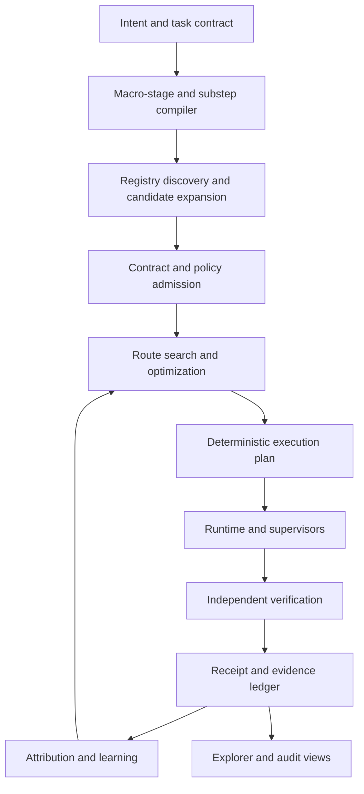

# Universal Graph Solution System

## Complete architecture, node standard, route explorer, feedback system, and implementation blueprint

This document is the single, copy-pasteable specification for the universal
graph solution system implemented as a proof of concept in BrowserGraph. It is
deliberately domain-neutral: document ingestion, automated browsing, image
processing, data cleaning, machine learning, business workflows, API
orchestration, and future task classes all use the same primitives.

The central proposition is:

> A solution is not one fixed capability. It is an ordered graph assembled
> from interchangeable atomic candidates, validated through typed contracts,
> evaluated from execution evidence, and improved by selecting better routes.

The implementation must preserve unlimited extensibility. New macro stages,
atomic substeps, node definitions, concrete parameter bindings, feedback
signals, objectives, and complete routes can be added without changing the
fundamental model.

---

## 1. The invariant that makes the architecture understandable

The execution graph has one unambiguous visual and semantic direction:

1. Macro stages are ordered submatrices from left to right.
2. Every macro stage contains a contiguous sequence of typed atomic substeps.
3. Every substep contains every atomic candidate currently admitted to perform
   that substep, stacked vertically in one column.
4. A complete route selects exactly one primary candidate in every substep.
5. A route line connects only consecutive substeps and never changes macro or
   substep order.
6. Fallbacks belong to a candidate selection at a substep; they do not become
   extra substeps.
7. Contracts, configuration dimensions, policies, metrics, feedback, and
   optimization describe, validate, or improve the route. They are not task
   substeps unless the task itself explicitly requires them as actions.

This distinction prevents the most important source of confusion:

- `Acquire inputs` is a macro stage.
- `Resolve source` is an atomic substep inside that macro stage.
- `Browser target · Playwright · Firefox · headless` is an atomic candidate
  that can perform that substep.
- `controller`, `binary`, and `display` are configuration dimensions bound by
  that candidate.
- `InputHandle` is an output contract.
- `browser` and `network` are permissions.
- latency, quality, and cost are measurements.
- a Bayesian update or weighted scorer is optimization logic.

Only the first item is a macro stage. Only the second item is an atomic
substep. The remaining items belong to candidate, contract, policy, metric, or
control-plane definitions.

---

## 2. Canonical terminology

| Concept | Canonical meaning | It is not |
|---|---|---|
| Task | The requested outcome and its success oracle | A hard-coded implementation |
| Macro stage | One conceptual phase that groups a contiguous submatrix of atomic substeps | A selectable route node or one visual column |
| Atomic substep | One typed, independently selectable requirement; one visual column (`StageDefinition`) | A broad phase that hides several operations |
| Node definition | A reusable implementation and technical manifest | A concrete browser/model/parameter choice |
| Atomic candidate | One node definition with every selected parameter explicitly bound | An unexpanded family of choices |
| Route | Exactly one primary candidate per atomic substep, with optional ordered fallbacks | A macro stage or an optimization algorithm |
| Contract | Typed input/output, capability, permission, effect, and runtime requirements | A visual task column |
| Receipt | Structured evidence produced by execution and verification | An unlabeled log message |
| Feedback channel | A typed route, macro-stage, substep, edge, candidate, task, or registry signal | A backward execution edge mixed into the task graph |
| Optimization profile | Objectives and strategy used to rank eligible alternatives | Permission to bypass a contract or policy |
| Registry | The discoverable set of definitions and materialized candidates | A manually curated top-k list |

The older word `plane` may be used conversationally. The canonical wire model
uses `MacroStageDefinition` for a conceptual phase and `StageDefinition` for
the atomic ordered substep. This avoids confusing task hierarchy with
configuration planes, execution planes, or feedback planes.

---

## 3. Universal task decomposition

A task compiler converts intent into a hierarchy and then compiles that
hierarchy into an ordered sequence of atomic claims:

```text
Task
└── Macro stage (conceptual phase / visible submatrix)
    └── Atomic substep (typed selection column)
        └── Node family
            └── Atomic parameter binding
```

The number of macro stages and substeps is not fixed. Either may be inserted,
removed, split, or refined when the task demands it. Macro stages are for
human comprehension and scoped optimization; routes select candidates at the
substep level.

Each atomic substep answers five questions:

1. What must be true before this substep runs?
2. What typed input does it consume?
3. What typed output must it produce or certify?
4. What capability is required from an eligible node?
5. What observable condition proves the substep succeeded?

A macro stage must split whenever any of these can vary independently:

- capability or implementation family;
- input/output contract;
- pass-through eligibility;
- failure, fallback, retry, or checkpoint policy;
- permission or external effect;
- success evidence or verifier;
- cost, latency, quality, or resource attribution;
- the optimizer's ability to replace the operation without replacing its
  neighbors.

A useful general-purpose hierarchy contains six macro stages and 21 atomic
substeps:

| Order | Macro stage | Atomic substeps in strict order | Input → output |
|---:|---|---|---|
| 1 | Acquire inputs | Resolve source → authorize access → retrieve payload → identify/fingerprint | `TaskReference → InputHandle` |
| 2 | Canonicalize representation | Detect representation → decode content → normalize values → map canonical schema | `InputHandle → CanonicalState` |
| 3 | Enrich context | Clean/protect → resolve language → retrieve context → derive features/evidence | `CanonicalState → EnrichedState` |
| 4 | Transform or act | Plan operation → execute operation → reconcile result | `EnrichedState → CandidateResult` |
| 5 | Verify success | Validate contract → verify outcome independently → adjudicate confidence/risk | `CandidateResult → VerifiedOutcome` |
| 6 | Emit result and receipt | Package result/evidence → deliver/persist → register receipt/checkpoint | `VerifiedOutcome → TaskReceipt` |

These six macro stages are not a fixed pipeline. Their 21 substeps are also a
demonstration, not a limit. A document task may split decoding into PDF parsing,
OCR, layout recovery, and page attribution. A machine-learning task may split
enrichment and transformation into splitting, imputation, feature generation,
collinearity handling, modeling, calibration, ensembling, stability checks,
and packaging. The compiler may recursively expand a composite candidate into
a child graph, but it must flatten the admitted execution plan into explicit
typed substeps before running it.

---

## 4. Standardized node definition

Every reusable node is described by a portable `NodeManifest`. The manifest is
separate from execution code so registries, compilers, viewers, validators,
optimizers, and other languages can inspect a node without importing its
runtime.

### 4.1 Required node identity

| Field | Purpose |
|---|---|
| `id` | Stable lowercase namespaced identifier |
| `kind` | Runtime/configuration kind |
| `name` | Human-readable implementation name |
| `version` | Implementation or adapter version |
| `schema_version` | Manifest wire-format version |
| `description` | Clear explanation of behavior and limits |
| `source` | Code or package location |
| `docs` | Documentation location |

### 4.2 Discovery and eligibility taxonomy

| Field | Purpose |
|---|---|
| `roles` | Broad roles such as source, adapter, transform, action, model, verifier, sink, composite, or control |
| `capabilities` | Specific functions the node can legally claim to perform |
| `tags` | Search, organization, ecosystem, and registry metadata |

### 4.3 Technical ports

Each input and output port declares:

- stable port name;
- technical data type;
- semantic type;
- schema;
- units;
- whether the port is required;
- human-readable description.

Ports are used before execution to prove that consecutive candidates can
connect. Runtime coercion must never silently conceal an incompatible route.
An explicit adapter node may be inserted when a safe conversion is available.

### 4.4 Parameters and atomic bindings

Each parameter declares:

- name;
- data type;
- description;
- required flag;
- default value;
- finite choices when the parameter is searchable.

Open-ended values such as a document body, URL, query, or image belong on
typed input ports. A configuration dimension must be enumerated or deliberately
discretized before it can define a finite candidate search space.

### 4.5 Authority, effects, and operation

| Field | Purpose |
|---|---|
| `permissions` | Required authority such as filesystem, browser, network, database, LLM, or human review |
| `effects` | Possible local or external state changes |
| `dependencies` | Packages, binaries, services, models, or child graphs |
| `resources` | CPU, memory, GPU, storage, concurrency, and other requirements |
| `runtime` | Determinism, sandbox, isolation, browser need, mutation, verification, and runtime metadata |
| `context` | Declared reads, writes, context scopes, and brokered access policy |
| `intelligence` | Deterministic/model-assisted mode, optional micro-model, abstention, and authority to propose route changes |
| `metrics` | Measured or predicted priors with explicit source and version |

### 4.6 Thin executable wrapper

`NodeDefinition` couples a portable manifest to an optional factory. The
wrapper is intentionally thin. It provides discovery and construction without
forcing the implementation into a large inheritance framework.

```python
definition = NodeDefinition(manifest=manifest, factory=NormalizeAddress)
node = definition.build(strategy="aggressive")
```

Existing BrowserGraph nodes can receive inferred manifests. Authors can attach
complete metadata using `@described_node(...)`, or registries can supply
metadata-only definitions for remote, non-Python, generated, or unavailable
implementations.

---

## 5. Atomic candidates: show the real choices

A reusable definition with parameter choices is not one candidate. Every
concrete binding must be materialized as a separate candidate if the user or
optimizer can select it independently.

For example:

```text
Browser adapter
├── controller: BrowserPort | Playwright | Selenium | Puppeteer | CDP
├── binary: Chrome | Chromium | Edge | Firefox | WebKit | Brave
└── display: headless | headed
```

This definition expands to:

```text
5 controllers × 6 binaries × 2 display modes = 60 atomic candidates
```

Examples include:

```text
Browser adapter · BrowserPort · Chrome · headless
Browser adapter · Playwright · Firefox · headless
Browser adapter · Selenium · Edge · headed
Browser adapter · CDP · Brave · headless
…56 additional concrete choices
```

Likewise:

```text
LLM parser
├── model: Gemini | DeepSeek | GLM | Qwen | Claude | GPT
└── strategy: single-schema | field-by-field | map-reduce
```

expands to 18 independently selectable candidates.

### Stable candidate identity

Candidate IDs must be stable and parameter-sensitive. BrowserGraph derives a
readable ID plus a digest from deterministically serialized parameter values:

```python
candidate_id("example.llm_parser", {
    "model": "DeepSeek",
    "strategy": "map-reduce",
})
```

Changing parameter order does not change the ID. Changing a parameter value
does.

### No hidden top-k truncation

Candidate expansion and atomic-substep discovery have no architectural top-k limit.
Presentation filters may reduce what is temporarily visible, and search
strategies may evaluate subsets under explicit budgets, but the registry must
retain the full admitted candidate set and report what was or was not examined.

---

## 6. Standardized macro-stage and substep definitions

`MacroStageDefinition` groups a contiguous submatrix but contains no selectable
candidate IDs:

```json
{
  "id": "canonicalize",
  "name": "Canonicalize representation",
  "input_type": "InputHandle",
  "output_type": "CanonicalState",
  "success": "the input has a typed canonical representation",
  "substeps": [
    "canonicalize.detect",
    "canonicalize.decode",
    "canonicalize.normalize",
    "canonicalize.schema"
  ]
}
```

Each `StageDefinition` is an atomic substep and contains:

```json
{
  "id": "canonicalize.schema",
  "macro_stage_id": "canonicalize",
  "name": "Map canonical schema",
  "description": "Map normalized content into the task schema.",
  "input_type": "NormalizedContent",
  "output_type": "CanonicalState",
  "success": "required fields and identities are schema-valid",
  "optional": true,
  "variant_axes": ["mapper", "schema", "model", "strategy"],
  "required_capabilities": ["canonicalize.schema"],
  "candidates": ["candidate.id.one", "candidate.id.two"]
}
```

`variant_axes` describe dimensions worth exploring. They do not become visual
substeps. `required_capabilities` controls discovery. `candidates` contains the
complete materialized set admitted to the atomic substep. Macro-stage
membership must cover every substep exactly once and preserve global contiguous
order.

### Pass-through candidates

An optional substep may contain a pass-through candidate. Pass-through is still
an atomic candidate with a contract; it is not absence of execution metadata.
It must certify that the incoming state already satisfies the substep output
contract and postcondition.

A required substep cannot silently use pass-through merely because skipping is
cheaper.

---

## 7. Candidate discovery and completeness

For atomic substep `s`, node-definition registry `N`, and concrete candidate registry
`B`, the complete eligible candidate set is:

```text
C(s) = [b in B where
        b.node_id resolves to n in N
        and b binds valid parameter values for n
        and required_capabilities(s) is a subset of capabilities(n)
        and input_type(s) matches an input port of n
        and output_type(s) matches an output port of n]
```

`StageDefinition.with_discovered_candidates()` materializes this complete set.
`WorkbenchDefinition.validate()` rejects a substep that silently omits any
compatible registered candidate.

This creates a useful handshake:

1. The registry declares what definitions, parameters, versions, schemas,
   search mechanisms, and execution modes it supports.
2. The compiler declares the macro hierarchy plus each substep contract and required capabilities.
3. Discovery returns all technically compatible atomic candidates.
4. Policy gates mark candidates eligible or ineligible for the current task.
5. The optimizer ranks only the eligible candidates.

Discovery, policy, and scoring remain separate operations.

---

## 8. Complete solution routes

A `SolutionDefinition` selects one primary candidate for every ordered atomic
substep. Macro stages do not appear as route keys:

```json
{
  "id": "accuracy_first",
  "name": "Accuracy-first route",
  "description": "Uses composite transformation and independent consensus.",
  "status": "candidate",
  "route": {
    "acquire.resolve": "candidate.database.snowflake",
    "acquire.authorize": "candidate.identity.gcp",
    "acquire.retrieve": "candidate.query.snapshot",
    "acquire.identify": "candidate.integrity.composite",
    "canonicalize.detect": "candidate.detector.ensemble",
    "canonicalize.decode": "candidate.pdf.ocrmypdf",
    "canonicalize.normalize": "candidate.unicode.nfkc",
    "canonicalize.schema": "candidate.schema.hybrid",
    "enrich.clean": "candidate.quality.combined",
    "enrich.language": "candidate.translate.gemini.terminology",
    "enrich.context": "candidate.graph.graphrag",
    "enrich.analyze": "candidate.evidence.ensemble",
    "transform.plan": "candidate.search.mcts",
    "transform.execute": "candidate.child_graph.adaptive",
    "transform.reconcile": "candidate.ensemble.mixture_of_experts",
    "verify.contract": "candidate.invariant.metamorphic",
    "verify.outcome": "candidate.simulation.digital_twin",
    "verify.adjudicate": "candidate.consensus.bayesian",
    "emit.package": "candidate.evidence.prov_o",
    "emit.deliver": "candidate.object_store.s3",
    "emit.register": "candidate.ledger.replicated"
  },
  "fallbacks": {
    "verify.outcome": ["candidate.oracle.exact", "candidate.human.dual_review"]
  },
  "metrics": {
    "quality": 0.97,
    "latency_ms": 1420,
    "cost_usd": 0.031
  },
  "tags": ["quality", "independent-verification"]
}
```

### Route validity

A valid route must:

- contain every atomic substep exactly once;
- contain no unknown substeps;
- select a candidate admitted to each substep;
- resolve every candidate to a valid node manifest;
- satisfy adjacent output/input contracts;
- satisfy required capabilities;
- bind every required parameter;
- use only allowed parameter values;
- satisfy active permission, effect, dependency, resource, runtime, and policy
  constraints;
- keep fallbacks inside the same substep;
- avoid duplicate fallbacks or listing the primary as its own fallback.

### Search-space size

For substep candidate counts `c1, c2, …, cn`, the number of primary routes is:

```text
route_count = c1 × c2 × … × cn
```

The hierarchical demonstration contains:

```text
81 × 22 × 23 × 15 × 15 × 38 × 29 × 35 × 25 × 36 × 29 × 33 ×
24 × 68 × 25 × 19 × 27 × 21 × 23 × 26 × 20
= 1,610,460,741,842,511,132,974,400,000,000 complete primary routes
```

Fallback ordering, retries, parameter schedules, conditional branches, and
generated nodes can enlarge the operational search space, but the primary
linear compiled route remains understandable because macro-stage boundaries
remain visible and every selection still belongs to one typed substep.

---

## 9. Demonstration registry

The proof of concept includes:

- 6 ordered macro stages;
- 21 ordered atomic substeps;
- 154 reusable node definitions;
- 634 atomic candidates;
- 5 named example routes;
- 1,610,460,741,842,511,132,974,400,000,000 possible primary routes;
- 16,601 possible adjacent-substep transitions;
- 8 typed feedback channels;
- 4 optimization profiles.

Candidate counts by macro stage and atomic substep:

| Macro stage | Atomic substep | Atomic candidates |
|---|---|---:|
| Acquire inputs | Resolve source | 81 |
| Acquire inputs | Authorize access | 22 |
| Acquire inputs | Retrieve payload | 23 |
| Acquire inputs | Identify and fingerprint | 15 |
| Canonicalize representation | Detect representation | 15 |
| Canonicalize representation | Decode content | 38 |
| Canonicalize representation | Normalize values | 29 |
| Canonicalize representation | Map canonical schema | 35 |
| Enrich context | Clean and protect | 25 |
| Enrich context | Resolve language | 36 |
| Enrich context | Retrieve context | 29 |
| Enrich context | Derive features and evidence | 33 |
| Transform or act | Plan operation | 24 |
| Transform or act | Execute operation | 68 |
| Transform or act | Reconcile result | 25 |
| Verify success | Validate contract | 19 |
| Verify success | Verify outcome independently | 27 |
| Verify success | Adjudicate confidence and risk | 21 |
| Emit result and receipt | Package result and evidence | 23 |
| Emit result and receipt | Deliver or persist | 26 |
| Emit result and receipt | Register receipt and checkpoint | 20 |

The example metric values are explicitly illustrative UI priors, not benchmark
claims. Production metrics must identify their source, context, version,
sample size, uncertainty, and freshness.

---

## 10. Five synchronized projections

All views consume the same canonical workbench data. Changing a view must not
change the graph semantics.

### 10.1 Hierarchical submatrices

Purpose: answer **What can perform each atomic part of every macro step?**

- one visible submatrix per macro stage;
- one ordered column per atomic substep inside that submatrix;
- every atomic candidate stacked vertically inside its substep;
- candidates grouped by reusable node definition;
- bindings shown separately from definition metadata;
- multiple named solution routes visible simultaneously above the matrix;
- clicking a candidate replaces only that substep in a separate Custom route;
- search, role, and permission filters affect visibility, not registry content;
- stacks may be collapsed for scanning or expanded to prove completeness;
- inspector shows description, ports, bindings, capabilities, permissions,
  effects, dependencies, resources, runtime, and evidence.

### 10.2 Path network

Purpose: answer **What does the full choice topology look like?**

- every candidate appears once in its substep column;
- macro-stage bands and substep columns always remain in task order;
- edges connect only adjacent substeps;
- no force layout or physics engine may reorder the graph;
- no backward, diagonal-substep, or mixed-direction topology;
- faint background structure can show all 16,601 runnable adjacent
  possibilities in the bundled demonstration;
- deterministic sampling can show 50, 200, or 1,000 complete routes;
- selected-only mode removes background clutter;
- an initial/baseline route is visually distinct from a current/learned route;
- candidate-level port compatibility is checked before a background edge is
  considered runnable;
- incompatible edges are excluded and counted rather than drawn as possible;
- clicking any node replaces only its own substep in the Custom route.

### 10.3 Compare routes

Purpose: answer **How do complete solutions differ?**

- one solution per row;
- one atomic substep per column, labeled with its macro stage;
- route metrics remain in a separate metrics column;
- cells differing from the selected baseline are highlighted;
- non-dominated routes are identified across quality, latency, and cost;
- route status, tags, fallback counts, reliability, memory, and evidence counts
  are shown when supplied;
- complete routes are compared, not isolated node scores alone.

### 10.4 Build step by step

Purpose: answer **Which candidate should this route select now?**

- ordered 21-substep rail grouped by macro stage;
- every candidate for the current substep remains visible;
- ineligible candidates remain visible but disabled;
- each disabled candidate explains its blocking reason;
- hard-policy controls include network, browser, LLM, external effects, and
  deterministic runtime;
- recommendation objective is selected from data-defined optimization
  profiles;
- recommendation only ranks eligible candidates;
- the top five eligible candidates show normalized score and per-objective
  contribution so the decision is inspectable;
- a macro-stage proposal can re-rank only the substeps in the active submatrix
  while preserving every selection outside that macro stage;
- a route-wide coordinate proposal can select the highest-ranked eligible
  candidate for every substep and then revalidate the complete route;
- previous/next navigation never changes substep order;
- live route validation checks membership, contracts, permissions, effects,
  runtime, and completeness;
- the current route remains visible as one linear row.

### 10.5 Feedback and optimization

Purpose: answer **How does the graph learn without corrupting task topology?**

- execution route remains strictly left to right;
- receipts are displayed outside the macro-stage and substep line;
- feedback channels are explicit and typed;
- learning logic is a separate control plane;
- optimizer proposes a new route or binding;
- proposal must pass contracts and policy again before execution;
- route evidence summary shows admission status, metrics, evidence source,
  fallbacks, permissions, effects, dependencies, and route status;
- baseline and learned routes can be compared without implying that learning
  is an execution substep.

The self-contained studio also provides copy controls for the full normalized
workbench and current route, plus a direct normalized JSON download. These
operations copy or export data; they do not mutate task semantics.

---

## 11. Feedback channels

Feedback must never be represented as an unlabeled web of backward arrows.
Each `FeedbackDefinition` declares:

| Field | Meaning |
|---|---|
| `id` | Stable namespaced channel identity |
| `name` | Human-readable signal name |
| `signal` | Typed receipt, verdict, measurement, or event |
| `scope` | Candidate, edge, atomic substep, macro stage, route, task, registry, version, or context |
| `producer` | Component that emits the signal |
| `consumer` | Component allowed to use it |
| `action` | Permitted response |
| `description` | Interpretation and limitations |
| `required` | Whether absence blocks admission or acceptance |

The demonstration includes eight channels:

1. **Contract compatibility** — reject or repair invalid candidate and edge
   contracts before execution.
2. **Execution diagnosis** — classify success, transient failure, permanent
   failure, timeout, dependency failure, or invalid output.
3. **Independent verification** — accept, reject, escalate, retry, or activate
   a fallback based on an oracle independent of the producer.
4. **Quality and yield** — update task-context performance evidence.
5. **Latency and resources** — update runtime, resource, and capacity estimates.
6. **Cost and tokens** — update monetary, token, model, and service usage.
7. **Policy, authority, and effects** — block or constrain candidates that
   exceed permissions, effects, budgets, or risk.
8. **Provenance, drift, and freshness** — invalidate or discount evidence when
   code, data, schema, model, environment, or context has changed.

### Feedback processing sequence

The control plane processes feedback in six ordered operations:

```text
Observe → Attribute → Diagnose → Propose → Gate → Learn
```

1. **Observe** — collect node status, verifier result, latency, cost, yield,
   resources, policy, and provenance.
2. **Attribute** — attach each signal to candidate, edge, substep, macro stage, route, task
   context, version, environment, and evidence window.
3. **Diagnose** — distinguish contract errors, policy blocks, transient
   failures, quality misses, stale evidence, and drift.
4. **Propose** — replace one candidate, activate a fallback, adjust a binding,
   insert a required adapter substep, or propose a new complete route.
5. **Gate** — revalidate contracts, permissions, effects, dependencies,
   budgets, runtime, and independent acceptance requirements.
6. **Learn** — update uncertainty-aware evidence and route rankings while
   retaining complete replayable receipts.

These operations are control logic, not execution substeps.

---

## 12. Optimization profiles

An `OptimizationProfile` declares:

- stable ID and name;
- strategy;
- weighted objectives;
- metric direction for every objective;
- minimum evidence requirement;
- exploration rate;
- description and intended operating regime.

Each objective has:

```json
{
  "metric": "quality",
  "direction": "maximize",
  "weight": 0.55
}
```

The demonstration defines balanced, quality-first, speed-first, and cost-first
profiles. Profiles are data, not hard-coded UI behavior, so future profiles can
focus on stability, tail risk, energy, memory, privacy, robustness, diversity,
reproducibility, human effort, or domain-specific acceptance.

### Hard constraints before soft scoring

Optimization must follow this order:

```text
registry discovery
→ parameter binding validation
→ technical contract validation
→ permission/effect/dependency/runtime/resource policy
→ evidence sufficiency and freshness
→ objective scoring
→ exploration or exploitation decision
→ route proposal
→ full route revalidation
→ execution
→ independent verification
→ receipt update
```

A high predicted quality score cannot legalize a candidate that lacks a
required permission or produces the wrong output type.

### Advanced route-search strategies

The framework may support all of the following without changing the canonical
model:

- exhaustive enumeration when tractable;
- deterministic sampling;
- random search with recorded seed;
- greedy coordinate replacement;
- beam search;
- best-first search;
- Bayesian optimization;
- contextual bandits;
- Thompson sampling;
- upper-confidence-bound selection;
- genetic and evolutionary search;
- graph mutation and graph crossover;
- multi-objective Pareto search;
- stability-aware selection;
- plateau and neighborhood analysis;
- ensemble and route-diversity selection;
- counterfactual route evaluation;
- learned cost, latency, failure, and quality predictors;
- generated node proposals admitted through contract, sandbox, fixture, and
  verification gates.

Search strategy is replaceable. The canonical macro-stage, substep, candidate,
route, receipt, and contract model remains stable.

---

## 13. Execution receipts and evidence

Every run should produce a durable `TaskReceipt` containing at least:

- task identity and normalized intent;
- task context and data fingerprint;
- exact ordered macro stages and atomic substeps;
- selected candidate ID for every substep;
- an outcome for every atomic substep and an aggregate outcome for every macro
  stage;
- fallback candidates and activation events;
- node definition versions and source digests;
- complete parameter bindings;
- input and output schemas;
- environment and dependency versions;
- permissions granted and effects observed;
- start, end, latency, retries, and resource use;
- token and monetary cost;
- output artifact references and content hashes;
- verifier identity, evidence, verdict, and independence relationship;
- verifier implementation digest and immutable evaluator/data/environment identities;
- failure classification and responsible scope;
- optimizer/profile/version that proposed the route;
- baseline route and comparison metrics when relevant;
- reproducibility and replay information;
- provenance and freshness metadata.

LLM-generated campaigns additionally retain a population DAG: candidate ID,
all parent IDs, proposal operator and artifact digest, hypothesis, generation,
budget/fidelity, and append-only promotion or rejection events. The campaign
ledger is not part of the executable DAG and cannot make a route valid.

Metrics without task context, evidence count, uncertainty, and version should
not be treated as universal truths. A candidate may be best for one document
class, browser environment, image distribution, cost budget, or risk regime and
poor for another.

---

## 14. Domain examples

The framework is universal because macro stages, atomic substeps, and
candidates are data, while the execution and optimization semantics remain
standardized.

### 14.1 Document ingestion and structured extraction

One possible atomic-substep expansion:

```text
Load document
→ detect type
→ convert to text/OCR
→ remove junk
→ detect language
→ translate
→ segment/chunk
→ prioritize pages or regions
→ deterministic extraction
→ LLM extraction
→ reconcile fields
→ validate schema
→ verify against source evidence
→ emit fields and receipt
```

Each atomic substep may contain many candidates: PDF libraries, OCR engines, cleanup
algorithms, translation packages, chunkers, deterministic parsers, model
families, prompting strategies, validators, and pass-through candidates where
the substep is genuinely optional.

### 14.2 Automated web browsing

One possible atomic-substep expansion:

```text
Resolve target
→ acquire browser session
→ reach page
→ settle state
→ locate target
→ act
→ verify effect
→ extract result
→ emit trace and receipt
```

Candidate dimensions may include controller, browser binary, local or remote
transport, headless/headed display, stealth strategy, preprocessing,
selector/vision/LLM location, action implementation, verification method, and
capture strategy. These dimensions expand candidates within the relevant atomic
substep; they do not automatically become substeps themselves.

### 14.3 Image processing

One possible atomic-substep expansion:

```text
Load image
→ decode and normalize
→ inspect metadata
→ detect AI/synthetic signals
→ detect text/OCR
→ analyze distortion and compression
→ analyze geometry/corners
→ enhance or transform
→ verify visual constraints
→ emit image, measurements, and receipt
```

Candidates may include OpenCV algorithms, Pillow operations, OCR engines,
forensic packages, classical detectors, learned vision models, multimodal LLMs,
GPU and CPU runtimes, and no-op certification candidates.

### 14.4 Names, businesses, and addresses

One possible atomic-substep expansion:

```text
Load records
→ profile data
→ normalize encoding
→ parse person or business names
→ detect compound identities
→ parse address components
→ normalize streets and units
→ enrich with USPS/Census/reference data
→ deduplicate and link entities
→ score confidence
→ verify sampled records
→ emit clean data and receipt
```

### 14.5 Machine learning and data science

One possible atomic-substep expansion:

```text
Acquire dataset
→ validate target and leakage constraints
→ split data
→ clean labels and records
→ impute
→ encode
→ generate features
→ reduce collinearity
→ select features
→ fit candidate models
→ calibrate
→ ensemble/stack/blend
→ postprocess
→ quantify uncertainty
→ test stability and tail behavior
→ package model
→ emit evidence and receipt
```

Candidates may include deterministic preprocessing, statistical models, tree
models, MLP/deep/wide architectures, MAPIE and conformal methods, aggressive
ensembles, stacking, bagging, learned cleaning, stability-focused selection,
and multiple runtime profiles.

### 14.6 General business workflow

One possible atomic-substep expansion:

```text
Receive request
→ establish identity and authority
→ gather records
→ classify request
→ apply policy
→ calculate decision
→ request approval when required
→ perform permitted effect
→ independently verify
→ notify authorized parties
→ archive receipt
```

The same compiler and viewer can represent deterministic rules, APIs, humans,
models, browser actions, generated adapters, and composite child graphs as
nodes with explicit contracts.

---

## 15. Composite nodes, nested graphs, and unlimited scale

Everything may be a node without flattening every internal detail into one
unreadable graph.

A composite node may encapsulate a validated child graph. Its manifest exposes
the child graph's external ports, capabilities, permissions, effects,
dependencies, resources, metrics, version, and receipt policy.

The viewer should support progressive expansion:

```text
Task route
└── Macro-stage submatrix
    └── Atomic-substep candidate
        └── Composite node
            └── Child task route
                └── Child macro stages, substeps, and candidates
```

This permits millions of primitives and deeply nested solutions while keeping
the current level understandable. Architectural scale must be managed through
indexing, discovery, filtering, lazy expansion, evidence summaries, and
hierarchy—not by imposing arbitrary capability limits.

---

## 16. Version and capability handshake

Registries and graph compilers should negotiate capabilities explicitly.

A registry handshake may declare:

- registry and schema versions;
- supported manifest versions;
- available node kinds and namespaces;
- candidate materialization mechanisms;
- supported parameter types;
- supported input/output type systems;
- embedding formats and dimensions, if any;
- keyword, lexical, vector, hybrid, graph, or metadata search support;
- version and compatibility constraints;
- package, model, binary, and runtime availability;
- supported execution environments and sandboxes;
- authorization and effect policies;
- receipt formats;
- metric and evidence schemas;
- generated-node admission support;
- maximum query/result page sizes as operational facts, not architecture limits.

The compiler then chooses supported retrieval and execution methods. It must not
assume that every registry has embeddings, that every embedding has the same
dimension, or that every runtime supports every node.

---

## 17. Portable workbench wire model

The version-2 workbench shape is:

```json
{
  "schema_version": "2.0",
  "title": "Universal graph solution studio",
  "task": "Description of the requested task",
  "success": "Independent task-level success oracle",
  "nodes": [],
  "candidates": [],
  "macro_stages": [],
  "stages": [],
  "solutions": [],
  "feedback_channels": [],
  "optimization_profiles": [],
  "receipts": [],
  "optimization_decisions": [],
  "metadata": {}
}
```

Canonical implementation classes:

```text
NodeManifest
PortSpec
ParameterSpec
NodeDefinition
NodeCandidate
MacroStageDefinition
StageDefinition
SolutionDefinition
FeedbackDefinition
OptimizationObjective
OptimizationProfile
ExecutionReceipt
OptimizationDecision
WorkbenchDefinition
```

The exact schemas are implemented in:

```text
browsergraph/schemas/node-manifest.schema.json
browsergraph/schemas/workbench.schema.json
```

Version-1 `planes` input remains loadable as a compatibility alias. New
serialization uses `macro_stages` for conceptual groups and `stages` for the
atomic selection substeps retained for wire compatibility.

---

## 18. Validation requirements

The canonical validator rejects:

- invalid or duplicate node IDs;
- invalid node kinds or manifest versions;
- duplicate input, output, or parameter names;
- invalid parameter defaults or choices;
- duplicate roles, capabilities, effects, permissions, dependencies, or tags;
- invalid or duplicate candidate IDs;
- unknown candidate definitions;
- missing required parameter bindings;
- unknown or out-of-range parameter values;
- empty macro stages or substeps;
- unknown, duplicated, reordered, non-contiguous, or mis-owned substeps;
- macro-stage boundary contracts that disagree with their first or last substep;
- candidates in technically incompatible substeps;
- compatible registered candidates omitted from a substep;
- pass-through on required substeps;
- duplicate macro-stage or substep IDs;
- incomplete routes;
- routes with unknown substeps;
- route choices outside a substep candidate set;
- disconnected adjacent ports;
- invalid or duplicate fallbacks;
- invalid feedback channels;
- invalid optimization profiles, directions, or weights;
- non-finite metrics and invalid exploration settings where applicable.

The builder adds task-context policy validation for permissions, effects,
dependencies, resources, deterministic-runtime requirements, evidence
sufficiency, and freshness.

---

## 19. Repository implementation

The proof of concept is organized as:

```text
browsergraph/
├── manifest.py
│   ├── PortSpec
│   ├── ParameterSpec
│   ├── NodeManifest
│   ├── NodeDefinition
│   ├── described_node()
│   └── manifest_of()
├── workbench.py
│   ├── NodeCandidate
│   ├── MacroStageDefinition
│   ├── StageDefinition
│   ├── SolutionDefinition
│   ├── FeedbackDefinition
│   ├── OptimizationObjective
│   ├── OptimizationProfile
│   ├── WorkbenchDefinition
│   ├── expand_node_candidates()
│   └── candidate_id()
├── demo.py
│   └── domain-neutral demonstration registry and routes
├── schemas/
│   ├── node-manifest.schema.json
│   └── workbench.schema.json
├── assets/
│   └── workbench-studio-template.html
└── cli.py
    ├── browsergraph nodes --json
    └── browsergraph workbench

examples/
├── universal-graph-workbench.html
├── universal-node-graph-workbench.html
├── workbench-demo.json
└── workbench-suite/
    ├── index.html
    ├── path-network.html
    ├── compare-routes.html
    ├── build-route.html
    ├── feedback-loop.html
    └── workbench.json
```

The manifest and workbench modules are description and validation layers. They
do not execute nodes or import a browser engine. The studio consumes serialized
data and remains an adapter rather than part of the runtime core.

---

## 20. Python construction example

```python
from browsergraph import (
    MacroStageDefinition,
    NodeCandidate,
    NodeDefinition,
    NodeManifest,
    OptimizationObjective,
    OptimizationProfile,
    ParameterSpec,
    PortSpec,
    SolutionDefinition,
    StageDefinition,
    WorkbenchDefinition,
    candidate_id,
    expand_node_candidates,
)


nodes = (
    NodeManifest(
        id="example.file_reference",
        kind="file_reference",
        name="File reference resolver",
        description="Resolves an authorized file reference.",
        roles=("source", "adapter"),
        capabilities=("acquire.resolve",),
        inputs=(PortSpec("task", "TaskReference"),),
        outputs=(PortSpec("reference", "ResolvedReference"),),
        parameters=(
            ParameterSpec(
                "mode",
                "string",
                default="file",
                choices=("file", "directory", "glob"),
            ),
        ),
        permissions=("filesystem:read",),
        runtime={"deterministic": True, "sandbox": "process"},
    ).assert_valid(),
    NodeManifest(
        id="example.api_reference",
        kind="api_reference",
        name="API reference resolver",
        description="Resolves a typed API reference with provenance.",
        roles=("source", "adapter"),
        capabilities=("acquire.resolve",),
        inputs=(PortSpec("task", "TaskReference"),),
        outputs=(PortSpec("reference", "ResolvedReference"),),
        parameters=(
            ParameterSpec(
                "method",
                "string",
                default="GET",
                choices=("GET", "POST", "PUT"),
            ),
        ),
        permissions=("network",),
        runtime={"deterministic": True, "sandbox": "process"},
    ).assert_valid(),
    NodeManifest(
        id="example.payload_reader",
        kind="payload_reader",
        name="Payload reader",
        description="Retrieves a resolved source through a selected transport.",
        roles=("source", "adapter"),
        capabilities=("acquire.retrieve",),
        inputs=(PortSpec("reference", "ResolvedReference"),),
        outputs=(PortSpec("handle", "InputHandle"),),
        parameters=(
            ParameterSpec(
                "transport",
                "string",
                default="file",
                choices=("file", "http"),
            ),
        ),
        runtime={"deterministic": True, "sandbox": "process"},
    ).assert_valid(),
)

candidates = expand_node_candidates(nodes)

resolve = StageDefinition(
    id="acquire.resolve",
    macro_stage_id="acquire",
    name="Resolve source",
    description="Resolve an authorized task reference to a concrete source.",
    input_type="TaskReference",
    output_type="ResolvedReference",
    success="the source identity is explicit",
    required_capabilities=("acquire.resolve",),
).with_discovered_candidates(nodes, candidates)

retrieve = StageDefinition(
    id="acquire.retrieve",
    macro_stage_id="acquire",
    name="Retrieve payload",
    description="Read the resolved source through a typed transport.",
    input_type="ResolvedReference",
    output_type="InputHandle",
    success="the input is readable and versioned",
    required_capabilities=("acquire.retrieve",),
).with_discovered_candidates(nodes, candidates)

acquire = MacroStageDefinition(
    id="acquire",
    name="Acquire inputs",
    input_type="TaskReference",
    output_type="InputHandle",
    success="the input is available as a typed handle",
    substeps=("acquire.resolve", "acquire.retrieve"),
)

solution = SolutionDefinition(
    id="local_file",
    name="Local file route",
    route={
        "acquire.resolve": candidate_id("example.file_reference", {"mode": "file"}),
        "acquire.retrieve": candidate_id("example.payload_reader", {"transport": "file"}),
    },
)

profile = OptimizationProfile(
    id="profile.balanced",
    name="Balanced",
    objectives=(
        OptimizationObjective("quality", "maximize", 0.50),
        OptimizationObjective("latency_ms", "minimize", 0.25),
        OptimizationObjective("cost_usd", "minimize", 0.25),
    ),
    minimum_evidence=5,
    exploration=0.10,
)

workbench = WorkbenchDefinition(
    title="Universal graph solution studio",
    task="Acquire an authorized input",
    success="the independently checked input handle is valid",
    nodes=nodes,
    candidates=candidates,
    macro_stages=(acquire,),
    stages=(resolve, retrieve),
    solutions=(solution,),
    optimization_profiles=(profile,),
).assert_valid()

workbench.write_html("solution-studio.html")
workbench.write_suite("solution-studio-suite")
```

---

## 21. Command-line interface

Generate the domain-neutral demonstration as one self-contained studio:

```bash
browsergraph workbench -o browsergraph-workbench.html
```

Generate the viewer and normalized data:

```bash
browsergraph workbench \
  --export-data workbench.json \
  -o browsergraph-workbench.html
```

Load custom standardized data:

```bash
browsergraph workbench my-workbench.json -o my-workbench.html
```

Open a specific projection first:

```bash
browsergraph workbench --view network -o path-network.html
browsergraph workbench --view compare -o compare-routes.html
browsergraph workbench --view builder -o route-builder.html
browsergraph workbench --view feedback -o feedback-loop.html
```

Generate the complete multi-file suite:

```bash
browsergraph workbench --suite examples/workbench-suite
```

Export canonical manifests for the existing node registry:

```bash
browsergraph nodes --json
```

---

## 22. Required extensibility behavior

The system must allow all of the following without redesigning the core:

- unlimited macro-stage and atomic-substep counts subject only to operational resources;
- arbitrary candidate counts per atomic substep;
- multiple definitions implementing the same capability;
- many concrete bindings per definition;
- deterministic, statistical, model-based, LLM, human, browser, API, package,
  generated, remote, and composite nodes;
- optional pass-through candidates with explicit certification;
- nested child graphs;
- new technical and semantic port types;
- new permission and effect taxonomies;
- new runtime and resource metadata;
- new metrics and feedback channels;
- new optimization profiles and route-search algorithms;
- online and offline learning;
- context-specific priors;
- multiple complete solutions visible simultaneously;
- route fallbacks and retry policies;
- registry federation and version handshakes;
- non-Python implementations;
- generated nodes admitted through strict testing and authorization;
- local, cloud, hybrid, browser, serverless, container, and distributed
  execution environments.

Improvements may increase validation, evidence, discoverability, safety,
performance, and clarity. They must not impose arbitrary limits on corpus size,
graph size, node diversity, optimization methods, or future capability.

---

## 23. Anti-patterns to reject

The implementation should reject or redesign any feature that:

- mixes macro stages or atomic substeps with model names, engines, packages, policies, or scores;
- represents a parameter family as one candidate when bindings are selectable;
- hides compatible candidates behind an unexplained top-k cutoff;
- uses a force-directed layout that changes the ordered task topology;
- draws routes backward or in mixed directions;
- turns feedback into unlabeled backward edges;
- treats an optimizer as an execution substep;
- permits scoring to bypass contracts or permissions;
- silently coerces incompatible ports;
- skips an optional substep without a pass-through certification contract;
- changes a node binding without recording a new candidate identity;
- records metrics without context, version, or evidence source;
- declares success using only the producing node's self-assessment;
- loses failed runs, rejected routes, fallbacks, or negative evidence;
- replaces real execution evidence with fabricated benchmark results;
- forces every node to use one runtime, model, embedding, or language;
- hard-codes the six-macro-stage demonstration or its 21 substeps as a universal pipeline;
- limits future scale merely to simplify the first viewer.

---

## 24. Acceptance criteria

An implementation is acceptable when all of the following are true.

### Canonical model

- Node definitions, atomic candidates, macro stages, atomic substeps, routes,
  feedback channels, and optimization profiles are separate typed objects.
- The portable wire format is versioned and machine-readable.
- Existing node implementations can be wrapped or inferred without rewrites.
- Parameter choices expand into stable atomic candidate IDs.

### Completeness and contracts

- Every compatible admitted candidate is discoverable in its atomic substep.
- The validator detects omissions, unknown candidates, invalid bindings,
  incomplete routes, and disconnected ports.
- Permissions, effects, dependencies, runtime, and resources are available for
  policy gating.
- Macro-stage membership covers every substep exactly once in contiguous order.
- Pass-through is explicit and restricted to optional substeps.

### Viewer

- Every macro stage is a visible left-to-right submatrix.
- Every atomic substep is a left-to-right column inside its macro stage.
- Every candidate is visible within its substep.
- Multiple complete routes can be shown at the same time.
- All route lines preserve macro-stage and substep order.
- Baseline and learned routes are distinguishable.
- The user can inspect every node and binding.
- The user can compare routes row by row.
- The user can build a route one atomic substep at a time.
- Ineligible candidates stay visible with blocking reasons.
- Feedback and optimization remain outside the execution-substep line.
- The viewer works as a self-contained offline file.

### Optimization and evidence

- Hard eligibility precedes soft scoring.
- Recommendations are driven by declared profiles rather than hidden UI rules.
- Every execution emits a reproducible receipt.
- Independent verification can reject a technically completed route.
- Feedback is attributed to the correct scope.
- New proposals are revalidated before execution.
- Baseline, candidate, learned, failed, and fallback routes remain auditable.

### Extensibility

- A new domain can be represented by supplying manifests, candidates, macro
  stages, substeps, routes, feedback channels, and profiles rather than
  rewriting the viewer.
- Composite nodes can expose nested graphs without flattening all details.
- Registries can advertise supported discovery, schema, embedding, and runtime
  capabilities through a handshake.
- No arbitrary architecture limit prevents larger corpora, more candidates,
  more hierarchy levels, substeps, or new optimization methods.

---

## 25. Verified proof-of-concept status

The current BrowserGraph implementation verifies:

- six ordered macro stages;
- 21 ordered atomic substeps;
- 154 node definitions;
- 634 concrete atomic candidates;
- candidate counts of `81, 22, 23, 15, 15, 38, 29, 35, 25, 36, 29, 33, 24, 68, 25, 19, 27, 21, 23, 26, 20`;
- 1,610,460,741,842,511,132,974,400,000,000 complete primary routes;
- 16,601 adjacent-substep transitions;
- five simultaneous named routes plus an interactive Custom route;
- eight feedback channels;
- four optimization profiles;
- explicit context and local-intelligence manifest fields;
- typed execution receipts and optimization-decision traces;
- all five synchronized projections;
- macro-stage partition validity and substep candidate completeness;
- stable parameter-sensitive candidate IDs;
- workbench and manifest round trips;
- CLI generation of standalone and suite outputs;
- package inclusion of schemas and the studio template;
- JavaScript syntax and primary interaction behavior;
- full Python regression compatibility.

Verification result at implementation time:

```text
448 tests passed
140 tests skipped by environment/optional-engine conditions
3 tests deselected by the repository's configured selection rules
39 focused workbench tests passed
all studio interaction checks passed
wheel build and packaged assets verified
```

Illustrative priors in the demonstration are not presented as measured
performance. Real optimization should consume real receipts.

---

## 26. Copy-paste implementation mandate

The following concise mandate can be given to another development harness
together with this document:

> Implement the Universal Graph Solution System exactly as specified in this
> document. Preserve the strict distinction between macro stages, atomic
> substeps, reusable node definitions, concrete candidates, complete routes,
> contracts, feedback channels, and optimization profiles. Every macro stage
> must appear as a visible contiguous submatrix; every atomic substep must be
> one ordered left-to-right column; every admitted candidate must be visible
> within its substep; and every route must select exactly one primary candidate
> per substep. Configuration dimensions must expand candidates rather than
> masquerade as execution substeps. Feedback and optimization must remain
> in a typed control plane outside the task route. Implement portable manifests,
> parameter expansion, candidate completeness validation, technical port
> compatibility, permissions/effects/runtime policy gates, route comparison,
> step-by-step construction, receipt-driven optimization, independent
> verification, nested graphs, version/capability handshakes, and self-contained
> offline exploration. Maintain unlimited extensibility and do not introduce
> arbitrary limits on hierarchy depth, substeps, nodes, candidates, graph size, registries,
> optimization strategies, or domains. Use real execution evidence, preserve
> failed and rejected experiments, and verify all behavior with automated tests.

---

## 27. Primary artifacts

The complete interactive implementation is available as one self-contained
file:

```text
examples/universal-graph-workbench.html
```

The normalized demonstration data is:

```text
examples/workbench-demo.json
```

The focused compact network is:

```text
examples/universal-node-graph-workbench.html
```

The canonical architecture guide is this file:

```text
UNIVERSAL_GRAPH_SYSTEM.md
```

Together, the canonical model and the single self-contained studio demonstrate
the intended transition from fixed capabilities to reusable, contract-aware,
evidence-driven graphs that can continuously discover and select better ways
to solve a task.

---

## 28. Layered system architecture

The universal graph system should be implemented as replaceable layers with
stable boundaries. No layer should need to understand the private internals of
every other layer.



The feedback edge returns evidence to route search, not execution control flow
to an earlier execution substep. A new attempt is compiled as a new route or
route version and proceeds left to right again.

### Layer responsibilities

| Layer | Responsibility | Stable output |
|---|---|---|
| Intent normalizer | Turn a request into explicit task inputs, constraints, and success criteria | `TaskSpec` |
| Hierarchy compiler | Decompose the task into macro stages and atomic typed substeps | `MacroStageSpec[]`, `SubstepSpec[]` |
| Registry | Advertise definitions, versions, capabilities, and search mechanisms | `NodeManifest[]` |
| Candidate materializer | Expand finite parameter choices and bind environment-specific values | `NodeCandidate[]` |
| Admission compiler | Enforce ports, capabilities, authority, effects, dependencies, runtime, and policy | `EligibleCandidateSet[]` |
| Route optimizer | Search complete or partial routes under declared objectives and evidence | `RouteProposal[]` |
| Route compiler | Freeze exact versions, bindings, fallbacks, retries, and checkpoints | `ExecutionPlan` |
| Runtime | Execute nodes through stable ports and isolation boundaries | `AttemptReceipt[]` |
| Verifier | Apply independent task, macro-stage, and substep oracles | `VerificationReceipt` |
| Evidence ledger | Preserve outcomes, attribution, context, versions, and provenance | `TaskReceipt` |
| Learner | Update scoped priors and invalidate stale evidence | `EvidenceUpdate[]` |
| Explorer | Project the same canonical state into human-auditable views | Read-only projection |

---

## 29. Canonical intermediate representation and compiler lifecycle

The graph compiler should use an explicit intermediate representation instead
of allowing prompts or UI state to become executable behavior directly.

### 29.1 Task specification

```json
{
  "task_id": "task.content-addressed-id",
  "intent": "Extract the requested fields from the supplied document",
  "inputs": [{"port": "document", "type": "DocumentReference"}],
  "outputs": [{"port": "fields", "type": "VerifiedFieldSet"}],
  "success_oracle": "all required fields pass schema and source-evidence checks",
  "constraints": {
    "permissions": ["filesystem:read"],
    "forbidden_effects": ["remote_state"],
    "cost_ceiling_usd": 0.25,
    "latency_ceiling_ms": 30000
  },
  "context_fingerprint": "sha256:..."
}
```

### 29.2 Compilation phases

```text
TaskSpec
→ ordered MacroStageSpec list
→ contiguous ordered SubstepSpec list
→ discovered definitions
→ materialized atomic candidates
→ compatibility graph
→ policy-admitted compatibility graph
→ route proposals
→ validated RoutePlan
→ frozen ExecutionPlan
→ attempts and checkpoints
→ verification
→ immutable TaskReceipt
```

Every phase records its input digest, output digest, compiler version, decision
reason, warnings, and rejected alternatives. This makes compilation replayable
and prevents hidden prompt state from becoming an untraceable execution rule.

### 29.3 Execution plan

An execution plan freezes:

- ordered macro-stage IDs and atomic substep IDs;
- primary and fallback candidate IDs;
- exact node versions and source digests;
- complete parameters;
- resolved dependencies and runtime image;
- declared context reads and writes;
- permission grants and effect budgets;
- timeout, retry, backoff, and circuit-break policy;
- checkpoint boundaries;
- verifier and acceptance policy;
- optimizer and evidence snapshot used to choose the route.

The runtime executes this frozen plan. Dynamic recovery creates a receipt-backed
plan amendment or new attempt; it does not silently mutate history.

---

## 30. Context, memory, micro-models, and node communication

Nodes may be intelligent without gaining unrestricted implicit access to the
entire system. Context is divided into explicit scopes.

### 30.1 Context scopes

| Scope | Contents | Default access |
|---|---|---|
| Node-local | Private state, caches, learned thresholds, adapter history | Owning node and declared maintenance tools |
| Attempt | Inputs, outputs, errors, timing, and transient state for one execution | Nodes in the active attempt through declared ports |
| Substep | Candidate-set metadata, substep success evidence, fallback history | Compiler, substep candidates, verifier, optimizer |
| Macro stage | Aggregated substep evidence, checkpoint state, phase budget | Compiler, supervisor, macro-stage optimizer, verifier |
| Route | Selected candidates, edge contracts, policy decisions, aggregate metrics | Route runtime, supervisor, verifier, optimizer |
| Task | Intent, task constraints, task evidence, artifacts, prior attempts | Authorized task components |
| Global registry | Definitions, versions, generalized evidence, compatibility metadata | Discovery and learning under tenancy/policy controls |

Nodes declare context reads and writes. A node may request additional context,
but the context broker must authorize and record the request.

### 30.2 Optional micro-model inside a node

A node may contain a small CPU model, ruleset, bandit, classifier, or other
local decision component. The manifest should declare:

- purpose and decision boundary;
- features read from node-local and approved shared context;
- output schema;
- model/version digest;
- training evidence and freshness;
- uncertainty or abstention behavior;
- deterministic fallback;
- resource cost;
- whether the micro-model can change execution or only make a proposal.

A micro-model can answer questions such as:

- Is this input within the node's competence region?
- Which internal algorithm or parameter preset is most likely to work?
- Should the node abstain and request a fallback?
- Is the observed result anomalous compared with local history?
- What information should be sent to the supervisor or verifier?

Micro-model decisions are included in receipts. They do not exempt the node
from external contracts or independent verification.

### 30.3 Node messaging

Connected nodes communicate through typed ports. Non-connected nodes may
communicate through a typed message broker when explicitly authorized.

Every message declares:

```text
message type
producer identity and version
intended consumer or topic
task/route/attempt scope
schema and semantic type
provenance and timestamp
permission and retention class
whether it is evidence, a question, a proposal, or a command
```

Questions, advice, and route-mutation proposals never become commands unless a
supervisor validates authority and compiles an accepted plan change.

---

## 31. Node creation, generation, testing, and admission

The ease of generating new code with AI makes admission more important than
generation. Generated nodes enter a quarantine lifecycle:

```text
Need identified
→ candidate specification
→ code or adapter generated
→ manifest generated
→ static analysis
→ dependency and license scan
→ sandbox build
→ contract fixtures
→ adversarial fixtures
→ deterministic replay where applicable
→ resource and effect audit
→ independent verifier review
→ registry admission tier
→ monitored execution
→ evidence-based promotion or quarantine
```

### Admission tiers

| Tier | Meaning | Permitted use |
|---|---|---|
| Proposed | Metadata or code exists but is untested | Search and review only |
| Quarantined | Builds in isolation and has partial fixtures | Explicit experiments only |
| Admitted | Contract, policy, fixture, and sandbox requirements pass | Candidate discovery |
| Trusted | Sufficient versioned execution and verification evidence exists | Normal optimization |
| Preferred | Strong context-specific evidence and operational support | May receive a prior advantage, never exclusivity |
| Deprecated | Better replacement or known limitation | Existing replay; new use only by explicit policy |
| Revoked | Unsafe, invalid, compromised, or incompatible | No execution |

Promotion and demotion are receipt-driven and version-specific. A new version
does not inherit trust automatically.

---

## 32. Failure taxonomy and recovery semantics

Failures must be classified before deciding to retry, fallback, repair, or stop.

| Failure class | Example | Typical action |
|---|---|---|
| Compile-time contract | Output cannot satisfy next input | Reject route or insert an explicit adapter substep |
| Admission policy | Missing permission or forbidden effect | Reject or request authorized policy change |
| Dependency | Binary, package, model, or service unavailable | Select compatible fallback or environment |
| Transient runtime | Timeout, rate limit, temporary network loss | Bounded retry/backoff or fallback |
| Deterministic implementation | Same valid input repeatedly fails | Stop retrying; quarantine/version-repair node |
| Invalid output | Schema or invariant failure | Fallback, repair subgraph, or reject |
| Quality miss | Output is valid but below task oracle | Try alternative candidate/route |
| Verification disagreement | Independent oracles conflict | Consensus, stronger verifier, or human escalation |
| Budget exhaustion | Cost, latency, token, or resource ceiling reached | Stop, checkpoint, or choose lower-cost route |
| Drift/staleness | Evidence no longer matches data/model/environment | Discount prior and explore |
| Security/policy event | Unexpected effect or authority violation | Immediate stop, isolate, audit, and revoke if needed |

### Recovery order

```text
classify
→ determine retryability
→ check remaining budget and authority
→ retry same candidate if justified
→ activate same-substep fallback
→ propose one-substep replacement
→ propose a macro-local or multi-substep route change
→ insert an explicit repair/adapter substep if task semantics require it
→ escalate or stop
```

Every retry and fallback is bounded, versioned, and recorded. Circuit breakers
operate at candidate, dependency, environment, task-context, and registry
scopes.

---

## 33. Evidence ledger, attribution, and online learning

The evidence ledger should be append-only at the receipt level. Learned
summaries may be recomputed from immutable receipts.

### Evidence key

Performance evidence should be keyed by as much context as available:

```text
candidate version
parameter binding
incoming edge and outgoing edge
atomic-substep contract
macro-stage identity
task class
data/context fingerprint or cluster
environment/runtime
permission/effect regime
verifier and oracle version
time window
```

This prevents a candidate that performs well in one context from receiving an
unjustified universal prior.

### Attribution levels

- candidate outcome;
- edge compatibility or handoff quality;
- atomic-substep outcome;
- macro-stage aggregate outcome;
- route acceptance;
- task-level business outcome;
- environment or dependency contribution;
- verifier disagreement;
- registry/version drift.

### Learning rules

- retain failures and rejected routes;
- distinguish absence of evidence from negative evidence;
- record sample size and uncertainty;
- discount stale or incompatible evidence;
- use hierarchical priors when local evidence is sparse;
- keep exploration nonzero when uncertainty remains;
- avoid feedback leakage from test or future data;
- never train the producer solely on its own self-verdict;
- preserve enough data to reproduce every prior update;
- allow rollback to a prior evidence snapshot.

---

## 34. Route optimization, uncertainty, and Pareto reasoning

A single weighted score is one projection, not the definition of the best
route. The optimizer should preserve the underlying objective vector.

### Hard constraints

Hard constraints include contracts, permissions, effects, dependencies,
resource ceilings, determinism requirements, verifier independence, data
residency, licensing, and task-specific prohibitions.

### Soft objectives

Soft objectives may include:

- quality and acceptance probability;
- reliability and successful yield;
- latency and tail latency;
- monetary and token cost;
- memory, CPU, GPU, storage, and energy;
- robustness to noise, missing data, and drift;
- result stability across seeds or perturbations;
- evidence strength and uncertainty;
- route diversity and correlated-failure risk;
- reproducibility;
- human effort;
- maintainability and dependency risk.

### Decision output

Every optimizer decision should return:

```json
{
  "eligible_count": 27,
  "rejected_count": 4,
  "profile": "profile.balanced",
  "chosen_candidate": "candidate.id",
  "score": 0.842,
  "objective_values": {},
  "normalized_contributions": {},
  "uncertainty": {},
  "runner_up_candidates": [],
  "pareto_status": "non_dominated",
  "exploration_reason": "highest uncertainty-adjusted value",
  "evidence_snapshot": "sha256:..."
}
```

The viewer should expose the top alternatives and contribution breakdown, as
the proof-of-concept builder now does. Route-wide optimization may begin with
coordinate-wise selection but should support edge and route interaction terms,
fallback resilience, correlated failures, and global budgets.

---

## 35. Service interfaces and persistence model

The canonical model should be usable locally as files and remotely through
stable service interfaces.

### Suggested service boundaries

```text
POST /tasks/compile
POST /registries/search
POST /candidates/materialize
POST /routes/validate
POST /routes/propose
POST /plans/compile
POST /runs
GET  /runs/{id}
GET  /runs/{id}/receipts
POST /verifications
GET  /evidence/query
POST /registries/nodes/admit
GET  /workbenches/{id}
```

### Persistence entities

- immutable task specifications;
- versioned macro-stage and atomic-substep specifications;
- node manifests and source digests;
- materialized candidates;
- compatibility and admission decisions;
- route proposals and optimizer traces;
- frozen execution plans and amendments;
- attempts, logs, artifacts, and checkpoints;
- verification receipts;
- final task receipts;
- evidence updates and snapshots;
- registry admission history;
- policy and authorization decisions.

Large logs and artifacts may live in object storage, while relational or graph
indexes store identities, relationships, digests, summaries, and searchable
metadata. Every external object is content-addressed or versioned and referenced
from the receipt ledger.

---

## 36. Security, authorization, tenancy, and effects

Universal capability requires explicit authority boundaries.

### Required controls

- tenant and user identity on every task and receipt;
- capability-based node permissions;
- least-privilege grants compiled into the execution plan;
- separation between read, propose, approve, and execute authority;
- explicit external-effect declarations;
- effect budgets and idempotency keys;
- secret references rather than secret values in manifests or receipts;
- sandbox and network policy per node;
- dependency provenance and supply-chain verification;
- output data classification and retention rules;
- human approval for policy-defined high-risk effects;
- immutable audit history for plan changes and overrides;
- revocation that prevents future execution without deleting evidence.

An optimizer may propose a route requiring more authority, but it cannot grant
that authority. Authorization is an independent gate.

---

## 37. Performance and scale without arbitrary limits

The architecture remains unbounded while implementations use explicit
operational budgets.

### Registry scale

- partition by namespace, capability, version, domain, environment, and trust;
- use lexical, metadata, graph, vector, or hybrid indexes according to the
  negotiated registry handshake;
- page and stream results without pretending later pages do not exist;
- cache content-addressed manifests and compatibility results;
- materialize parameter combinations lazily when the Cartesian product is
  extremely large, while preserving exact count and generation rules;
- record retrieval coverage and unexplored regions.

### Viewer scale

- preserve one ordered column per atomic substep and one visible submatrix per macro stage;
- virtualize long candidate stacks;
- group by definition while retaining every binding;
- support progressive expansion of composite graphs;
- use deterministic edge aggregation at high density;
- allow all-compatible, sampled-complete, selected-only, and failure-only edge
  projections;
- keep exact counts visible when not every mark can be rendered simultaneously;
- never let presentation sampling alter the canonical registry or route set.

### Execution scale

- parallelize independent candidate evaluation and route experiments;
- deduplicate identical content-addressed work;
- checkpoint expensive substeps or macro-stage boundaries;
- share immutable artifacts safely;
- enforce global and per-task budgets;
- schedule by dependencies, resources, locality, and effect conflicts;
- preserve deterministic seeds and environment fingerprints.

---

## 38. Evaluation and benchmark program

The system should prove value across many domains rather than optimize only the
demonstration.

### Required comparison arms

- fixed hand-built baseline;
- single-shot generated solution;
- repeated generation without graph memory;
- graph-selected deterministic floor;
- graph-selected hybrid route;
- graph optimization with feedback;
- ablations removing candidate expansion, contracts, receipts, feedback,
  fallbacks, micro-models, or registry memory.

### Required measurements

- task-oracle acceptance;
- quality and yield;
- latency and tail latency;
- monetary/token/resource cost;
- reliability and recovery rate;
- stability across seeds, noise, and data perturbations;
- evidence coverage and uncertainty calibration;
- route diversity and correlated failure;
- compile time and runtime;
- human intervention;
- reproducibility and replay success;
- number of candidates discovered, admitted, evaluated, rejected, and never
  examined;
- benefit attributable to route selection rather than model or data leakage.

Results must use real tasks, real executions, real logs, and independent
acceptance. Synthetic fixtures are appropriate for contract and mechanism
tests, but they must be labeled and must not replace real benchmark evidence.

---

## 39. Implementation roadmap and strengthened definition of done

### Phase 1: canonical description

- portable node manifests;
- parameter materialization;
- ordered macro stages, atomic substeps, and complete routes;
- schemas and validation;
- self-contained explorer;
- version compatibility.

### Phase 2: compiler and admission

- explicit `TaskSpec`, `RoutePlan`, and `ExecutionPlan` IR;
- registry handshake;
- all-candidate discovery;
- port/capability compatibility graph;
- permissions, effects, dependencies, resources, and runtime gates;
- candidate generation quarantine and admission tiers.

### Phase 3: execution and receipts

- deterministic plan runner;
- retries, fallbacks, circuit breakers, and checkpoints;
- content-addressed artifacts;
- attempt, verification, and task receipts;
- independent acceptance;
- immutable evidence ledger.

The repository now contains a trusted-local Phase 3 bootstrap: the reference
executor reconstructs an admitted-space-bound plan, checks Python source
identity, applies explicit runtime/effect/permission policy, content-addresses
outputs, performs bounded retry and compiler-frozen fallback, invokes an
independent verifier, and emits receipts for six programs across five domain
notebook families. It remains
in-process and does not satisfy the least-privilege isolation, durable crash
replay, tenancy, or production-ledger portions of this phase.

### Phase 4: optimization and learning

- data-defined optimization profiles;
- top-alternative and contribution explanations;
- uncertainty-aware candidate and route ranking;
- Pareto frontiers;
- contextual evidence and drift invalidation;
- online learning with replay and rollback;
- route-wide interaction models.

### Phase 5: universal scale

- federated registries;
- nested graph expansion;
- node-local micro-models and typed messaging;
- distributed execution;
- multi-tenant authorization and billing;
- broad real-task benchmark program;
- production monitoring, governance, and recovery.

The system is not done merely because a graph renders. It is done when a real
task can be compiled into explicit macro stages and atomic substeps, all eligible candidates can be
discovered and inspected, a complete route can be justified and executed,
independent verification can accept or reject it, every decision can be replayed
from receipts, and future evidence can select a better route without weakening
contracts, authority, auditability, or unlimited extensibility.
